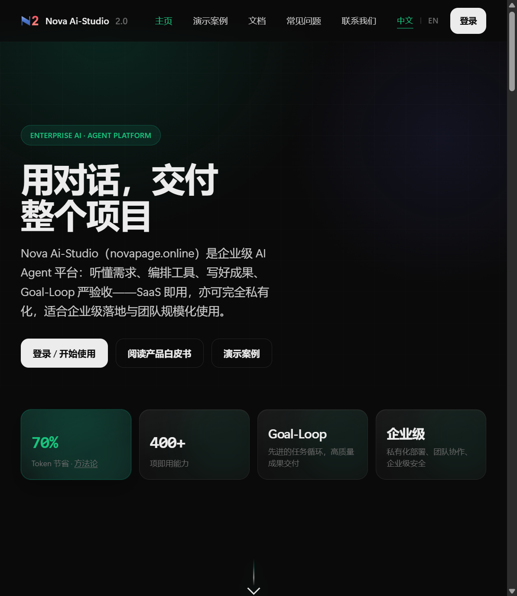
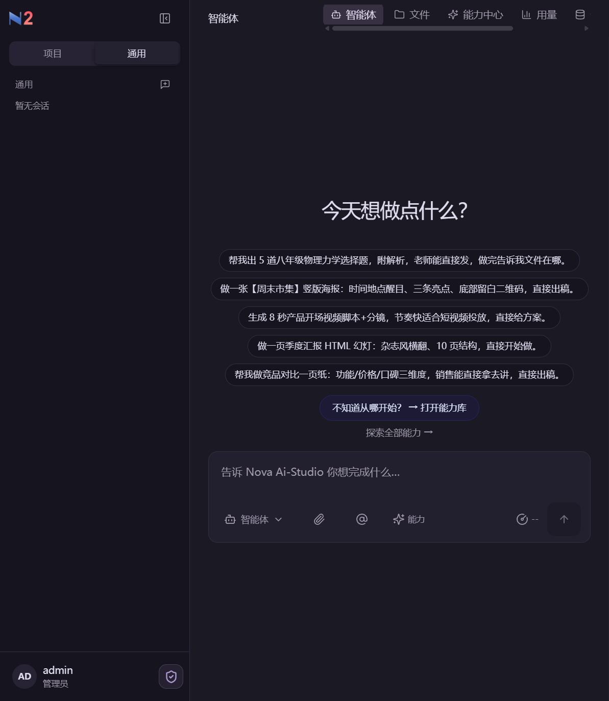
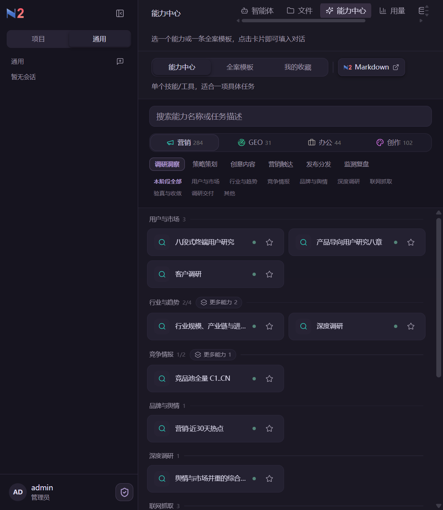
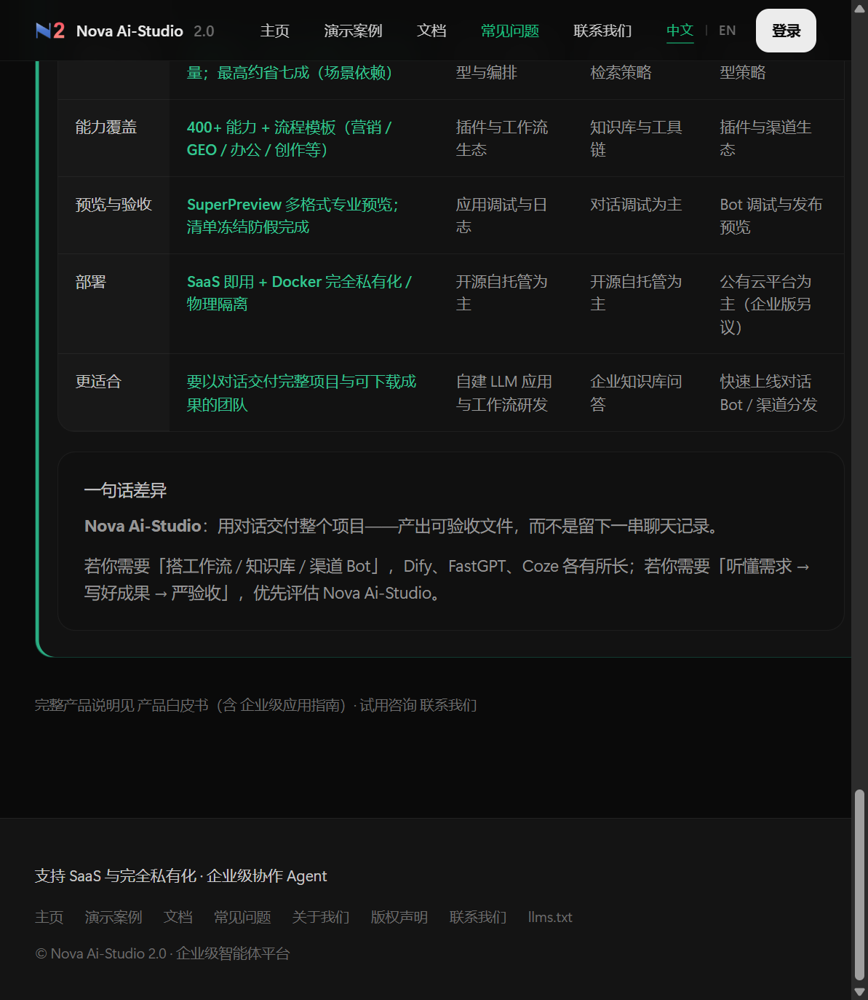
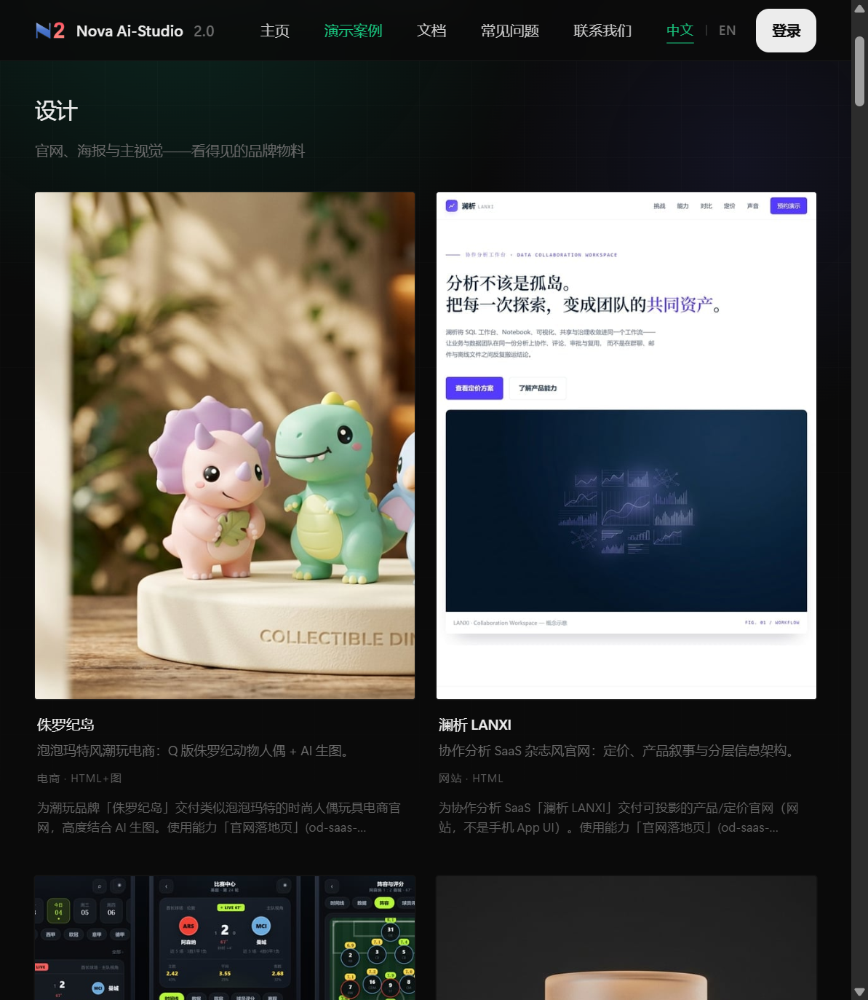
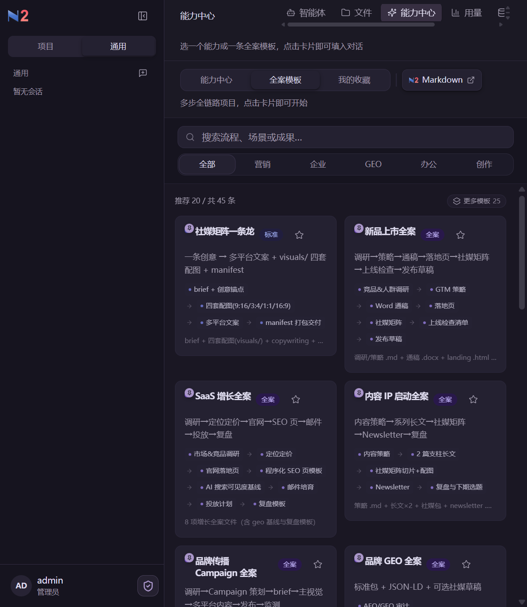

# Nova Studio

[English](README.md) · [简体中文](README.zh-CN.md) · [日本語](README.ja.md) · [한국어](README.ko.md) · [Español](README.es.md) · [Français](README.fr.md)

<p align="center">
  
</p>

<p align="center"><strong>Nova Ai-Studio 2.0</strong> · 企业级 AI Agent 平台</p>

<h1 align="center">用对话，交付整个项目</h1>

<p align="center">听懂需求、编排工具、写好成果、Goal-Loop 严验收。<br>交给同事的是报告、PPT、网页、视频——不是一屏聊完就散的文字。</p>

<p align="center">
  <a href="https://www.novapage.online/">官网</a> ·
  <a href="https://www.novapage.online/docs/">白皮书</a> ·
  <a href="https://www.novapage.online/showcase/">演示案例</a> ·
  <a href="https://www.novapage.online/contact/">联系我们</a>
</p>

<p align="center">
  <a href="https://www.novapage.online/"></a>
</p>

---

## 工作台长这样

平常说话提需求。能力中心、全案模板、文件区都在同一块屏上。

<p align="center">
  
</p>

<p align="center">
  
</p>

---

## 和聊天工具差在哪

官网 FAQ 的原话：**用对话交付整个项目——产出可验收文件，而不是留下一串聊天记录。**

已经有 ChatGPT / Codex 也可以并存：它们擅长把话说顺、写代码。Nova Studio 补的是「听懂需求 → 写好成果 → 对照清单验收」。

<p align="center">
  
</p>

| | 网页聊天 | 搭 Bot / 知识库 / 工作流 | **Nova Studio** |
| --- | --- | --- | --- |
| 你拿到什么 | 对话记录 | 应用、问答或渠道 Bot | **报告 / PPT / 网页 / 视频等真文件** |
| 怎么算做完 | 模型说「好了」 | 调试通过 | **成果清单对照落盘文件** |
| 预览 | 气泡里的字 | 对话调试 | **SuperPreview，40+ 格式** |
| 怎么开始 | 自己写提示词 | 先画节点或配知识库 | **能力中心 + 35 条流程模板** |

对照表全文：[官网 FAQ · 与 Dify / FastGPT / Coze 如何选型](https://www.novapage.online/faq/#q-compare)（非贬损，竞品持续演进）。

和 **Amazon Nova / Nova Act** 不是一家产品。

---

## 交付长这样

官网演示案例：电商站、SaaS 产品页、主视觉——看得见的品牌物料，不是聊天截图。

<p align="center">
  <a href="https://www.novapage.online/showcase/"></a>
</p>

不知道第一句怎么说？点一条全案模板开跑：调研到落地页、大纲到 PPT 到视频，卡片上写清会交出哪些文件。

<p align="center">
  
</p>

---

## Goal-Loop：假完成无处遁形

启动即锁定成果清单。听需求 → 做分析 → 定目标 → 搞生产 → 严验收。缺项继续补，不靠口头「做完了」。

<p align="center">
  
</p>

---

## 数字（官网口径，不要改成保证）

| | 怎么写 |
| --- | --- |
| 能力 | **400+**，八个业务域：办公、调研、营销飞轮、GEO、创作、媒体、开发、教育 |
| 流程模板 | **35** 条（白皮书第 2 章） |
| Token | 难步骤旗舰、轻步骤轻量；典型多步骤相对全程旗舰 **最高约 70%**，部分硬核约 **1/6**。[方法论](https://www.novapage.online/claims/) |
| 预览 | **40+** 种格式 · SuperPreview |

不是「只做投放文案的 AI」。营销只是能力中心里的一环。

---

## 本机运行

```bash
git clone https://github.com/rufeng0411/Nova-Ai-Studio.git
cd Nova-Ai-Studio
cp .env.example .env          # Windows: Copy-Item .env.example .env
# 填写 SAAS_ADMIN_PASSWORD
corepack enable
pnpm install
pnpm run dev
```

打开终端打印的地址，登录后进工作台。步骤以 [安装手册](docs/zh-CN/install.md) 为准。必须用 **pnpm**，不要裸 `npm install`。

浏览器里直接用、团队协作、私有化部署：走官网 [novapage.online](https://www.novapage.online/)。

---

## 文档

[安装](docs/zh-CN/install.md) · [使用](docs/zh-CN/user-guide.md) · [能力亮点](docs/zh-CN/capabilities.md) · [白皮书摘要](docs/zh-CN/whitepaper.md) · [FAQ](docs/zh-CN/faq.md)

完整产品说明以 [官网白皮书](https://www.novapage.online/docs/) 为准。

---

## 合作

[联系我们](https://www.novapage.online/contact/) · 微信 **山君**

<p align="center">
  
</p>
