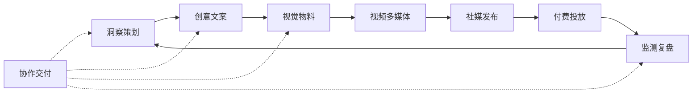
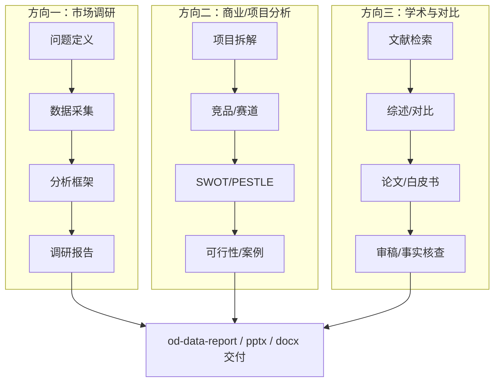

# 广告公关创意全流程：Skills 与 MCP 选型目录

> 面向 PilotDeck 项目维护者与业务选型。涵盖：项目已有能力、Claude 官方 Skills、Claude Cowork 知识工作插件、第三方营销/监测 Skills、**商业调研与学术分析 Skills**、MCP 工具，以及仓库级整合候选。
>
> **最后更新**：2026-06-01（改造分级 **L1–L3** + 集成测试说明）  
> **改造分级速查**：文末 [§十三、改造分级总表 L1–L3](#十三改造分级总表-l1l3)
> **相关文档**：[`open-design-admin-guide.md`](./open-design-admin-guide.md) · [`open-design-prompt-examples.md`](./open-design-prompt-examples.md) · [`saas-feasibility-report.md`](./saas-feasibility-report.md)

---

## 如何使用本文

1. 按下方「流程阶段」找到你关心的环节。
2. 在表格中勾选候选（可在「名称」列打 `[x]`）。
3. 查看该章 **「集成与测试」** 表，或文末 **§十三 L1–L3 总表** 确认改造量。
4. 把勾选结果发给维护者，或自行按「接入方式」安装。

**接入方式速记**

| 类型 | 命令 / 配置 | 落盘位置 |
|------|-------------|----------|
| Skill（单个） | `npx skills add <owner/repo@skill-name>` | 同步至 `~/.pilotdeck/skills` |
| Skill（整包） | `npx skills add coreyhaines31/marketingskills` | 同上 |
| MCP | 编辑 `~/.pilotdeck/mcp.json` 或项目 `.pilotdeck/mcp.json` | stdio 或 HTTP |
| 本仓 Skill | 已在 `skills/` 目录 | bootstrap 自动同步 |
| 仓库级整合 | 单独部署服务 + API/MCP | 见第四节 |

同步本仓技能：

```bash
node scripts/bootstrap-pilotdeck-config.mjs
```

### 改造分级 L1–L3（选型用）

| 级别 | 一句话 | 典型工作量 | 你要做多少改造 |
|------|--------|------------|----------------|
| **L1 拿来就用** | Skill 装进 `~/.pilotdeck/skills` 即可对话使用 | **0～2 小时** | 几乎零改造：`bootstrap` / `npx skills add` → `skill_list` 可见 → 对话里 `read_skill` |
| **L2 配好再用** | 除装 Skill 外，还要配 MCP、API Key、运行环境或 prompt 规范 | **0.5～2 天** | 改 `mcp.json`、环境变量、provider 配置；写 prompt 模板替代 Cowork 斜杠命令；Office/LaTeX 脚本环境 |
| **L3 项目级改造** | 要部署服务、写 smoke、接 UI/文档，或动平台能力 | **3 天～数周** | 自托管/Docker、定制 MCP 网关、整合进仓库脚本与 admin 文档、专项运维 |

**与旧版 1–5 分对照**：L1 ≈ 原 1–2 分 · L2 ≈ 原 3–4 分 · L3 ≈ 原 5 分。

**L1 验收标准（统一）**

1. `skill_list` 列出 skill 名称  
2. `skill_read` 能读完整 `SKILL.md`  
3. Agent 对话按 skill 产出 Markdown / HTML（`write_file` 可落盘）  

**L2 额外验收**：MCP 设置页 connected；或 pptx/docx 等二进制产物生成成功。  

**L3 额外验收**：专用 smoke 脚本通过；非技术人员可按 admin 文档复现。

**通用测试基线（Skill 接入后必做）**

1. 网关：`skill_list` 能列出该 skill 的 `name`。
2. 网关：`skill_read` 能读到完整 `SKILL.md`。
3. Agent 对话：发下方「提示词举例」，确认 Agent 调用 `read_skill` 并按 skill 结构产出。
4. 若有 MCP：Settings → MCP 显示 connected；对话中能调用 `mcp__*` 工具。
5. 若有文件交付：检查 `write_file` 落盘路径与格式（HTML/docx/pptx 等）。

**提示词写法约定（本文举例）**

- 显式点名 skill：`先 read_skill 读取 <skill-name>，然后…`
- 加「直接执行，不要反复问卷」可减少 Agent 中途追问（与 Open Design 联调经验一致）。
- 需要落地文件时写明路径，如 `写到 artifacts/research/xxx.md`。

---

## 流程总览



| 阶段 | 典型产出 | 本文对应章节 |
|------|----------|--------------|
| 洞察策划 | Brief、竞品分析、内容日历 | §3 Cowork · §4 营销 · **§5 调研分析** |
| **市场调研报告** | 行业研究、用户洞察、白皮书 | **§5.2 市场调研** |
| **商业/项目分析** | 可行性、竞品、案例、SWOT | **§5.3 商业分析** |
| **学术与对比研究** | 文献综述、论文、系统对比 | **§5.4 学术研究** |
| 创意文案 | 广告 copy、公关稿、品牌话术 | §2 官方 Skills · §3 Cowork marketing |
| 视觉物料 | 海报、落地页、轮播、PPT | §1 已有 od-* · §2 pptx/docx |
| 视频多媒体 | 短视频、脚本、配音 | §1 od-video · §7 Pixelle |
| 社媒发布 | 排期、多平台发帖 | §6 MCP 社媒 |
| 付费投放 | 广告账户、素材、报表 | §6 MCP 投放 |
| 监测复盘 | 舆情、SEO、投放数据 | §5.1 情报 · §6 MCP 数据 |
| 协作交付 | 文档、Slack、Notion | §3 productivity · §6 MCP 协作 |

---

## 一、项目已有能力（无需重复安装）

| 名称 | 地址 | 简介 | 适用环节 |
|------|------|------|----------|
| Open Design 总控 | 本仓 `skills/open-design` | 150 套设计系统、反 AI 味审稿、统一执行流程 | 全流程视觉规范 |
| od-saas-landing / od-poster-hero / od-deck-magazine 等 27 项 | 本仓 `skills/od-*` | 落地页、海报、演示稿、EDM、数据报告、社媒轮播等 HTML 物料 | 创意 · 视觉 · 提案 |
| od-social-carousel | 本仓 `skills/od-social-carousel` | 小红书风格多图轮播（3–7 张） | 社媒创意 |
| od-research-decision-room | 本仓 `skills/od-research-decision-room` | 研究决策可视化看板 | 策划 · 比稿 |
| od-video-gen / od-image-gen | 本仓 | 调用网关生图生视频 | 视频 · 配图 |
| frontend-slides | 本仓 `skills/frontend-slides` | Web 幻灯片 | 提案演示 |
| Figma MCP（文档已示例） | https://github.com/GLips/Figma-Developer-MCP | 读写 Figma 设计稿 | 设计交付 |
| 通义 / 火山 生图生视频 | provider 配置 | qwen-image、Seedance、Seedream | 国内素材生成 |
| find-skills | 本仓 `skills/find-skills` | 搜索 skills.sh 生态 | 扩展发现 |

完整 od-* 列表见 [`open-design-admin-guide.md`](./open-design-admin-guide.md#表面技能一览skillsod-)。

#### §1 集成与测试

| 名称 | 集成难度 | 需要做什么 | 测试条件 | Agent 提示词举例 |
|------|:--------:|------------|----------|------------------|
| Open Design + od-* | **1** | `node scripts/bootstrap-pilotdeck-config.mjs`；可选跑 `integration-open-design-smoke.mjs` | `skill_list` 含 `open-design`、`od-data-report`；smoke 产出 HTML | `先 read_skill 读取 open-design，再按 od-data-report 做一份「2025 中国新式茶饮市场」数据调研 HTML 报告，直接执行写到 artifacts/research/tea-market.html，不要反复问卷。` |
| od-research-decision-room | **1** | 同上 | 产出可交互决策看板 HTML | `read_skill od-research-decision-room，主题：是否在抖音投达人 vs 信息流，给出三方案对比看板，直接写 artifacts/research/channel-decision.html。` |
| Figma MCP | **4** | `mcp.json` 配 `figma-developer-mcp` + `FIGMA_TOKEN`；见 admin-guide §4.2 | MCP 连接成功；能 `mcp__figma__*` 读文件 | `用 Figma MCP 读取 [文件 URL] 的首页 Frame，总结品牌色与组件规范，并 read_skill od-saas-landing 做一版符合该规范的落地页 HTML。` |
| 通义/火山生图生视频 | **3** | `pilotdeck.yaml` 配 `tools.image` / `tools.video` 与 API Key | `integration-media-smoke.mjs` 或对话触发生图 | `read_skill od-image-gen，为「春季露营装备」campaign 生成 3 张 16:9 主视觉并说明 prompt。` |
| find-skills | **1** | 已在本仓 | `skill_list` 可见 | `用 find-skills 帮我在 skills.sh 找「行业研究报告」相关 skill，列出前 5 个与安装命令。` |

---

## 二、Claude 官方 Skills（anthropics/skills）

> 仓库：https://github.com/anthropics/skills · 约 180 万总安装 · Apache-2.0  
> 安装整包：`npx skills add anthropics/skills`

Anthropic 官方维护的通用 Agent Skills，适合作为**办公交付层**（文档、演示、品牌规范、内部沟通），与 Open Design 的 HTML 视觉产出互补。

| 名称 | 地址 | 安装量 | 简介 | 为什么适用 |
|------|------|--------|------|------------|
| **pptx** | https://skills.sh/anthropics/skills/pptx | ~128K | 创建与编辑 PowerPoint | 客户提案、比稿 deck；可与 od-deck-magazine 双轨（HTML + PPT） |
| **docx** | https://skills.sh/anthropics/skills/docx | ~109K | 创建与编辑 Word 文档 | 公关通稿、合同附件、正式 brief |
| **pdf** | https://skills.sh/anthropics/skills/pdf | 同包 | PDF 读取与生成 | 客户资料 ingestion、交付 PDF |
| **xlsx** | https://skills.sh/anthropics/skills/xlsx | 同包 | 电子表格操作 | 投放预算表、内容日历导出 |
| **brand-guidelines** | https://skills.sh/anthropics/skills/brand-guidelines | ~50K | 品牌调性、语气、视觉规范 | 多 agent 协作时统一品牌声线 |
| **internal-comms** | https://skills.sh/anthropics/skills/internal-comms | ~44K | 内部沟通、状态更新、FAQ | 项目组同步、客户周报话术 |
| **frontend-design** | https://skills.sh/anthropics/skills/frontend-design | 同包 | 高质量前端界面设计 | _campaign landing_ 快速原型 |
| **canvas-design** | https://skills.sh/anthropics/skills/canvas-design | 同包 | 视觉设计画布输出 | 社媒配图、信息图 |
| **web-artifacts-builder** | https://skills.sh/anthropics/skills/web-artifacts-builder | 同包 | 交互式 Web 产物 | 互动 H5、活动 microsite |
| **doc-coauthoring** | https://skills.sh/anthropics/skills/doc-coauthoring | 同包 | 协作文档共创流程 | 与客户/团队联写 brief |
| **theme-factory** | https://skills.sh/anthropics/skills/theme-factory | 同包 | 主题/样式工厂 | 多品牌 campaign 换肤 |
| **mcp-builder** | https://skills.sh/anthropics/skills/mcp-builder | 同包 | 构建 MCP 服务器指南 | 自研 Postiz/Pixelle 类 MCP 时参考 |
| **skill-creator** | https://skills.sh/anthropics/skills/skill-creator | 同包 | 编写新 Skill 的方法论 | 把内部 SOP 沉淀为 Skill |

**广告公关场景推荐最小集**：`pptx` + `docx` + `brand-guidelines` + `internal-comms`

#### §2 集成与测试

| 名称 | 集成难度 | 需要做什么 | 测试条件 | Agent 提示词举例 |
|------|:--------:|------------|----------|------------------|
| anthropics/skills 整包 | **3** | `npx skills add anthropics/skills`；部分 skill（pptx/docx/pdf）依赖 Python/Node 脚本，需在 Agent 环境可执行 | 任选 pptx：能生成 `.pptx` 或明确报错缺依赖 | `先 read_skill pptx，做 8 页「某 SaaS 产品 Q2 传播提案」PPT，含封面、洞察、策略、排期、预算，输出 proposal-q2.pptx。` |
| pptx | **3** | 同包；确认 `python`/`node` 与 skill 内脚本可跑 | 产出合法 pptx 或用 od-deck 作 HTML 备选 | 同上 |
| docx | **3** | 同包 | 产出 `.docx` 含标题/目录/正文 | `read_skill docx，写一份 3000 字「某品牌危机公关声明」Word 稿，含时间线、立场、媒体 Q&A，保存 artifacts/pr/statement.docx。` |
| pdf | **3** | 同包 | 能读入 PDF 并摘要 | `read_skill pdf，阅读 attachments/brief.pdf 并输出 500 字 executive summary。` |
| xlsx | **3** | 同包 | 产出含多 sheet 的 xlsx | `read_skill xlsx，做 campaign 预算表：渠道/金额/CPM/备注，保存 artifacts/campaign/budget.xlsx。` |
| brand-guidelines | **2** | 纯 Markdown 为主 | Agent 按规范审稿 | `read_skill brand-guidelines，审查下面这段社媒文案是否符合品牌语气：[粘贴文案]` |
| internal-comms | **2** | 纯 Markdown | 输出内部周报格式 | `read_skill internal-comms，写本周项目组周报：进展/风险/下周计划，给非技术老板看。` |
| frontend-design / canvas-design | **2** | 纯 Markdown；交付靠 write_file | 产出 HTML/CSS | `read_skill frontend-design，做一版活动报名页 HTML，移动端优先。` |
| skill-creator / mcp-builder | **2** | 方法论 skill | Agent 能按指南起草 SKILL.md | `read_skill skill-creator，把我们「行业调研 SOP」沉淀成可安装 skill 的 SKILL.md 草稿。` |

> **降级方案**：若 pptx/docx 脚本环境不齐，用 **od-deck-magazine + docx 纯 Markdown 导出** 或 **frontend-slides** 交付 HTML，难度降为 **2**。

---

## 三、Claude Cowork 知识工作插件（anthropics/knowledge-work-plugins）

> 仓库：https://github.com/anthropics/knowledge-work-plugins · ~18K stars · 230 skills · ~26 万总安装  
> 安装整包：`npx skills add anthropics/knowledge-work-plugins`  
> Cowork 内安装：`/plugin marketplace add anthropics/knowledge-work-plugins`

Anthropic 为 Claude Cowork / Claude Code 开源的**角色型插件包**。每个插件 = Skills（自动触发）+ Commands（斜杠命令）+ MCP Connectors（外部工具）。以下按插件列出，并标注与广告公关流程的关联度。

### 3.1 插件总览（11 个官方角色包）

| 插件 | 仓库路径 | 核心价值 | 推荐 MCP 连接器 | 广告公关关联 |
|------|----------|----------|-----------------|--------------|
| **marketing** | [`marketing/`](https://github.com/anthropics/knowledge-work-plugins/tree/main/marketing) | 内容、campaign、品牌、竞品、报表 | Slack, Canva, Figma, HubSpot, Ahrefs, Klaviyo, Notion | ⭐⭐⭐⭐⭐ 核心 |
| **productivity** | [`productivity/`](https://github.com/anthropics/knowledge-work-plugins/tree/main/productivity) | 任务、日历、每日工作流 | Notion, Asana, Linear, Slack, M365 | ⭐⭐⭐⭐ 项目管理 |
| **product-management** | [`product-management/`](https://github.com/anthropics/knowledge-work-plugins/tree/main/product-management) | 规格、路线图、用户研究 | Figma, Amplitude, Notion, Intercom | ⭐⭐⭐⭐ 新品发布 |
| **sales** | [`sales/`](https://github.com/anthropics/knowledge-work-plugins/tree/main/sales) | 客户调研、电话准备、pipeline | HubSpot, Clay, Fireflies, Slack | ⭐⭐⭐ B2B 提案 |
| **data** | [`data/`](https://github.com/anthropics/knowledge-work-plugins/tree/main/data) | SQL、可视化、统计分析 | Snowflake, BigQuery, Amplitude | ⭐⭐⭐⭐ 投放/效果数据 |
| **enterprise-search** | [`enterprise-search/`](https://github.com/anthropics/knowledge-work-plugins/tree/main/enterprise-search) | 跨工具信息检索 | Slack, Notion, Guru, M365 | ⭐⭐⭐ 知识库 |
| **customer-support** | [`customer-support/`](https://github.com/anthropics/knowledge-work-plugins/tree/main/customer-support) | 工单、回复、知识库 | Intercom, HubSpot, Guru | ⭐⭐ 舆情响应 |
| **legal** | [`legal/`](https://github.com/anthropics/knowledge-work-plugins/tree/main/legal) | 合同、NDA、合规 | Box, Egnyte, M365 | ⭐⭐⭐ 赞助/合作合同 |
| **finance** | [`finance/`](https://github.com/anthropics/knowledge-work-plugins/tree/main/finance) | 对账、报表、审计 | Snowflake, BigQuery | ⭐⭐ 预算/结案 |
| **bio-research** | [`bio-research/`](https://github.com/anthropics/knowledge-work-plugins/tree/main/bio-research) | 生命科学 R&D | 专业数据库 | ⭐ 垂直行业 |
| **cowork-plugin-management** | [`cowork-plugin-management/`](https://github.com/anthropics/knowledge-work-plugins/tree/main/cowork-plugin-management) | 定制组织专属插件 | — | ⭐⭐⭐ 二次开发 |

---

### 3.2 Marketing 插件（广告公关首选）

> 路径：https://github.com/anthropics/knowledge-work-plugins/tree/main/marketing

#### 斜杠命令（Commands）

| 命令 | 说明 | 典型场景 |
|------|------|----------|
| `/draft-content` | 博客、社媒、邮件、落地页、**新闻稿**、案例研究 | 内容量产 |
| `/campaign-plan` | 完整 campaign brief：目标、渠道、内容日历、KPI | 活动策划 |
| `/brand-review` | 对照品牌声线/style guide 审稿 | 出稿前质检 |
| `/competitive-brief` | 竞品调研 + 定位对比 | 比稿、提案 |
| `/performance-report` | 渠道效果报告 + 优化建议 | 结案复盘 |
| `/seo-audit` | 关键词、站内、内容缺口、技术 SEO | 官网/落地页 |
| `/email-sequence` | 多封 nurture/onboarding/drip 序列 | EDM 自动化 |

#### 核心 Skills

| Skill | 地址 | 简介 | 为什么适用 |
|------|------|------|------------|
| content-creation | 插件内 `skills/content-creation` | 各渠道写作模板、标题公式、CTA | 与 od-* 视觉配套 |
| campaign-planning | 插件内 | 渠道选择、日历、预算、KPI 框架 | 标准 campaign 流程 |
| brand-voice | 插件内 | 品牌声线文档、术语管理 | 与 brand-guidelines 互补 |
| competitive-analysis | 插件内 | 竞品研究、battlecard | 公关 positioning |
| performance-analytics | 插件内 | 分渠道指标、归因、优化 | 对接 GA4/HubSpot MCP |

#### 推荐 MCP 配对

Slack · Canva · Figma · HubSpot · Amplitude · Notion · Ahrefs · Similarweb · Klaviyo · Supermetrics

---

### 3.3 其他插件中与广告公关强相关的 Skills

以下 skill 可从整包安装后按需触发（skills.sh 可查单 skill 安装量）：

| Skill | 地址 | 安装量 | 所属插件 | 简介 | 适用环节 |
|------|------|--------|----------|------|----------|
| campaign-plan | https://skills.sh/anthropics/knowledge-work-plugins/campaign-plan | ~1.4K | marketing | 活动计划与里程碑 | 策划 |
| competitive-intelligence | https://skills.sh/anthropics/knowledge-work-plugins/competitive-intelligence | ~2.6K | 多插件 | 竞争情报方法论 | 洞察 |
| competitive-brief | 插件内 | — | marketing | 竞品简报 | 比稿 |
| brand-voice-enforcement | 插件内 | — | marketing | 强制品牌语气 | 审稿 |
| brand-review | 插件内 | — | marketing | 品牌一致性审查 | 审稿 |
| discover-brand | 插件内 | — | marketing | 品牌发现与定位 | 新品牌 onboarding |
| create-an-asset | 插件内 | — | marketing | 创建营销资产 | 创意 |
| canva-creator | 插件内 | — | marketing | Canva 资产创建流程 | 快速出图 |
| run-campaign | 插件内 | — | marketing | 执行 campaign 检查清单 | 上线 |
| content-strategy | 插件内 | — | marketing | 内容策略 | 策划 |
| draft-content | 插件内 | — | marketing | 多类型内容起草 | 文案 |
| email-sequence | 插件内 | — | marketing | 邮件序列设计 | EDM |
| performance-report | 插件内 | — | marketing | 效果报告 | 复盘 |
| data-visualization | https://skills.sh/anthropics/knowledge-work-plugins/data-visualization | ~7.6K | data | 图表与可视化 | 数据报告 |
| explore-data | 插件内 | — | data | 探索性数据分析 | 洞察 |
| statistical-analysis | 插件内 | — | data | 统计分析 | A/B 检验 |
| user-research | 插件内 | — | product-management | 用户研究 | 洞察 |
| user-research-synthesis | 插件内 | — | product-management | 研究综合 | 策划 |
| research-synthesis | 插件内 | — | 多插件 | 多源研究汇总 | 洞察 |
| meeting-briefing | 插件内 | — | productivity | 会议简报 | 客户会 |
| daily-briefing | 插件内 | — | productivity | 每日简报 | 运营 |
| stakeholder-update | 插件内 | — | 多插件 | 干系人进展更新 | 客户沟通 |
| draft-outreach | 插件内 | — | sales | 外联邮件起草 | BD/媒体联络 |
| account-research | 插件内 | — | sales | 客户/媒体背景调研 | 公关 pitch |
| call-prep | 插件内 | — | sales | 电话/会议准备 | 客户提案 |
| design-critique | 插件内 | — | product-management | 设计审稿 | 创意 QC |
| ux-copy | 插件内 | — | product-management | 界面文案 | 产品传播 |
| task-management | https://skills.sh/anthropics/knowledge-work-plugins/task-management | ~4.3K | productivity | 任务分解与跟踪 | 项目管理 |
| documentation | https://skills.sh/anthropics/knowledge-work-plugins/documentation | ~4.5K | 多插件 | 结构化文档 | SOP/手册 |
| knowledge-synthesis | 插件内 | — | enterprise-search | 知识综合 | 调研 |
| legal-risk-assessment | 插件内 | — | legal | 法律风险评估 | 赞助合规 |
| review-contract | 插件内 | — | legal | 合同审查 | 合作条款 |

**Cowork 广告公关推荐最小集**

```bash
# PilotDeck / 任意 MCP Agent
npx skills add anthropics/knowledge-work-plugins

# 或只装 marketing 相关（从仓库 marketing/skills/ 目录迁移单个 SKILL.md）
```

重点启用：**marketing 插件全套** + `data-visualization` + `competitive-intelligence` + `task-management`

#### §3 集成与测试

| 名称 | 集成难度 | 需要做什么 | 测试条件 | Agent 提示词举例 |
|------|:--------:|------------|----------|------------------|
| knowledge-work-plugins 整包 | **3** | `npx skills add anthropics/knowledge-work-plugins`（230 个 skill 目录）；**斜杠命令不可用**，需用自然语言等价 prompt | `skill_list` 含 `campaign-plan`、`competitive-intelligence` 等 | `先 read_skill campaign-plan，为「618 美妆品类」写完整 campaign brief：目标、人群、渠道、4 周内容日历、KPI，直接输出 Markdown。` |
| marketing 插件（代表） | **3** | 整包安装；可选配 Notion/HubSpot/Ahrefs MCP（**4**） | 无 MCP 时仍能出 brief/文案 | `read_skill content-creation 与 competitive-analysis，写竞品 X/Y/Z 对比 battlecard（定位、人群、渠道、话术差异）。` |
| `/campaign-plan` 等价 | **3** | 用 prompt 替代 slash | 输出含目标/渠道/日历/KPI | `按 knowledge-work marketing 插件的 campaign-plan 流程：目标 500 线索、预算 5 万、周期 6 周，输出完整 brief。` |
| `/competitive-brief` 等价 | **3** | 同上 | 含 3+ 竞品对比表 | `read_skill competitive-intelligence，行业：企业级 AI 客服，对比 4 家竞品并给传播建议。` |
| data-visualization | **3** | 整包内 skill；有数据文件更佳 | 输出图表 spec 或 Markdown 表 | `read_skill data-visualization，根据下面 CSV 摘要写投放复盘并建议 3 种图表类型：[粘贴数据]` |
| productivity / task-management | **2** | 纯 Markdown skill | 输出任务分解 | `read_skill task-management，把「上市发布」拆成 2 周任务清单与负责人建议。` |
| sales → account-research | **3** | 配 Clay/HubSpot MCP 可升到 **4** | 无 MCP 时用公开信息 | `read_skill account-research，调研「某新能源品牌」市场负责人背景，写媒体 pitch 要点。` |
| data 插件（SQL/BI） | **4** | 需 Snowflake/BigQuery MCP + 凭据 | MCP 能查数 | `read_skill sql-queries，通过已连接的数据仓库查上月各渠道 ROI（需 MCP）。` |

---

## 四、营销专业 Skills（marketingskills 等）

### 4.1 coreyhaines31/marketingskills（首选大包）

> 仓库：https://github.com/coreyhaines31/marketingskills · ~31K stars · 62 skills · ~250 万总安装  
> 安装：`npx skills add coreyhaines31/marketingskills`

| Skill | 地址 | 安装量 | 简介 | 流程阶段 |
|------|------|--------|------|----------|
| seo-audit | https://skills.sh/coreyhaines31/marketingskills/seo-audit | ~124K | 站内 SEO 全面审计 | 监测 |
| copywriting | https://skills.sh/coreyhaines31/marketingskills/copywriting | ~114K | 广告文案、落地页 copy | 创意 |
| marketing-psychology | https://skills.sh/coreyhaines31/marketingskills/marketing-psychology | ~84K | 消费心理、说服框架 | 策划 |
| content-strategy | https://skills.sh/coreyhaines31/marketingskills/content-strategy | ~79K | 内容策略与选题矩阵 | 策划 |
| programmatic-seo | https://skills.sh/coreyhaines31/marketingskills/programmatic-seo | ~77K | 规模化 SEO 页面 | 监测 |
| marketing-ideas | https://skills.sh/coreyhaines31/marketingskills/marketing-ideas | ~75K | 增长/传播创意 brainstorm | 策划 |
| ad-creative | https://skills.sh/coreyhaines31/marketingskills/ad-creative | ~58K | 广告创意方向与 hook | 创意 |
| analytics-tracking | https://skills.sh/coreyhaines31/marketingskills/analytics-tracking | ~58K | 埋点、指标、看板 | 复盘 |
| paid-ads | https://skills.sh/coreyhaines31/marketingskills/paid-ads | 同包 | 付费投放策略 | 投放 |
| social-content | https://skills.sh/coreyhaines31/marketingskills/social-content | 同包 | 各平台帖文与互动 | 社媒 |
| launch-strategy | https://skills.sh/coreyhaines31/marketingskills/launch-strategy | 同包 | 上市/发布节奏 | 策划 |
| customer-research | https://skills.sh/coreyhaines31/marketingskills/customer-research | ~40K | 用户洞察、persona | 洞察 |
| competitor-profiling | https://skills.sh/coreyhaines31/marketingskills/competitor-profiling | 同包 | 竞品画像 | 洞察 |
| ai-seo | https://skills.sh/coreyhaines31/marketingskills/ai-seo | 同包 | AI 搜索可见度（GEO） | 监测 |
| email-sequence | https://skills.sh/coreyhaines31/marketingskills/email-sequence | 同包 | 邮件 nurture 序列 | EDM |
| copy-editing | https://skills.sh/coreyhaines31/marketingskills/copy-editing | 同包 | 文案润色与删减 | 审稿 |
| community-marketing | https://skills.sh/coreyhaines31/marketingskills/community-marketing | 同包 | 社区运营 | 社媒 |
| lead-magnets | https://skills.sh/coreyhaines31/marketingskills/lead-magnets | 同包 | 引流 magnet 设计 | 转化 |
| ab-test-setup | https://skills.sh/coreyhaines31/marketingskills/ab-test-setup | 同包 | A/B 实验设计 | 优化 |

完整 62 skill 列表：https://skills.sh/coreyhaines31/marketingskills

#### §4 集成与测试

| 名称 | 集成难度 | 需要做什么 | 测试条件 | Agent 提示词举例 |
|------|:--------:|------------|----------|------------------|
| marketingskills 整包（62） | **2** | `npx skills add coreyhaines31/marketingskills`；约 62 个目录写入 `~/.pilotdeck/skills` | 抽查 `copywriting`、`seo-audit` 在 `skill_list` | `read_skill content-strategy，为 B2B 工业软件做 90 天内容日历（主题/渠道/CTA）。` |
| copywriting | **2** | 单 skill 可 `npx skills add …@copywriting` | 输出多版 headline + 正文 | `read_skill copywriting，产品：智能客服，写 5 条信息流标题 + 200 字落地页首屏。` |
| customer-research | **2** | 纯 Markdown | 含 persona、访谈提纲 | `read_skill customer-research，品类：宠物鲜食，输出 2 个 persona + 10 个访谈问题。` |
| competitor-profiling | **2** | 纯 Markdown | 3 竞品结构化画像 | `read_skill competitor-profiling，对比 A/B/C 三家 DTC 咖啡品牌的定位与渠道。` |
| ad-creative | **2** | 纯 Markdown | 3 个创意方向 + hook | `read_skill ad-creative，618 大促家电品类，给 3 套创意概念与主视觉一句话。` |
| seo-audit / ai-seo | **3** | 完整审计需 GSC/Ahrefs MCP（**4**）；无 MCP 时出检查清单 | 输出 audit 报告 Markdown | `read_skill seo-audit，站点 example.com（公开可见部分），出技术+内容 SEO 检查清单与优先级。` |
| seo-geo-claude-skills 整包 | **3** | 从 GitHub 克隆或 `skills add`；skill 多、需选子目录 | 任一 optimize skill 可读 | `read_skill on-page-seo-auditor（来自 seo-geo 包），审计首页 E-E-A-T 与 AI 引用友好度。` |
| apify-brand-reputation-monitoring | **4** | Skill + Apify MCP + `APIFY_TOKEN` | MCP 调用成功 | `read_skill apify-brand-reputation-monitoring，监测「某手机品牌」近 7 天中文舆情摘要。` |
| brandkit / creative-director | **2** | 纯 Markdown | 品牌 kit 或审稿意见 | `read_skill brandkit，为「极简北欧家居」定义色板、字体、语气三要素。` |
| remotion-best-practices | **3** | 需 Node/React 环境若真要渲染视频 | Agent 输出 Remotion 组件草稿 | `read_skill remotion-best-practices，做 15 秒数据亮点片头 Remotion 结构说明与伪代码。` |

**同档继承（均为 2 分，测试：read_skill + 结构化 Markdown 输出）**：marketing-psychology、marketing-ideas、social-content、launch-strategy、email-sequence、copy-editing、paid-ads、analytics-tracking、ab-test-setup 等 marketingskills 包内纯方法论 skill。

---

### 4.2 SEO / GEO 专项 Skills

**已接入（2026-06-07）**：`skills/pd-geo`（L2 全案）+ `skills/vendor/seo-geo/geo-*`（aaron-he-zhu 精选 7 项 + best-aeo + geo-citability）+ `mkt-ai-seo` / `mkt-seo-audit`；能力中心六阶段均有「AI搜索」Pill。选型见 [ai-search-skills-matrix.zh-CN.md](./ai-search-skills-matrix.zh-CN.md)。

| 名称 | 地址 | 简介 | 为什么适用 |
|------|------|------|------------|
| **pd-geo + seo-geo 包（已接入）** | 本仓 `skills/pd-geo` + `skills/vendor/seo-geo/` | AI 搜索全案 + 关键词/审计/跟踪 | 飞轮 AI 搜索主路径 |
| seo-geo-claude-skills（20+） | https://github.com/aaron-he-zhu/seo-geo-claude-skills | 关键词、内容、排名监测、CORE-EEAT | 已 vendor 精选 7 项 |
| best-aeo-skill | https://github.com/metawhisp/best-aeo-skill | Princeton GEO 四维审计 | 已接入 `geo-aeo-audit` |
| geo-seo-claude | https://github.com/zubair-trabzada/geo-seo-claude | citability 评分、llms.txt、PDF 报告 | 已接入 `geo-citability` |
| SEO-AEO-GEO-Assistant | https://github.com/kxwu222/SEO-AEO-GEO-Assistant | AI 代理用 SEO/AEO/GEO 模块化 skill | 备选，未 vendor |
| apify-brand-reputation-monitoring | https://skills.sh/apify/agent-skills/apify-brand-reputation-monitoring | 品牌声誉监测工作流 | 舆情；配 Apify MCP |

---

### 4.3 品牌、社媒与其他补充 Skills

| 名称 | 地址 | 安装量 | 简介 | 适用环节 |
|------|------|--------|------|----------|
| brandkit | https://skills.sh/leonxlnx/taste-skill/brandkit | ~46K | 品牌 kit 结构化 | 与 Open Design 设计系统联动 |
| creative-director | https://skills.sh/nexu-io/open-design/creative-director | ~580 | 创意总监式审稿 | 创意 QC（与 od 同源） |
| social-media-manager | https://skills.sh/alirezarezvani/claude-skills/social-media-manager | ~630 | 社媒运营 SOP | 社媒 |
| campaign-analytics | https://skills.sh/alirezarezvani/claude-skills/campaign-analytics | ~619 | 活动效果分析 | 复盘 |
| competitive-ads-extractor | https://skills.sh/composiohq/awesome-claude-skills/competitive-ads-extractor | ~2.7K | 竞品广告素材提取 | 创意情报 |
| giving-presentations | https://skills.sh/refoundai/lenny-skills/giving-presentations | ~1.7K | Lenny 系演示技巧 | 客户提案 |
| competitive-analysis | https://skills.sh/refoundai/lenny-skills/competitive-analysis | ~2.2K | 竞品分析框架 | 比稿 |
| ai-video-generation | https://skills.sh/skills-shell/skills/ai-video-generation | ~207K | 短视频生成指引 | 视频 |
| remotion-best-practices | https://skills.sh/remotion-dev/skills/remotion-best-practices | ~341K | 程序化视频（React） | 模板化片头/数据视频 |

---

## 五、商业分析、调研与研究报告 Skills（扩展）

> 本节对应三大方向：**① 市场调研与专业调研报告** · **② 商业/互联网项目深度分析** · **③ 专业对比、学术研究与论文**  
> 与 §1 的 `od-research-decision-room`、`od-data-report` 配合：Skill 负责**方法论与文稿结构**，Open Design 负责**可视化交付**（HTML 报告页 / deck）。



---

### 5.1 数据采集与情报前置（三类调研共用）

| 名称 | 地址 | 安装量 | 简介 | 为什么适用 |
|------|------|--------|------|------------|
| firecrawl（CLI 包） | https://skills.sh/firecrawl/cli/firecrawl | ~64K | 网页抓取/搜索/爬取 | 竞品官网、行业新闻、政策页 |
| firecrawl-deep-research | https://skills.sh/firecrawl/firecrawl-workflows/firecrawl-deep-research | ~7.7K | 深度研究 workflow | 行业报告素材采集 |
| firecrawl-competitive-intel | https://skills.sh/firecrawl/firecrawl-workflows/firecrawl-competitive-intel | ~7.6K | 竞争情报 | 比稿前竞品扫描 |
| tavily-research | https://skills.sh/tavily-ai/skills/tavily-research | ~11K | Tavily 实时搜索研究 | 热点、政策、舆情 |
| parallel-deep-research | https://skills.sh/parallel-web/parallel-agent-skills/parallel-deep-research | ~9K | 并行深度研究 | 大型调研、多源交叉验证 |
| apify-market-research | https://skills.sh/sickn33/antigravity-awesome-skills/apify-market-research | ~83 | 市场研究 + Apify 数据 | 结构化市场数据；配 Apify MCP |
| apify-brand-reputation-monitoring | https://skills.sh/apify/agent-skills/apify-brand-reputation-monitoring | ~2.5K | 品牌声誉监测 | 舆情章节素材 |
| apify-content-analytics | https://skills.sh/apify/agent-skills/apify-content-analytics | ~2.5K | 内容表现分析 | 社媒/内容赛道分析 |
| persona-researcher | https://skills.sh/googleworkspace/cli/persona-researcher | ~16K | 用户 persona 研究 | 消费者/受众画像 |
| fact-checker | https://skills.sh/shubhamsaboo/awesome-llm-apps/fact-checker | ~2.5K | 事实核查 | 报告出稿前验真 |
| **od-research-decision-room** | 本仓 `skills/od-research-decision-room` | 内置 | 研究决策可视化看板 | 调研结论一页呈现 |
| **od-data-report** | 本仓 `skills/od-data-report` | 内置 | 数据汇报 HTML 页 | 调研/分析可视化交付 |

> Firecrawl / Tavily / Apify / Brave Search MCP 需 API Key；调研类 Skill 建议与 **fact-checker** 组合，降低幻觉风险。

---

### 5.2 方向一：市场调研与专业调研报告

面向：行业研究、品类扫描、用户洞察、**可交付的调研报告/白皮书**。

#### 5.2.1 首选 Skill 大包

| 大包 | 地址 | 规模 | 安装命令 | 说明 |
|------|------|------|----------|------|
| **bytedance/deer-flow** ⭐ | https://github.com/bytedance/deer-flow | 21 skills · ~29K 安装 | `npx skills add bytedance/deer-flow` | 字节开源；含咨询分析、深度研究、数据图表、PPT、文献综述 |
| **coreyhaines31/marketingskills** | https://skills.sh/coreyhaines31/marketingskills | 62 skills | `npx skills add coreyhaines31/marketingskills` | customer-research、competitor-profiling、content-strategy |
| **anthropics/knowledge-work-plugins** | §3 | 230 skills | `npx skills add anthropics/knowledge-work-plugins` | competitive-intelligence、research-synthesis、data-visualization |
| **shubhamsaboo/awesome-llm-apps** | https://skills.sh/shubhamsaboo/awesome-llm-apps | 20 skills · ~59K | `npx skills add shubhamsaboo/awesome-llm-apps` | academic-researcher、deep-research、data-analyst、strategy-advisor |

#### 5.2.2 市场调研与报告写作（单项）

| 名称 | 地址 | 安装量 | 简介 | 典型产出 |
|------|------|--------|------|----------|
| **consulting-analysis** | https://skills.sh/bytedance/deer-flow/consulting-analysis | ~1.5K | 咨询式结构化分析（问题树、假设、结论） | 行业进入策略、品类机会报告 |
| **deep-research** | https://skills.sh/bytedance/deer-flow/deep-research | 同包 | 多轮检索 + 综合 | 深度行业扫描 |
| deep-research | https://skills.sh/shubhamsaboo/awesome-llm-apps/deep-research | 同包 | 通用深度研究流程 | 同上 |
| deep-research-pro | https://skills.sh/parags/deep-research-pro/deep-research-pro | ~314 | 增强版深度研究 | 大型定制调研 |
| customer-research | https://skills.sh/coreyhaines31/marketingskills/customer-research | ~40K | 用户洞察、访谈、persona | 消费者调研章节 |
| competitor-profiling | https://skills.sh/coreyhaines31/marketingskills/competitor-profiling | 同包 | 竞品画像 | 竞争格局章节 |
| industry-research | https://skills.sh/rkreddyp/investrecipes/industry-research | ~387 | 行业研究框架 | TAM/SAM、产业链 |
| longbridge-industry-overview | https://skills.sh/longbridge/skills/longbridge-industry-overview | ~327 | 行业概览（偏金融视角） | 赛道速览 |
| industry-expert | https://skills.sh/jmsktm/claude-settings/industry-expert | ~151 | 行业专家视角输出 | 垂直行业 deep dive |
| sector-analyst | https://skills.sh/nicepkg/ai-workflow/sector-analyst | ~74 |  sector 分析师 | 细分赛道对比 |
| industry-pulse | https://skills.sh/majesticlabs-dev/majestic-marketplace/industry-pulse | ~73 | 行业脉搏/趋势 | 趋势简报 |
| researching-markets | https://skills.sh/jesseotremblay/claude-skills/researching-markets | ~28 | 市场研究 SOP | 入门向 |
| market-research | https://skills.sh/jk-0001/skills/market-research | ~71 | 市场调研流程 | 标准 MR 结构 |
| business-analyst | https://skills.sh/sickn33/antigravity-awesome-skills/business-analyst | ~723 | 业务分析师角色 | 需求/市场交叉分析 |
| strategy-advisor | https://skills.sh/shubhamsaboo/awesome-llm-apps/strategy-advisor | 同包 | 战略建议 | 报告「建议与行动」章节 |
| data-analyst | https://skills.sh/shubhamsaboo/awesome-llm-apps/data-analyst | 同包 | 数据分析叙事 | 定量章节 |
| chart-visualization | https://skills.sh/bytedance/deer-flow/chart-visualization | 同包 | 图表可视化规范 | 报告图表说明 |
| data-visualization | https://skills.sh/anthropics/knowledge-work-plugins/data-visualization | ~7.6K | 数据可视化 | 与 od-data-report 互补 |
| case-study-writing | https://skills.sh/inference-sh/skills/case-study-writing | ~432 | 案例研究写作 | 标杆案例章节 |
| white-paper-author | https://skills.sh/jmsktm/claude-settings/white-paper-author | ~138 | 白皮书作者 | B2B 白皮书 |
| brief | https://skills.sh/alirezarezvani/claude-skills/brief | ~323 | 结构化 brief | 调研任务启动 |
| **pptx** / **docx** | §2 anthropics/skills | ~128K / ~109K | Office 交付 | PDF/Word/PPT 终稿 |

#### 5.2.3 专业调研报告结构参考（Skill 组合用法）

| 报告类型 | 推荐 Skill 链 | 可视化交付 |
|----------|---------------|------------|
| 行业研究报告 | industry-research → deep-research → consulting-analysis → chart-visualization | od-data-report + pptx |
| 消费者洞察报告 | persona-researcher → customer-research → case-study-writing | od-research-decision-room |
| 竞品扫描报告 | firecrawl-competitive-intel → competitor-profiling → competitive-brief | od-deck-magazine |
| B2B 白皮书 | white-paper-author → fact-checker → seo-audit（可选 GEO 章） | docx + od-article-magazine |

---

### 5.3 方向二：商业 / 互联网项目深度分析

面向：SaaS/产品/平台项目、投融资材料、**可行性分析**、商业模式拆解、互联网赛道比较。

#### 5.3.1 分析框架类 Skills

| 名称 | 地址 | 安装量 | 简介 | 适用场景 |
|------|------|--------|------|----------|
| **consulting-analysis** | https://skills.sh/bytedance/deer-flow/consulting-analysis | ~1.5K | MECE、问题树、咨询报告体例 | 项目可行性、战略选项 |
| consulting-frameworks | https://skills.sh/aznatkoiny/zai-skills/consulting-frameworks | ~146 | 经典咨询框架库 | 快速选型框架 |
| strategy-and-competitive-analysis | https://skills.sh/lyndonkl/claude/strategy-and-competitive-analysis | ~309 | 战略与竞争分析 | 定位与护城河 |
| **swot-analysis** | https://skills.sh/phuryn/pm-skills/swot-analysis | ~1K | SWOT 结构化输出 | 项目/品牌速评 |
| swot-pestle-analysis | https://skills.sh/melodic-software/claude-code-plugins/swot-pestle-analysis | ~91 | SWOT + PESTLE | 宏观+微观 |
| biz-porters-five-forces | https://skills.sh/asgard-ai-platform/skills/biz-porters-five-forces | ~20 | 波特五力 | 行业结构分析 |
| competitive-analysis | https://skills.sh/refoundai/lenny-skills/competitive-analysis | ~2.2K | Lenny 系竞品框架 | 互联网产品对比 |
| competitive-intelligence | https://skills.sh/anthropics/knowledge-work-plugins/competitive-intelligence | ~2.6K | 竞争情报方法论 | 持续监测型分析 |
| competitive-analyst | https://skills.sh/404kidwiz/claude-supercode-skills/competitive-analyst | ~171 | 竞品分析师角色 | 多产品矩阵对比 |
| wshobson competitive-landscape | https://skills.sh/wshobson/agents/competitive-landscape | ~7K | 竞争格局地图 | 赛道玩家全景 |
| product-marketing-context | https://skills.sh/coreyhaines31/marketingskills/product-marketing-context | 同包 | 产品营销上下文 | SaaS GTM 分析 |
| launch-strategy | https://skills.sh/coreyhaines31/marketingskills/launch-strategy | 同包 | 上市策略 | 新产品上线评估 |
| feasibility-assessor | https://skills.sh/mathews-tom/armory/feasibility-assessor | ~75 | 可行性评估 | 技术/商业可行性 gate |
| tech-due-diligence | https://skills.sh/onewave-ai/claude-skills/tech-due-diligence | ~95 | 技术尽调 | 互联网项目技术面 |
| startup-due-diligence | https://skills.sh/skala-io/legal-skills/startup-due-diligence | ~227 | 创业尽调清单 | 投融资材料 |
| ma-playbook | https://skills.sh/alirezarezvani/claude-skills/ma-playbook | ~499 | 并购 playbook | 整合类项目 |
| github-deep-research | https://skills.sh/bytedance/deer-flow/github-deep-research | ~1.6K | GitHub 开源项目深研 | 开源/SaaS 竞品代码与社区 |
| data-analysis | https://skills.sh/bytedance/deer-flow/data-analysis | ~2.1K | 数据分析流程 | 指标验证、增长分析 |
| visualization-expert | https://skills.sh/shubhamsaboo/awesome-llm-apps/visualization-expert | 同包 | 可视化专家 | 商业数据图表叙事 |

#### 5.3.2 互联网 / SaaS 项目专题

| 名称 | 地址 | 简介 | 与 PilotDeck 关系 |
|------|------|------|-------------------|
| 本仓 SaaS 可行性样例 | [`saas-feasibility-report.md`](./saas-feasibility-report.md) | 单机→SaaS 改造分析范例 | 可沉淀为内部 Skill 模板 |
| od-saas-landing | 本仓 | SaaS 落地页原型 | 分析→原型一体 |
| od-pricing-page | 本仓 | 定价页 | 商业模式可视化 |
| od-dashboard | 本仓 | 数据看板 UI | 产品能力演示 |
| web-design-guidelines | https://skills.sh/bytedance/deer-flow/web-design-guidelines | Web 设计规范审计 | 互联网产品 UX 评估 |
| frontend-design | §2 anthropics/skills | 前端设计质量 | 产品界面分析 |

#### 5.3.3 商业项目分析报告结构参考

| 分析类型 | 推荐 Skill 链 | 交付 |
|----------|---------------|------|
| 互联网产品竞品对比 | github-deep-research → competitive-landscape → swot-analysis | od-deck-magazine |
| SaaS 可行性 | feasibility-assessor → consulting-analysis → product-marketing-context | docx（可参考 saas-feasibility-report 体例） |
| 赛道进入策略 | industry-research → biz-porters-five-forces → strategy-advisor | pptx + od-data-report |
| 投融资 Teaser | startup-due-diligence → data-analysis → case-study-writing | docx + xlsx |

---

### 5.4 方向三：专业对比、学术研究与论文

面向：文献综述、系统对比、学术论文、研究报告、**严谨引用与审稿**。

#### 5.4.1 学术研究 Skill 大包

| 大包 | 地址 | 规模 | 安装命令 | 核心能力 |
|------|------|------|----------|----------|
| **lingzhi227/agent-research-skills** ⭐ | https://github.com/lingzhi227/agent-research-skills | 31 skills · ~20K | `npx skills add lingzhi227/agent-research-skills` | 文献检索、综述、LaTeX、图表、论文各章节 |
| **imbad0202/academic-research-skills** | https://skills.sh/imbad0202/academic-research-skills | 4 skills · ~10K | `npx skills add imbad0202/academic-research-skills` | 论文写作、审稿、deep-research pipeline |
| **bytedance/deer-flow** | §5.2.1 | 含 academic-paper-review、systematic-literature-review | 同包 | 系统综述 + 论文审稿 |
| **bahayonghang/academic-writing-skills** | https://skills.sh/bahayonghang/academic-writing-skills | 多 skill | `npx skills add bahayonghang/academic-writing-skills` | LaTeX 论文/学位论文（中英文） |
| **aaron-he-zhu/seo-geo-claude-skills** | https://github.com/aaron-he-zhu/seo-geo-claude-skills | 20+ | GitHub 安装 | 若报告含 GEO/SEO 学术对比 |
| **huangwb8/chineseresearchlatex** | https://skills.sh/huangwb8/chineseresearchlatex | 中文科研 LaTeX | 单包 | 中文论文与系统综述 |

#### 5.4.2 文献、论文与对比分析（单项）

| 名称 | 地址 | 安装量 | 简介 | 典型产出 |
|------|------|--------|------|----------|
| **systematic-literature-review** | https://skills.sh/bytedance/deer-flow/systematic-literature-review | ~704 | PRISMA 式系统文献综述 | 学术/政策综述报告 |
| systematic-literature-review | https://skills.sh/huangwb8/chineseresearchlatex/systematic-literature-review | ~755 | 中文系统综述 | 中文学位/课题 |
| **literature-review** | https://skills.sh/lingzhi227/agent-research-skills/literature-review | ~1.1K | 文献综述写作 | Related Work 章节 |
| literature-review | https://skills.sh/affaan-m/everything-claude-code/literature-review | ~1.1K | 通用文献综述 | 跨学科扫描 |
| literature-search | https://skills.sh/lingzhi227/agent-research-skills/literature-search | 同包 | 文献检索策略 | 数据库/关键词设计 |
| **academic-researcher** | https://skills.sh/shubhamsaboo/awesome-llm-apps/academic-researcher | ~5.3K | 学术研究助手 | 课题设计、方法论 |
| academic-paper | https://skills.sh/imbad0202/academic-research-skills/academic-paper | ~2.9K | 学术论文撰写 | 期刊/会议稿 |
| academic-paper-reviewer | https://skills.sh/imbad0202/academic-research-skills/academic-paper-reviewer | ~3K | 论文审稿 | Peer review 模拟 |
| academic-paper-review | https://skills.sh/bytedance/deer-flow/academic-paper-review | 同包 | 论文评审 | 出稿前 QC |
| academic-pipeline | https://skills.sh/imbad0202/academic-research-skills/academic-pipeline | 同包 | 研究 pipeline | 端到端科研流程 |
| academic-search | https://skills.sh/claude-office-skills/skills/academic-search | ~3K | 学术搜索 | Google Scholar 等 |
| deep-research | https://skills.sh/lingzhi227/agent-research-skills/deep-research | 同包 | 科研向深度研究 | 多源文献综合 |
| survey-generation | https://skills.sh/lingzhi227/agent-research-skills/survey-generation | 同包 | Survey 论文生成 | 综述型论文 |
| related-work-writing | https://skills.sh/lingzhi227/agent-research-skills/related-work-writing | 同包 | Related Work 专章 | 对比已有工作 |
| novelty-assessment | https://skills.sh/lingzhi227/agent-research-skills/novelty-assessment | 同包 | 创新性评估 | 研究贡献界定 |
| citation-management | https://skills.sh/lingzhi227/agent-research-skills/citation-management | 同包 | 引用管理 | BibTeX/格式 |
| latex-paper-en | https://skills.sh/bahayonghang/academic-writing-skills/latex-paper-en | ~2.5K | 英文 LaTeX 论文 | 投稿格式 |
| latex-thesis-zh | https://skills.sh/bahayonghang/academic-writing-skills/latex-thesis-zh | ~2.1K | 中文学位论文 LaTeX | 硕博论文 |
| firecrawl-research-papers | https://skills.sh/firecrawl/firecrawl-workflows/firecrawl-research-papers | ~7.8K | 论文/预印本抓取 | 文献素材 |
| results-report | https://skills.sh/galaxy-dawn/claude-scholar/results-report | ~165 | 研究结果报告 | 实验/调研结果章 |
| grad-systematic-review | https://skills.sh/asgard-ai-platform/skills/grad-systematic-review | ~33 | 研究生系统综述 | 课程/课题 |
| fact-checker | https://skills.sh/shubhamsaboo/awesome-llm-apps/fact-checker | ~2.5K | 事实核查 | 学术/商业报告验真 |

#### 5.4.3 专业方向对比研究

| 名称 | 地址 | 简介 | 适用 |
|------|------|------|------|
| competitive-analysis | §5.3 / Cowork marketing | 商业竞品对比 | 产品/品牌 |
| strategy-and-competitive-analysis | §5.3 | 战略选项对比 | 战略咨询 |
| systematic-literature-review | §5.4.2 | 学术流派/方法对比 | 科研 |
| related-work-writing | §5.4.2 | 前人工作对比表 | 论文 |
| novelty-assessment | §5.4.2 | 创新点差异化 | 开题/投稿 |
| seo-geo-claude-skills | https://github.com/aaron-he-zhu/seo-geo-claude-skills | SEO/GEO 方法对比 | 营销技术向 |
| competitor-alternatives | https://skills.sh/coreyhaines31/marketingskills/competitor-alternatives | 「Alternatives」式对比页 | 互联网 SaaS 内容营销 |
| comp-analysis | Cowork 插件内 | 薪酬/竞品 comp（HR 向） | 若报告含组织维度 |

#### 5.4.4 学术 / 对比研究报告结构参考

| 报告类型 | 推荐 Skill 链 | 交付 |
|----------|---------------|------|
| 系统文献综述 | literature-search → systematic-literature-review → citation-management | LaTeX / docx |
| 学术论文草稿 | academic-researcher → paper-writing-section → academic-paper → self-review | latex-paper-en |
| 方法/技术对比白皮书 | deep-research → related-work-writing → fact-checker | docx + od-article-magazine |
| 行业学术政策综述 | firecrawl-research-papers → literature-review → results-report | pptx |

---

### 5.5 调研分析方向：推荐 Skill 组合包

#### 包 E：市场调研报告（方向一）

| 类型 | 项 | 覆盖 |
|------|-----|------|
| 大包 | `bytedance/deer-flow`（consulting-analysis + deep-research + chart-visualization） | 框架+研究+图表 |
| 补充 | marketingskills → customer-research, competitor-profiling | 用户与竞品 |
| 交付 | anthropics/skills → docx, pptx；本仓 od-data-report | 正式报告 |
| MCP | Firecrawl + Tavily（或 Brave Search） | 实时数据 |
| 质控 | fact-checker | 验真 |

#### 包 F：商业 / 互联网项目分析（方向二）

| 类型 | 项 | 覆盖 |
|------|-----|------|
| 框架 | deer-flow consulting-analysis + phuryn swot-analysis + competitive-landscape | 战略分析 |
| 互联网 | github-deep-research + product-marketing-context + web-design-guidelines | 产品/开源竞品 |
| 可行性 | feasibility-assessor + saas-feasibility-report（模板） | SaaS/平台评估 |
| 交付 | docx + od-deck-magazine + od-saas-landing（可选原型） | 报告+提案 |

#### 包 G：学术与专业对比（方向三）

| 类型 | 项 | 覆盖 |
|------|-----|------|
| 大包 | `lingzhi227/agent-research-skills` 或 deer-flow systematic-literature-review | 综述/论文 |
| 补充 | imbad0202 academic-research-skills + bahayonghang academic-writing-skills | 写作+LaTeX |
| 质控 | academic-paper-reviewer + fact-checker | 审稿+验真 |
| MCP | Firecrawl（论文页）+ 学术搜索 API | 文献源 |

#### §5 集成与测试（调研分析三板斧）

##### 5.x 数据采集层（§5.1）

| 名称 | 集成难度 | 需要做什么 | 测试条件 | Agent 提示词举例 |
|------|:--------:|------------|----------|------------------|
| firecrawl 系列 | **4** | Skill + [Firecrawl MCP](https://github.com/firecrawl/firecrawl-mcp-server) + `FIRECRAWL_API_KEY` | MCP scrape 返回 markdown | `read_skill firecrawl-deep-research，主题「2025 中国低空经济政策」，抓取公开来源并写 2000 字综述。` |
| tavily-research | **4** | Tavily API + 可选 MCP | 搜索有引用链接 | `read_skill tavily-research，检索「短剧出海」最新 10 条高质量来源并归纳趋势。` |
| parallel-deep-research | **4** | Parallel API（按 upstream 文档） | 多源汇总 | `read_skill parallel-deep-research，对比「私域运营工具」TOP5 厂商功能与定价（公开信息）。` |
| apify-* | **4** | Apify MCP + Token | Actor 跑通 | `read_skill apify-market-research，抓取某电商品类 TOP 商品标题关键词分布。` |
| persona-researcher | **3** | 多为 Markdown；增强可配 Google Workspace | persona 表格 | `read_skill persona-researcher，Z 世代「轻户外」消费 persona 2 份。` |
| fact-checker | **2** | 纯 Markdown | 对草稿标注待核实项 | `read_skill fact-checker，核查下面行业报告段落中的数据与来源：[粘贴]` |
| od-data-report / od-research-decision-room | **1** | 本仓 bootstrap | HTML 落盘 | `read_skill consulting-analysis 做分析，再用 od-data-report 出可视化 HTML 报告，写 artifacts/research/report.html。` |

##### 5.x 方向一：市场调研（§5.2）

| 名称 | 集成难度 | 需要做什么 | 测试条件 | Agent 提示词举例 |
|------|:--------:|------------|----------|------------------|
| deer-flow 整包 | **3** | `npx skills add bytedance/deer-flow`；部分 skill 假设 DeerFlow 运行时，PilotDeck 下仅用 Markdown 部分 | `consulting-analysis`、`deep-research` 可读 | `read_skill consulting-analysis，行业「预制菜 B 端」，MECE 问题树 + 结论 + 建议，再 read_skill chart-visualization 列 5 张必备图表。` |
| consulting-analysis | **3** | 单装 deer-flow | 咨询报告结构完整 | `read_skill consulting-analysis，评估「某品牌是否应进入东南亚电商」，直接给 3000 字报告大纲与 Executive Summary。` |
| deep-research（deer-flow / awesome-llm-apps） | **3–4** | **3**=仅 skill 框架；**4**=配 Firecrawl/Tavily | 有引用来源列表 | `read_skill deep-research，深度调研「AI 营销自动化」赛道大小、玩家、趋势，附参考链接。` |
| industry-research | **2** | 纯 Markdown | TAM/产业链章节 | `read_skill industry-research，「企业培训 SaaS」产业链与 sizing 框架（公开数据+假设注明）。` |
| customer-research + competitor-profiling | **2** | marketingskills | persona + 竞品表 | `依次 read_skill customer-research、competitor-profiling，做「母婴 DTC」调研报告前两章。` |
| white-paper-author | **2** | 纯 Markdown | B2B 白皮书结构 | `read_skill white-paper-author，主题「零信任在零售业的实践」，8000 字白皮书大纲+第一章样章。` |
| **包 E 联调** | **3–4** | deer-flow + marketingskills + Firecrawl MCP + docx/pptx | 端到端 Markdown/HTML/Office | `按包 E：调研「2025 中国银发经济消费」→ fact-checker 验真 → od-data-report 可视化 → docx 终稿，直接执行。` |

##### 5.x 方向二：商业/互联网项目（§5.3）

| 名称 | 集成难度 | 需要做什么 | 测试条件 | Agent 提示词举例 |
|------|:--------:|------------|----------|------------------|
| swot-analysis | **2** | `npx skills add phuryn/pm-skills@swot-analysis` | 四象限完整 | `read_skill swot-analysis，分析「PilotDeck 做营销创意 SaaS」的 SWOT（可参考 docs/saas-feasibility-report.md）。` |
| competitive-landscape | **2** | wshobson/agents | 竞争格局图描述 | `read_skill competitive-landscape，绘制「AI Agent 工作台」赛道主要玩家与差异化。` |
| github-deep-research | **3–4** | **4**=需 GitHub MCP 或 token 读 repo | 列出竞品 repo 活跃度 | `read_skill github-deep-research，对比 Postiz vs Buffer 开源实现与社区热度。` |
| feasibility-assessor | **2** | 纯 Markdown | Go/No-go 清单 | `read_skill feasibility-assessor，评估「30 天接入 Postiz MCP」可行性。` |
| tech-due-diligence / startup-due-diligence | **2–3** | 清单型；真实 DD 需数据室 | 输出尽调 checklist | `read_skill startup-due-diligence，B 轮 SaaS 公司营销 tech stack 尽调问题清单 30 条。` |
| saas-feasibility-report（文档模板） | **1** | 已有 `docs/saas-feasibility-report.md` | Agent 能仿写体例 | `参照 docs/saas-feasibility-report.md 体例，为「Open Design 企业版」写一份 SaaS 可行性报告 Markdown。` |
| **包 F 联调** | **3** | swot + consulting-analysis + od-deck | HTML deck 落盘 | `按包 F：分析某开源社媒工具商业化的 SWOT+竞品，输出 od-deck-magazine 比稿 deck，写 artifacts/deck/social-tool.html。` |

##### 5.x 方向三：学术与对比（§5.4）

| 名称 | 集成难度 | 需要做什么 | 测试条件 | Agent 提示词举例 |
|------|:--------:|------------|----------|------------------|
| agent-research-skills 整包 | **3** | `npx skills add lingzhi227/agent-research-skills`（31 个）；LaTeX 产出需 TeX 环境 **4** | `literature-review` 可读 | `read_skill literature-review，主题「大模型在营销创意中的应用」，写 Related Work 结构+对比表。` |
| systematic-literature-review | **3** | deer-flow 或 chineseresearchlatex | PRISMA 式章节 | `read_skill systematic-literature-review，检索策略+纳入排除标准+综述框架（营销 AI 方向）。` |
| academic-researcher | **2** | awesome-llm-apps | 研究问题+方法 | `read_skill academic-researcher，帮我把「GEO 对品牌搜索的影响」写成可研究的 RQ 与方法论。` |
| academic-paper-reviewer | **2** | imbad0202 包 | 审稿意见格式 | `read_skill academic-paper-reviewer，对下面摘要给出 Major/Minor 审稿意见：[粘贴]` |
| latex-paper-en / latex-thesis-zh | **4** | 需 LaTeX 编译链；PilotDeck 可先出 `.tex` 源码 | 产出 .tex 可编译或结构完整 | `read_skill latex-thesis-zh，生成第三章「文献综述」LaTeX 草稿（中文），保存 artifacts/thesis/ch3.tex。` |
| citation-management | **2** | Markdown + BibTeX 文本 | 输出 .bib 条目 | `read_skill citation-management，为下面 5 篇文献生成 BibTeX：[粘贴文献信息]` |
| **包 G 联调** | **3–4** | agent-research + fact-checker + Firecrawl | 综述 Markdown + 引用 | `按包 G：系统综述「Generative Engine Optimization」2023–2025 代表论文，fact-checker 后输出 docx 大纲。` |

---


## 六、MCP 工具选型

配置示例见 [`open-design-admin-guide.md` §4.2](./open-design-admin-guide.md#42-figma-mcp项目或全局)。

### 6.1 社媒发布与运营

| 名称 | 地址 | 简介 | 为什么适用 | 难度 |
|------|------|------|------------|------|
| **Postiz MCP** ⭐ | https://postiz.com/mcp · https://github.com/gitroomhq/postiz-app | 30+ 平台排期；AI 文案/图/短视频 | AGENTS.md 待整合；对话→发布闭环 | 中 |
| **蚁小二 Skill** ⭐（已整合） | https://github.com/yixiaoer888/yixiaoer-skill · 本仓 `skills/yixiaoer` | 国内 40+ 平台矩阵发布；OpenClaw Skill + REST（**无官方 MCP**） | 小红书/抖音/公众号等国内分发；`YIXIAOER_API_KEY` | **L2** |
| **社媒矩阵创作** ⭐（已落地） | 本仓 `skills/social-creative-matrix` | 一条 brief → 8 平台文案 + 9:16/1:1/16:9/3:4 四套 `generate_image`；交付 `artifacts/social-matrix/`；发布交接蚁小二 | Canva 式「创意→尺寸→文案→打包」编排层，不替代 yixiaoer DTO；见 `docs/social-matrix-admin-guide.md` | **L2** |
| Viraly MCP | https://github.com/viraly-io/viraly-mcp-server · https://mcp.viraly.io/mcp | 32+ 工具：排期、分析、多品牌 | 代理商多账号 | 低 |
| Threadly MCP | https://threadlyhq.com/mcp | 排期、竞品、提及监测、日历 | 监测+发布一体 | 低 |
| OpenTweet MCP | https://github.com/opentweetio/mcp-server | X/Twitter 专精 | 科技品牌 build in public | 低 |
| CreatorCrawl MCP | https://github.com/creatorcrawl/mcp-server | TikTok/IG/YouTube/LinkedIn/X/Reddit 数据 | **只读**竞品与热点研究 | 低 |

### 6.2 创意生产

| 名称 | 地址 | 简介 | 为什么适用 | 难度 |
|------|------|------|------------|------|
| Figma MCP | https://github.com/GLips/Figma-Developer-MCP | 设计稿读写 | 文档已有示例 | 低 |
| Canva MCP | https://www.canva.com/help/mcp/ | 模板、品牌 kit、导出 | 非设计同事出图 | 中 |
| Pixelle-MCP | https://github.com/AIDC-AI/Pixelle-MCP | ComfyUI 文生图/视频/TTS | 配 Pixelle-Video 短视频工厂 | 高 |

### 6.3 付费投放与广告数据

| 名称 | 地址 | 简介 | 为什么适用 | 难度 |
|------|------|------|------------|------|
| ads-mcp | https://github.com/manlikemuneeb/ads-mcp | Meta/Google/LinkedIn/GA4/GSC 89 工具 | 一个 MCP 覆盖投放+分析 | 中 |
| Google Ads MCP | Google 官方 | Google Ads 查询/调整 | 只读起步更安全 | 中 |
| Meta Ads MCP | 如 https://github.com/pipeboard-co/meta-ads-mcp | Meta 读写 | 国内 Meta 团队 | 中 |

### 6.4 监测、舆情与 SEO 数据

| 名称 | 地址 | 简介 | 为什么适用 | 难度 |
|------|------|------|------------|------|
| DataForSEO MCP | https://github.com/dataforseo/mcp-server-typescript | 关键词、SERP、品牌情感 | 监测+ SEO 自动化 | 中（付费） |
| SEO MCP PRO | https://github.com/bypixels/SEO-MCP-PRO | GA4/GSC/Google Ads 等 121 工具 | 落地页健康度 | 中 |
| seo-mcp | https://github.com/Autom8Minds/seo-mcp | 29 个 SEO 工具，开源 | 轻量自托管 | 低 |
| ReviewOracle MCP | https://github.com/ToolOracle/revieworacle | 品牌新闻监测、情感、竞品 | 公关危机预警 | 低 |
| Apify MCP | https://github.com/apify/apify-mcp-server | 上千爬虫 Actor | 与 brand-reputation skill 配套 | 中 |
| Firecrawl MCP | https://github.com/firecrawl/firecrawl-mcp-server | 网页抓取/API | 竞品页、新闻监测 | 低 |

### 6.5 协作与交付

| 名称 | 地址 | 简介 | 为什么适用 | 难度 |
|------|------|------|------------|------|
| Notion MCP | https://github.com/makenotion/notion-mcp-server | Brief、日历、wiki | 策划文档→执行 | 低 |
| Slack MCP | Slack 官方 | 消息、搜索、通知 | 团队审稿/告警 | 低 |
| Google Sheets MCP | 社区若干 | 排期表、预算表 | 中小团队零成本 | 低 |
| HubSpot MCP | HubSpot 官方/社区 | CRM、campaign 数据 | B2B 营销 | 中 |
| Ahrefs MCP | 社区/SaaS | SEO 关键词、外链 | 与 Cowork marketing 插件配对 | 中 |

#### §6 MCP 集成与测试

| 名称 | 集成难度 | 需要做什么 | 测试条件 | Agent 提示词举例 |
|------|:--------:|------------|----------|------------------|
| Postiz MCP | **4** | `mcp.json` 配 HTTP `https://api.postiz.com/mcp` + Bearer API Key；或自托管 **5** | Settings MCP 绿点；能创建 draft post | `通过 Postiz MCP 草拟一条 LinkedIn 帖：主题「AI 设计工具趋势」，不要发布，只返回草稿与时间建议。` |
| 蚁小二 Skill（本仓） | **2** | `node scripts/sync-yixiaoer-skill.mjs --force`；`YIXIAOER_API_KEY`；`node scripts/integration-yixiaoer-smoke.mjs` | `accounts` 返回 success | `read_skill yixiaoer，查登录失效账号列表，不要发布。` |
| CreatorCrawl MCP | **4** | `npx -y @creatorcrawl/mcp-server` 或托管 URL；API Key | 能查 TikTok/IG 公开数据 | `用 CreatorCrawl 查品牌 X 抖音近 10 条视频互动数据，并 read_skill competitor-profiling 写小结。` |
| Figma MCP | **4** | 见 admin-guide；`FIGMA_TOKEN` | 读指定 file 节点 | `Figma MCP 读取 [URL]，列出组件库颜色变量。` |
| Firecrawl MCP | **4** | `FIRECRAWL_API_KEY`；stdio 或 HTTP | scrape 返回内容 | `Firecrawl 抓取 competitor.com/pricing 页面 markdown，并做定价对比表。` |
| Apify MCP | **4** | Apify token；选 Actor | Actor 运行成功 | `Apify 跑社交媒体 scraper（按文档选 Actor），汇总某 hashtag 下 Top20 帖文主题。` |
| ads-mcp | **4** | Google/Meta OAuth；建议先只读 GA4/GSC | `core.diagnose` 或 list accounts | `用 ads-mcp 查 GA4 过去 28 天 organic vs paid 会话趋势（只读）。` |
| Notion / Slack MCP | **4** | OAuth 或 Integration Token | 读/写测试页或频道 | `Notion MCP 读取「Campaign Brief」页面内容，read_skill campaign-plan 补全缺失章节。` |
| seo-mcp | **3–4** | 开源 self-host；部分工具需目标 URL 可访问 | `analyze_page` 返回分数 | `seo-mcp analyze_page https://example.com，输出 SEO 分数与 TOP5 问题。` |
| DataForSEO MCP | **4** | 付费 API 账号 | keyword 数据返回 | `DataForSEO 查「预制菜」百度/谷歌搜索量与 SERP 特征，写入调研报告一节。` |

---

## 七、仓库级整合候选（AGENTS.md 已标注）

| 名称 | 地址 | 简介 | 优先级 | 说明 |
|------|------|------|--------|------|
| **Postiz** | https://github.com/gitroomhq/postiz-app | 开源社媒调度 + MCP + AI 素材 | **P0** | 海外/排期发布；可自建 |
| **蚁小二** | https://github.com/yixiaoer888/yixiaoer-skill | 国内社媒矩阵 OpenClaw Skill + Open API | **已整合 L2** | 国内发布默认端；见 `docs/yixiaoer-admin-guide.md` |
| **Pixelle-Video** | https://github.com/AIDC-AI/Pixelle-Video | 主题→脚本→配图/视频→配音→成片 | **P1** | 支持通义；配 Pixelle-MCP |
| **AIGEOTOOLS** | https://github.com/chnjames/AIGEOTOOLS | GEO 智能内容优化 | **P2** | AI 搜索可见度；与 seo-geo skills 同赛道 |

Pixelle 生态相关：

- Pixelle-Video：https://github.com/AIDC-AI/Pixelle-Video
- Pixelle-MCP：https://github.com/AIDC-AI/Pixelle-MCP
- 文档：https://aidc-ai.github.io/Pixelle-Video/zh

#### §7 仓库级整合与测试

| 名称 | 集成难度 | 需要做什么 | 测试条件 | Agent 提示词举例 |
|------|:--------:|------------|----------|------------------|
| Postiz 自托管 | **5** | Docker 部署 postiz-app；配 MCP URL；写 admin 文档 | 本地 MCP + UI 发帖 | `（Postiz 整合完成后）用 MCP 排期 3 条测试帖到测试账号。` |
| Pixelle-Video + Pixelle-MCP | **5** | ComfyUI/GPU；Pixelle 服务；MCP 接入 PilotDeck | `POST /api/video/generate` 返回 mp4 | `（Pixelle 整合后）主题「春季新品 15 秒竖屏广告」，走 Pixelle 流水线出片。` |
| AIGEOTOOLS | **5** | Python 环境部署；可选封装 MCP；与 seo-geo skills 对齐 | GEO 评分/API 可调 | `（AIGEOTOOLS 整合后）对 example.com 做 GEO 审计并出 0–100 分报告。` |

---

## 八、推荐组合包（可直接勾选）

### 包 A：最小可用（1 天内可落地）

| 类型 | 项 | 覆盖 |
|------|-----|------|
| 已有 | Open Design od-* | 视觉物料 |
| Skill | `anthropics/skills` → pptx, docx, brand-guidelines | 办公交付 |
| Skill | `coreyhaines31/marketingskills` → copywriting, content-strategy, social-content | 策划+文案 |
| MCP | Postiz 或 CreatorCrawl（二选一：发布 vs 监测） | 社媒 |

### 包 B：标准广告公关闭环

| 类型 | 项 | 覆盖 |
|------|-----|------|
| 包 A 全部 | — | — |
| Skill | `anthropics/knowledge-work-plugins` → marketing 全套 | Cowork 工作流 |
| Skill | marketingskills → ad-creative, analytics-tracking, paid-ads | 创意+复盘 |
| MCP | Postiz + CreatorCrawl + Figma | 发布+研究+设计 |
| MCP | Notion 或 Slack | 协作 |

### 包 C：监测与 GEO 强化

| 类型 | 项 | 覆盖 |
|------|-----|------|
| 包 B 全部 | — | — |
| Skill | seo-geo-claude-skills 或 SEO-AEO-GEO-Assistant | AI 搜索可见度 |
| Skill | apify-brand-reputation-monitoring + firecrawl-competitive-intel | 舆情+竞品 |
| MCP | DataForSEO 或 seo-mcp + Apify | 数据拉取 |
| 整合 | AIGEOTOOLS（评估） | GEO 平台化 |

### 包 D：短视频工厂

| 类型 | 项 | 覆盖 |
|------|-----|------|
| 已有 | od-video-gen + 通义/火山 provider | 网关生视频 |
| 整合 | Pixelle-Video + Pixelle-MCP | 全自动短视频产线 |
| Skill | ai-video-generation + remotion-best-practices | 工作流指引 |
| MCP | Postiz（带 AI 视频配额） | 排期发布 |

### 包 E / F / G：调研分析三板斧

见 **§5.5**：包 E（市场调研报告）· 包 F（商业/互联网项目分析）· 包 G（学术与专业对比）。

#### §8 组合包集成难度与 smoke 提示词

| 组合包 | 整体级别 | 最小集成步骤 | 建议 smoke 测试 | 一条 Agent 联调 prompt |
|--------|:--------:|--------------|-----------------|------------------------|
| **包 A** 最小可用 | **L1–L2** | bootstrap + marketingskills（L1）；MCP 可选（L2） | od-* HTML + copy 输出 | `read_skill copywriting + od-poster-hero，618 咖啡海报 HTML，artifacts/campaign/poster.html。` |
| **包 B** 标准闭环 | **L2** | L1 + knowledge-work-plugins + Postiz/CreatorCrawl MCP | MCP 连通 + brief | `read_skill campaign-plan + CreatorCrawl 竞品数据，6 周 brief。` |
| **包 C** GEO 强化 | **L2** | 包 B + seo-geo + Apify/DataForSEO | 舆情/SEO 有数据 | `read_skill ai-seo，品牌 X AI 可见度周报。` |
| **包 D** 短视频 | **L3** | 包 B + Pixelle 整合 | mp4 落盘 | 见 §13.4 Pixelle |
| **包 E** 市场调研 | **L2** | deer-flow + Firecrawl MCP + od-data-report | HTML/Markdown 报告 | 见 §5.2 包 E |
| **包 F** 商业项目 | **L1–L2** | swot（L1）+ consulting-analysis + od-deck | 比稿 deck HTML | 见 §5.3 包 F |
| **包 G** 学术对比 | **L2–L3** | agent-research（L2）；LaTeX PDF（L3） | 综述+引用 | 见 §5.4 包 G |

---

## 九、接入成本对照（L1–L3）

| 级别 | 代表 | 说明 |
|------|------|------|
| **L1** | od-*、marketingskills、fact-checker、swot-analysis | 装 skill 即对话；分钟级～2 小时 |
| **L2** | knowledge-work-plugins、deer-flow、Firecrawl/Postiz MCP、pptx/docx | 配 MCP/Key/脚本；半天～2 天 |
| **L3** | Pixelle、Postiz 自托管、AIGEOTOOLS、LaTeX 编译链 | 部署+smoke+文档；数天起 |

完整清单见 **§十三**。

---

## 十、选型勾选表（复制使用）

```
【Skill 包 — 营销创意】
[ ] anthropics/skills（官方办公）
[ ] anthropics/knowledge-work-plugins（Cowork 知识工作，重点 marketing）
[ ] coreyhaines31/marketingskills（营销 62 合 1）
[ ] seo-geo-claude-skills / SEO-AEO-GEO-Assistant（GEO）
[ ] firecrawl-workflows（研究/竞品）
[ ] apify agent-skills（舆情/内容分析）

【Skill 包 — 调研分析（§5）】
[ ] bytedance/deer-flow（咨询分析+深度研究+图表+文献综述）  ← 方向一/二/三通用大包
[ ] lingzhi227/agent-research-skills（31 合 1 科研论文）     ← 方向三首选
[ ] shubhamsaboo/awesome-llm-apps（researcher/analyst/fact-checker）
[ ] imbad0202/academic-research-skills（论文+审稿）
[ ] bahayonghang/academic-writing-skills（LaTeX 中英文）
[ ] phuryn/pm-skills@swot-analysis（SWOT/PESTLE）
[ ] 包 E 市场调研 / 包 F 商业项目 / 包 G 学术对比（§5.5）

【MCP】
[ ] Postiz（社媒发布 P0）
[ ] CreatorCrawl（社媒数据监测）
[ ] Figma / Canva（设计）
[ ] ads-mcp（投放数据）
[ ] DataForSEO / seo-mcp（SEO）
[ ] Notion / Slack（协作）
[ ] Apify / Firecrawl（爬虫/研究）

【仓库整合】
[ ] Postiz 自托管
[ ] Pixelle-Video + Pixelle-MCP
[ ] AIGEOTOOLS

【备注/优先级】
...
```

---

## 十一、维护说明

- 新增本仓 `skills/od-*` 或外部 Skill 接入后，同步更新 [`open-design-design-catalog.md`](./open-design-design-catalog.md)（若涉及设计类目）。
- MCP 配置变更写入 [`open-design-admin-guide.md`](./open-design-admin-guide.md) §4 或单独 MCP 运维文档。
- skills.sh 安装量会变动；重大选型前可用 `npx skills find <关键词>` 复核。
- **新增 skill 接入后**：在本文件对应 §1–§8「集成与测试」表补一行（难度、步骤、测试、prompt）。

**发现更多 Skill**：本仓 `skills/find-skills` 或 https://skills.sh/

---

## 十二、集成与测试速查索引

各章节详细表见：

| 章节 | 集成与测试表位置 |
|------|------------------|
| §1 本仓已有 | [§1 集成与测试](#1-集成与测试) |
| §2 Claude 官方 | [§2 集成与测试](#2-集成与测试) |
| §3 Cowork 插件 | [§3 集成与测试](#3-集成与测试) |
| §4 营销 Skills | [§4 集成与测试](#4-集成与测试) |
| §5 调研分析 | [§5 集成与测试](#5-集成与测试调研分析三板斧)（含 5.1–5.4 分方向） |
| §6 MCP | [§6 MCP 集成与测试](#6-mcp-集成与测试) |
| §7 仓库整合 | [§7 仓库级整合与测试](#7-仓库级整合与测试) |
| §8 组合包 | [§8 组合包集成难度](#8-组合包集成难度与-smoke-提示词) |
| **L1–L3 总表** | [§十三、改造分级总表](#十三改造分级总表-l1l3) |

**网关验证命令（维护者）**

```bash
# 同步本仓 skill 后
node scripts/bootstrap-pilotdeck-config.mjs

# Open Design 回归（可选）
node scripts/integration-open-design-smoke.mjs
```

WebSocket / UI 中确认：`skill_list` → `skill_read(name)` → 对话发送上表「Agent 提示词举例」。

**未单独列出的 skill 默认档位**

| 类型 | 默认级别 | 测试方式 |
|------|:--------:|----------|
| 本仓 `skills/od-*`、`open-design`、`find-skills` | **L1** | smoke 或 write_file 落地 HTML |
| marketingskills 包内纯 Markdown | **L1** | `read_skill <name>` + 结构化输出 |
| awesome-llm-apps / imbad0202 等纯方法论 skill | **L1** | 同上 |
| knowledge-work-plugins 包内 skill | **L2** | 同左；需 prompt 替代 slash |
| deer-flow / agent-research-skills 主体 | **L2** | 同左；LaTeX 编译升到 L3 |
| 名称含 firecrawl/tavily/apify 的 workflow | **L2** | 必须配同名 MCP + API Key |
| 任意 MCP 服务器 | **L2**（云端）/ **L3**（自托管） | Settings MCP + 联调 prompt |
| Pixelle / Postiz 自托管 / AIGEOTOOLS | **L3** | 专项 smoke + admin 文档 |

---

## 十三、改造分级总表 L1–L3

> 按 **PilotDeck 实际改造量** 划分，不是 skill 本身复杂度。  
> **L1 = 装 skill 就能在 Agent 里用**；**L2 = 还要配外部能力**；**L3 = 要动工程/运维**。

### 13.1 三级定义与改造需求（总览）

| 级别 | 改造需求（必须在 PilotDeck 侧完成的事） | 不需要做 | 推荐先做 |
|------|----------------------------------------|----------|----------|
| **L1** | ① `node scripts/bootstrap-pilotdeck-config.mjs`（本仓）或 `npx skills add …`（外部）<br>② 确认 `skill_list` / `skill_read` 正常<br>③ （可选）在 `docs/open-design-prompt-examples.md` 加一条用户可复制例句 | MCP、Docker、改代码、API 付费账号 | 营销文案、调研框架、od 出图 |
| **L2** | L1 全部，**外加**至少一项：<br>• `~/.pilotdeck/mcp.json` 或项目 `.pilotdeck/mcp.json`<br>• `pilotdeck.yaml` 的 provider / tools 配置<br>• Python/Node/LaTeX 等 Agent 运行依赖<br>• 将 Cowork `/命令` 改写为固定 prompt 模板（见 §3、§8）<br>• 环境变量（`FIGMA_TOKEN`、`FIRECRAWL_API_KEY` 等） | 自研后端、改网关协议、UI 新页面 | 真上网抓数、发社媒、读 Figma、出 Office |
| **L3** | L2 全部，**外加**至少一项：<br>• 自托管服务（Docker/Compose）+ 健康检查<br>• 新 smoke 脚本（如 `integration-postiz-smoke.mjs`）<br>• admin 文档 + 非技术用户手册<br>• 可选：UI「设置向导」、技能移植进本仓 `skills/`<br>• GPU/ComfyUI 等算力环境 | — | 短视频工厂、GEO 平台、Postiz 私有化 |

---

### 13.2 L1：拿来就用（装 Skill 即可）

| 分类 | 候选 | 安装/同步方式 | 改造需求（L1 仅这些） | Agent 测试 prompt 举例 |
|------|------|---------------|----------------------|------------------------|
| **本仓内置** | `open-design` + 全部 `od-*`（27）、`frontend-slides`、`find-skills` | `node scripts/bootstrap-pilotdeck-config.mjs` | 无；已在 `skills/` | `read_skill open-design，再 od-data-report，主题「2025 新式茶饮」，写 artifacts/research/tea.html，直接执行。` |
| **营销 62 合 1** | `coreyhaines31/marketingskills` 整包 | `npx skills add coreyhaines31/marketingskills` | 复制到 `~/.pilotdeck/skills`；无需 MCP | `read_skill copywriting，写 5 条信息流标题+落地页首屏。` |
| **营销单项（L1）** | copywriting、content-strategy、customer-research、competitor-profiling、ad-creative、marketing-psychology、marketing-ideas、social-content、launch-strategy、email-sequence、copy-editing、paid-ads、analytics-tracking、community-marketing、lead-magnets、ab-test-setup、competitor-alternatives 等 | 整包或 `@skill-name` | 同左 | `read_skill customer-research，宠物鲜食品类 2 个 persona。` |
| **官方办公（纯 Markdown 部分）** | brand-guidelines、internal-comms、frontend-design、canvas-design、web-artifacts-builder、doc-coauthoring、theme-factory、skill-creator、mcp-builder | `npx skills add anthropics/skills` | 仅 Markdown 类；**pptx/docx 见 L2** | `read_skill brand-guidelines，审这段文案语气：[粘贴]` |
| **调研方法论** | fact-checker、strategy-advisor、data-analyst（awesome-llm-apps）；industry-research、brief；phuryn `swot-analysis`；refoundai competitive-analysis；inference-sh case-study-writing | 各 `npx skills add …` | 纯文本产出 | `read_skill swot-analysis，分析某 DTC 品牌 SWOT。` |
| **学术方法论（不出 PDF/LaTeX）** | academic-researcher、academic-paper-reviewer、literature-review、citation-management、novelty-assessment（各包内） | 见 §5.4 | 只要 Markdown/BibTeX 文本 | `read_skill literature-review，主题「GEO 与品牌搜索」，写 Related Work 大纲。` |
| **Cowork 插件（仅用 SKILL 体）** | knowledge-work-plugins 内纯 Markdown skill（如 task-management、documentation） | `npx skills add anthropics/knowledge-work-plugins` | **不要用斜杠命令**；用自然语言 | `read_skill task-management，把上市发布拆成 2 周任务清单。` |

**L1 组合包**：包 A 中的 od-* + marketingskills 子集（不含 MCP）；包 F 中的 swot + od-deck（无 GitHub MCP）。

---

### 13.3 L2：配好再用（Skill + 配置/依赖）

| 分类 | 候选 | 改造需求（在 L1 之上额外做） | 测试条件 | Agent 测试 prompt 举例 |
|------|------|------------------------------|----------|------------------------|
| **Cowork 营销插件** | knowledge-work-plugins：`campaign-plan`、`competitive-intelligence`、`content-creation`、`data-visualization` 等 | ① 整包 L1 安装<br>② 写 7 条 prompt 模板替代 `/draft-content` 等（见 §3.2）<br>③ 可选 Notion/HubSpot MCP | 输出完整 brief / battlecard | `read_skill campaign-plan，618 美妆 campaign brief，含 4 周日历。` |
| **deer-flow 包** | consulting-analysis、deep-research、chart-visualization、systematic-literature-review、github-deep-research | ① `npx skills add bytedance/deer-flow`<br>② 深度研究类 **建议** 配 Firecrawl MCP（L2）<br>③ 忽略 DeerFlow 专有运行时假设 | Markdown 报告结构完整 | `read_skill consulting-analysis，预制菜 B 端市场进入策略报告大纲。` |
| **科研大包（文本为主）** | `lingzhi227/agent-research-skills`（31）、`imbad0202/academic-research-skills` | ① 安装整包<br>② **仅要 .tex 源码** 仍算 L2；**要编译 PDF** 升 L3 | literature-review 可读 | `read_skill systematic-literature-review（deer-flow），营销 AI 方向检索策略+框架。` |
| **SEO/GEO 技能包** | seo-geo-claude-skills、SEO-AEO-GEO-Assistant、geo-seo-claude | ① GitHub/`skills add` 迁入 skills 目录<br>② 完整审计需 GSC/Ahrefs MCP 或公开页 fallback | 输出 audit Markdown | `read_skill on-page-seo-auditor，审计 example.com 首页。` |
| **Office 二进制** | anthropics/skills：`pptx`、`docx`、`pdf`、`xlsx` | ① 安装 skill<br>② Agent 环境具备 skill 内要求的 Python/Node<br>③ 失败时降级 od-deck / Markdown | 生成文件或明确缺依赖 | `read_skill docx，3000 字危机公关声明，artifacts/pr/statement.docx。` |
| **生图生视频** | od-image-gen、od-video-gen + `pilotdeck.yaml` tools | ① 配置 qwen/火山等 provider 与 API Key<br>② 跑 `integration-media-smoke.mjs` | 网关返回图片/视频 | `read_skill od-image-gen，618 露营主视觉 16:9。` |
| **MCP：研究/监测** | Firecrawl、Tavily、Apify、CreatorCrawl、Brave Search（已有） | ① `mcp.json` + API Key<br>② skill workflow 与 MCP 联调<br>③ UI 验证 connected | MCP 工具可调用 | `Firecrawl 抓 competitor.com/pricing + read_skill competitor-profiling。` |
| **MCP：协作/设计** | Figma、Notion、Slack、Google Sheets | ① `mcp.json` + Token/OAuth<br>② admin-guide §4.2 示例 | 读/写测试资源 | `Figma MCP 读 [URL] 品牌色 + od-saas-landing 出 HTML。` |
| **MCP：社媒（云端）** | Postiz 云端 MCP、Viraly、Threadly、OpenTweet | ① HTTP MCP URL + Bearer Key<br>② **只读/草稿** 先测，再开 write | 草稿帖返回 | `Postiz MCP 草拟 LinkedIn 帖，不发布。` |
| **MCP：投放/SEO 数据** | ads-mcp、seo-mcp、DataForSEO、ReviewOracle | ① OAuth/API<br>② ads-mcp 建议先只读 GA4/GSC | diagnose 或 analyze 成功 | `seo-mcp analyze_page https://example.com。` |
| **Workflow skill + MCP** | firecrawl-*、apify-*、tavily-research | ① 对应 MCP 必配<br>② 两者缺一只能出「空框架」 | 返回带 URL 的摘要 | `read_skill firecrawl-deep-research + Firecrawl MCP，低空经济政策综述。` |

**L2 组合包**：包 B、包 C（不含 AIGEOTOOLS）、包 E、包 F、包 G（不含 LaTeX 编译）。

---

### 13.4 L3：项目级改造（工程/运维）

| 分类 | 候选 | 改造需求（在 L2 之上额外做） | 交付物 | 建议工期 |
|------|------|------------------------------|--------|----------|
| **Postiz 自托管** | gitroomhq/postiz-app | ① Docker/Redis 部署<br>② MCP 指向自建 URL<br>③ API Key 轮换说明<br>④ `integration-postiz-smoke.mjs`<br>⑤ admin + 用户例句 | 对话→排期→发布闭环 | 3–7 天 |
| **Pixelle 短视频** | Pixelle-Video + Pixelle-MCP | ① ComfyUI/GPU 或 RunningHub<br>② Pixelle API + MCP 接入<br>③ 与 od-video-gen 分工文档<br>④ mp4 smoke | 主题→成片 mp4 | 1–2 周 |
| **AIGEOTOOLS** | chnjames/AIGEOTOOLS | ① Python 服务部署<br>② 可选 MCP 封装<br>③ 与 seo-geo skills 对齐<br>④ GEO 报告模板 | GEO 评分/API | 1–2 周 |
| **LaTeX 全链** | latex-paper-en、latex-thesis-zh、huangwb8/chineseresearchlatex | ① TeX Live/MiKTeX 在 Agent 沙箱<br>② `pdflatex` 权限与安全评估<br>③ 或仅 CI 编译 | 可编译 PDF | 3–5 天 |
| **Canva 企业深集成** | Canva MCP + brand templates | ① 企业 OAuth<br>② 品牌模板 ID 配置 | 模板自动出图 | 2–5 天 |
| **ads-mcp 写操作** | Meta/Google _campaign 创建/修改 | ① 多平台 OAuth 生产账号<br>② dry-run + 审计日志策略<br>③ 权限最小化 | 只读→可控写 | 3–5 天 |
| **内部 SOP 技能化** | saas-feasibility-report 体例、行业调研 SOP | ① 移植为 `skills/od-*` 或 `skills/pd-*`<br>② catalog + prompt-examples 更新<br>③ smoke | 本仓一等公民 skill | 2–4 天 |
| **组合包 D** | 短视频工厂 | Pixelle L3 + Postiz L2/L3 + marketingskills L1 | 全链路 mp4+排期 | 2 周+ |

---

### 13.5 按业务场景推荐改造路径

| 你想先做什么 | 建议路径 | 级别 |
|--------------|----------|------|
| 今天就能写 brief / 调研框架 / 出 HTML 报告 | bootstrap + marketingskills + deer-flow（consulting-analysis） | **L1** |
| 真抓网页、社媒数据写进报告 | L1 报告 skill + Firecrawl/CreatorCrawl MCP | **L2** |
| 对话里发 LinkedIn / X 等海外帖 | Postiz 云端 MCP | **L2** |
| 对话里发小红书 / 抖音 / 公众号等国内矩阵 | **蚁小二 Skill**（本仓 `skills/yixiaoer`，`YIXIAOER_API_KEY`） | **L2** |
| 私有化社媒调度 | Postiz 自托管 | **L3** |
| 15 秒竖屏广告量产 | Pixelle L3 | **L3** |
| 硕博论文 PDF | LaTeX L3 或外部 Overleaf 手工 | **L3** |

---

### 13.6 L1–L3 选型勾选（复制）

```
【L1 — 本周可装】
[ ] bootstrap 本仓 od-* + open-design
[ ] coreyhaines31/marketingskills
[ ] bytedance/deer-flow（仅 Markdown 流程）
[ ] phuryn/pm-skills@swot-analysis
[ ] shubhamsaboo/awesome-llm-apps（fact-checker / academic-researcher）

【L2 — 需配 MCP/Key/环境】
[ ] anthropics/knowledge-work-plugins + prompt 模板
[ ] Firecrawl / CreatorCrawl / Apify MCP
[ ] Postiz 云端 MCP
[ ] Figma MCP + FIGMA_TOKEN
[ ] pilotdeck.yaml 生图生视频
[ ] anthropics/skills pptx/docx（或降级 HTML）

【L3 — 立项改造】
[ ] Postiz 自托管
[ ] Pixelle-Video + Pixelle-MCP
[ ] AIGEOTOOLS
[ ] LaTeX 编译链 / 内部 SOP 技能移植
```
