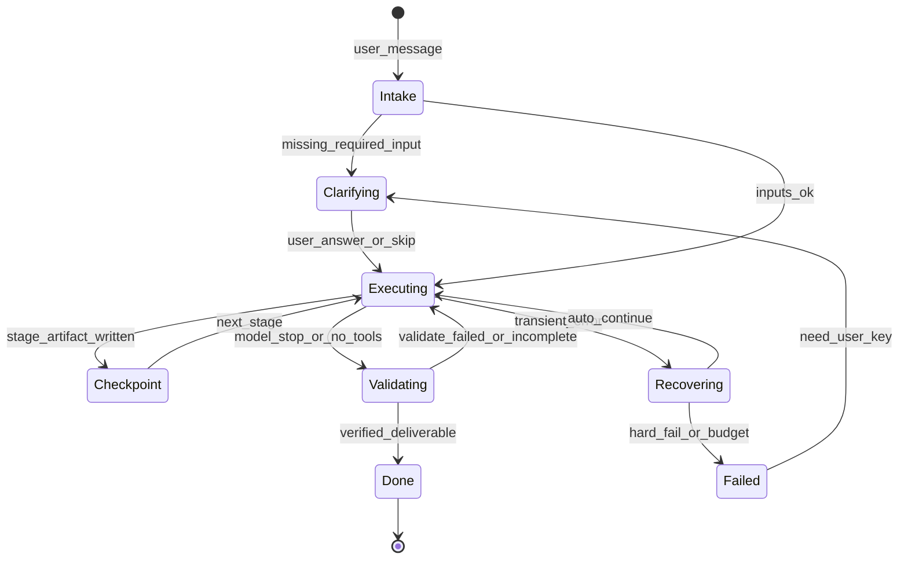

# 架构视角 Memo：链路断点与目标态

**角色**：系统架构师 | **日期**：2026-06-21

---

## 现状分层（摘要）

UI 三钩子续跑 → Bridge 120s/infra → AgentLoop RecoveryBudget → 上下文 binding（**仅首 turn**）→ JSONL（turn_progress **未全注入续跑**）。

## 单点故障

| ID | 故障 | 影响 |
|----|------|------|
| S1 | 引擎 success = 无 tool_calls | 假完成 |
| S2 | binding 首 turn 后丢失 | 多轮 PPT/调研偏航 |
| S3 | orchestration 剥离 web/bash | PPT/GEO 错路由 |
| S4 | deliverable_repair 未 Bridge 发射 | 缺文件无专用续跑 |
| S5 | buildTaskResumeContext 未生产接线 | 续跑丢 stepIndex |
| S6 | recovery 预算 vs 合法步骤 | 长任务耗尽 |
| S7 | tool_recovery 文案与 slug 无关 | 空转 HTML |

## 目标态草图（任务状态机）

## 改进杠杆

| P | 架构项 | 文件触点 |
|---|--------|----------|
| P0 | 会话级 binding | `capabilityBinding.ts`, transcript metadata |
| P0 | turn_progress → resume prompt | `buildTaskResumeContext.ts`, UI onContinue |
| P0 | Hub 能力 bypass orchestrate | `shouldBypassOrchestration.ts` |
| P0 | Bridge deliverable_repair | `pilotdeck-bridge.js` |
| P1 | slug 分支 recovery | `toolFailureRecovery.ts` |
| P1 | 阶段 recovery 子预算 | `recoveryPolicy.ts` |
| P2 | TTFT memory 超时 | Gateway context prepare |

## 证据

- [`conversation-resilience-spec.md`](../conversation-resilience-spec.md)
- [`conflict-matrix-v1.zh-CN.md`](conflict-matrix-v1.zh-CN.md)
