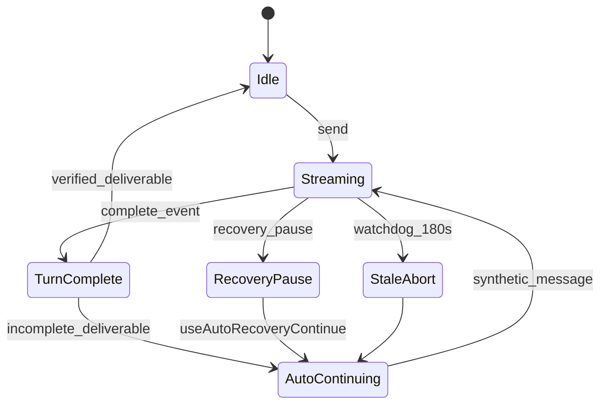

# 前端视角 Memo：UI 状态机与引擎语义

**角色**：前端工程师 | **日期**：2026-06-21

---

## Turn 生命周期 UI 状态

| 状态 | 来源 | 风险 |
|------|------|------|
| `isLoading` | WS streaming | turn 结束与成果 validate 不同步 |
| `turnCompleteSignal` | handleTurnComplete | 触发续跑 hook |
| `recoveryRunId` | 用户 submit 递增 | auto 续跑不递增（已用 turnCompleteSignal 缓解） |
| `claudeStatus` / `pilotDeckStatus` | Bridge status | recovery_pause vs success 竞态 |
| `lastTurnCompleteMeta` | complete 事件 | aborted 不触发 incomplete 兜底 |

## Bridge 事件对照

| statusKind | UI 行为 | 缺口 |
|------------|---------|------|
| recovery_pause | useAutoRecoveryContinue | OK |
| infra_interrupt | 同上 + 不占预算 | OK |
| deliverable_repair | hook 支持 | **Bridge 未发射** |
| (none) + success | incompleteDeliverable hook | fix 后 OK |

## 体验债（可前端独立修）

| # | 项 | 文件 |
|---|-----|------|
| F1 | 续跑无用户可见弱提示 | ChatInterfaceV2 / GentleNotice |
| F2 | Live stage 与 processGrouping 不同步 | MessagesPaneV2 |
| F3 | recovery 终局仍 mask 为思考中 | MessageRowV2（已部分修） |
| F4 | 成果 pending→消失无解释 | DeliverableCard + validate |
| F5 | StaleTurnFallback 文案未中文化工具名 | StaleTurnFallbackCard |

## UI 状态机（异常态）

## 改进杠杆

| P | 前端项 |
|---|--------|
| P1 | 自动续跑 GentleToast「已从上次继续」 |
| P1 | 成果 validate 失败保留卡片+原因 |
| P2 | 续跑 turn 跳过重复 session_prepare 文案（需 Bridge/引擎配合） |
| P2 | 阶段进度条绑定 processTemplate 阶段名 |
