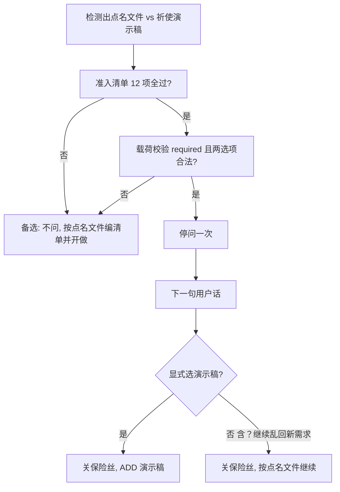

# 贵意图冲突 · 保险丝问一次（2026-08-19）

> 面向 Cursor Agent 一次闭环。勿估人天。TDD：先红后绿。质量 + 速度 + 兼容须同时达标。  
> **未经用户明示禁止 commit / 禁止 pull 上游。** 执行时先打 `restore-point/pre-expensive-intent-clarify-*`。  
> 本批 **不得生产 GO**。默认只到 **GO(shadow)**；`enforce` 须 L2 实机无空转后再开。  
> 禁止改 `resolveContinuationAction` 核心仲裁、阶段账本 enforce、GEO SDM 0/8、证书 enforce。

**Goal:** 同一条用户目标里，剥完否定/缺席投诉后仍有两种贵交付说得通时，**enforce 才允许停问一次**；推荐默认 = 已点名文件。提问模式必须通过 **准入清单 + 载荷校验**，任一失败则 **备选：不问、按推荐默认继续做**。问过之后下一句用户话 **必须能推进任务**（听不懂也按推荐项），**绝对禁止二次提问或空转卡死**。shadow 只打点。

**Architecture:** 纯函数 `admitExpensiveIntentAsk`（失败即 fallback）+ compile 覆盖层（仅 enforce 剥祈使 PPT）+ `AgentLoop` 澄清旁路。停问前 `assertExpensiveIntentAskPayload` 不过则禁止 `needed=true`。答复解析 **显式选 B 才改演示稿，其余一律 keep 并关保险丝**。不走 preference。

**Tech Stack:** Gateway/tsx、vitest、既有 `clarificationGate` / SDM bootstrap / `recordStabilityEvent`。

---

## 生产级可执行评估（全 A）

| 全 A 项 | 本计划 |
|---|---|
| 改什么 / 在哪改 / 符号 | 下文文件表与函数签名 |
| P0/P1 依赖拓扑 | P0-0 还原点 → P0-1 → P0-2 → P0-3 → P0-4 → P0-4b → P0-5；P0-6 可与 P0-5 并行（须在 L2 前）；P0-7；P1 空 |
| Flag `off\|shadow\|enforce` | `PILOTDECK_EXPENSIVE_INTENT_CLARIFY` |
| 三处同步 | `pack.mjs` + `apply-cloud-perf-env.sh` + `devLauncherCore` |
| 代码 unset 默认 | **`off`**（与 `PILOTDECK_TASK_STAGE_BUDGET` 同稳妥） |
| 注入默认 | 三处 **`shadow`** |
| L0–L4 | 下文验收表，KPI 绑命令 |
| 禁止项 | 专节 |
| 回滚 | `off` 或从 shadow 退回 off；enforce 出空转立刻关 |
| fork | `config/pilotdeck-core-fork.manifest.json` |
| 兼容 | 英文 legacy pathHints 不动；历史 JSONL 可读；不改 SDM 槽位形状 |

**结论：** 原文 CONDITIONAL GO **不成立**（R1–R6）。按下方审阅改法落地后才是 CONDITIONAL GO。未完成 L2 不得宣称修好。不得生产 GO。

---

## 审阅修订（生产级，2026-08-19）

对照真实接线后，下列冲突 **未改计划不得开工**。

| # | 问题 | 证据 | 稳定改法 |
|---|---|---|---|
| R1 | 用户回「继续/？」后 `resolveClarificationGoal` 仍吐出原 DUAL，会再问 | [`deliverableSessionGoal.mjs`](ui/shared/deliverableSessionGoal.mjs) 跳过 continuation / 歧义短句；裸 `2` 当页数拼回 | 再问只看 `expensiveIntentFingerprint` / `expensiveIntentHandled`。admit 的 A10 用 **`latestUserRaw`**。`detectClarificationNeeded` 扩参 |
| R2 | 缺 Key 的 UAR：「继续」仍 pending | [`parseUserActionNotice.ts`](ui/src/shared/parseUserActionNotice.ts) + 单测「stays blocked when continue」 | **仅本指纹**：其后任意非 synthetic 用户句 pending=false。缺 Key 单测不得改坏 |
| R3 | 单 Gateway 不能按 case 切 shadow/enforce | 进程 env | L2 **两趟进程** |
| R4 | `expensiveIntentConflict` ↔ `clarificationGate` 循环 import | 后者已引 authority | 保险丝模块禁止 import clarificationGate；短路留在 gate early return |
| R5 | 只剥 compileGoal 时 anchor 仍含做成 PPT，`resolveProfile(anchor)` 可能仍 ppt | [`deliverableCapabilityProfiles.ts`](src/saas/deliverableCapabilityProfiles.ts) PPT_GOAL | **禁止改全局 resolveProfile**；锁 SDM.profileId；repair 读 manifest |
| R6 | 文件表曾写 `shouldAsk*` | 与 admit 双轨 | 删除 shouldAsk，只留 admit |
| R7 | AgentLoop 现成 notice 标题是「需要补充一点信息」 | [`AgentLoop.ts` ~892–897](src/agent/loop/AgentLoop.ts) | 本指纹必须覆盖为 `expensiveIntentUserCopy`（标题「需要你选一下」）；不是改卡片组件 |
| R8 | `profileGate` 用 `resolveProfile(anchor)` 会把 DUAL 当 ppt，md 做完仍可能 repair 幻影 pptx | [`profileRequiresDeliverableForGoal`](src/saas/taskContinuationPolicy.ts) + PPT_GOAL | **禁止改 `resolveProfile` 函数体**。`shouldTriggerDeliverableRepair` **调用点**：有 `sessionManifest.profileId` 时用它，禁止再用含祈使 PPT 的 anchor 判 ppt。既有 repair 单测返回值不得改 |
| R9 | `stabilityFlags.test.ts` 的 `FLAGS`/`ALL_OFF` 漏键即红 | 同文件 STAGE_BUDGET 先例 | 新键必须三处登记：`StabilityFlagName`、`FLAGS`、`ALL_OFF` + snapshot |
| R10 | 裸 `2` 是页数短答 | [`isShortClarificationAnswerText`](ui/shared/deliverableSessionGoal.mjs) | 本保险丝约定：pending 下裸 `2` = 选项 B（`switch_to_ppt`）。禁止再送进页数问卷 |

`ui/` 本批 **只允许** 改 [`parseUserActionNotice.ts`](ui/src/shared/parseUserActionNotice.ts)（+测试）清本指纹 pending，以及其 `SessionMessageLike.metadata` 增加 `expensiveIntentFingerprint?`（**不是**新 TranscriptEntry 联合类型）。禁止改 `UserActionRequiredCard` 外观。

---

## 产品规则（锁死）

问一次须 **同时** 满足：

1. 同一条用户目标里，`stripNegatedDeliverableMentions` 之后仍有 **两种贵交付** 说得通。本批唯一冲突指纹：`expensive_intent:ppt_vs_named_files`。  
   判定：`parseMustDeliverClause` 得到 ≥1 个 **非 pptx** 槽，且剥完后仍命中 **祈使做 PPT**（做成/做一份/来一份/导出/制作/生成 + PPT/pptx/幻灯/演示文稿）。  
   **须交付已含 `.pptx`** → 不是冲突（用户已点名 PPT 文件），不问。
2. 规则层无法唯一判定（投诉句/「不要 PPT」已剥完仍冲突）。
3. **动手做贵成果之前** 停（`loopIteration===1`，模型/工具前）。TurnRunner bootstrap 允许先编译 **便宜默认** 清单，禁止先按 `ppt` 锁死 baseline。
4. 题干：两个选项 + 白话。推荐项 = 点名文件一侧。
5. `kind=required`，`hasDefaultOption=false`，`classifyElicitationKind({ requiredReason: "expensive_intent_conflict" })`。侧栏「需用户回答」。**禁止** preference（会被 `resolvePreferenceAskUserBypass` 绕过）。
6. 用户回「继续 / ？ / 直接开始做」→ **采用推荐默认并继续**，禁止干等。
7. 答完：**同一 session** 继续。选 B 才 `goalVersion++` ADD pptx。禁止新开聊天。
8. 每会话每个 `fingerprint` **最多问 1 次**（含备选 fallback 也算已处理，禁止再问）。
9. **跳过（不问、按推荐默认继续）：** `<task-resume>`、deliverable_repair / auto_continue / synthetic、纯寒暄、整句 `直接开始做`、质量投诉、飞轮、office 四格式包、`isFollowUpPptFromExistingDeliverables`、`isDeliverableQualityReworkGoal`、准入失败、载荷校验失败。
10. **卡死零容忍：** 停问后的下一轮用户输入，无论是否能解析成 1/2，**禁止**再次 `needed=true`；禁止等待「正确格式」；禁止页数/偏好问卷叠加上去。听不懂 → 备选 keep → 开做。

### 用户可见文案（须随 UI 语言；禁止内部术语）

中文：

- 标题：`需要你选一下`
- 说明：`你点名要做的文件，同时又说要做演示稿。选错一种会浪费不少时间。`
- 选项 1（推荐）：`按你点名的文件做（选题和长文），先不做演示稿`
- 选项 2：`现在改做演示稿`
- 步骤附注：`直接回复 1 或 2。回复「继续」按第 1 项。`

英文：

- Title: `Need a quick choice`
- Reason: `You named specific files and also asked for slides. The wrong pick wastes a lot of work.`
- Option 1: `Make the files you named (topics and longform) first — skip slides for now`
- Option 2: `Switch to slides now`
- Hint: `Reply 1 or 2. Saying "continue" uses option 1.`

禁止对用户写：SDM、profile、fingerprint、PPT_GOAL、clarificationGate、须交付槽。

---

## 提问模式：严格准入 + 备选 + 禁卡死

本批最高优先级：**宁可少问、按点名文件做下去，也不许任务停在选择题上。**

历史空转（页数问卷 + 用户回「？/继续」仍等）不得在本保险丝重演。



### A. 准入清单 `admitExpensiveIntentAsk`（必须全过才允许 `action:"ask"`）

输入：`userGoal`、`mode`、`loopIteration`、`latestUserRaw`、`messages`、`capabilitySlug`、`sessionManifest`、`alreadyAskedFingerprint`。

| # | 检查 | 失败则 |
|---|---|---|
| A1 | `mode === "enforce"` | `fallback_keep`（shadow/off 本来就不问） |
| A2 | `detectExpensiveIntentConflict != null` | `no_op` |
| A3 | `loopIteration === 1` | `fallback_keep` |
| A4 | 最新用户句 **无** `<task-resume>`、非 synthetic | `fallback_keep` |
| A5 | 本会话该 fingerprint **未问过、未 fallback 过** | `fallback_keep`（已处理） |
| A6 | 非 `DIRECT_START` | `fallback_keep`（直接按点名文件做） |
| A7 | 非飞轮 / office 四格式 / 质量投诉 / follow-up PPT / 纯寒暄 | `fallback_keep` 或 `no_op` |
| A8 | `isClarificationGateEnabled()` | `fallback_keep` |
| A9 | 剥完后仍有非 ppt 点名文件（便宜路径存在） | `no_op`（没有备选可做则不问也不要瞎停） |
| A10 | **`latestUserRaw`（最新用户句）** 不是「继续 / ？ / 仅短答」。禁止把 `resolveClarificationGoal` 回放的 DUAL 当成 latestUserRaw | `fallback_keep`（不得首次开火） |
| A11 | 文案 `expensiveIntentUserCopy` 两选项 **不含**「继续/推荐/默认/default/continue」 | **禁止问**，`fallback_keep` + `admission_copy_invalid` |
| A12 | `classifyElicitationKind({ requiredReason: "expensive_intent_conflict", hasDefaultOption: false }) === "required"` | **禁止问**，`fallback_keep` |

**分类器 `hasDefaultOption` 必须是 false**（避免被当成 preference 绕过）。  
**解析器另有隐式默认**（听不懂 → keep）。这两件事禁止混成 `hasDefaultOption: true`。

A6–A8 实现约束（防循环 import）：A7 飞轮/office/质量/follow-up **由** `detectClarificationNeeded` early return 负责，admit 内不要再 import `clarificationGate.ts`。A6 可用 `userFacingErrors.userGoalRequestsDirectStart(latestUserRaw)`。A8 直接读 `PILOTDECK_CLARIFICATION_GATE` env（与 `isClarificationGateEnabled` 同语义），不要 import 该函数。

### B. 载荷校验 `assertExpensiveIntentAskPayload`（停 turn 前最后一道闸）

AgentLoop 在 `messages.push(notice)` **之前**调用。任一失败 → **不得停 turn**，改走备选 keep，打点 `expensive_intent_conflict_fallback`。

必须全部为真：

- `kind === "required"` 且 `hasDefaultOption === false`
- `fingerprint === "expensive_intent:ppt_vs_named_files"`（禁止混用 `missing_input:clarification`）
- `purpose` 将写成 `user_action_required`（禁止 `preference_elicitation`）
- `question` 非空；`steps` 恰好覆盖选项 1 与选项 2
- 选项标签不匹配 `DEFAULT_CONTINUE_PATTERNS`（`taskLifecycle.ts` 的继续/推荐/默认）
- 中英文 copy 函数对当前 `promptLanguage` 有对应句子

测试：故意把 kind 改成 preference 或 fingerprint 写错 → `assert` 失败 → `needed` 不得为 true。

### C. 备选阶梯（永远有下一步）

| 优先级 | 条件 | 行为 |
|---|---|---|
| 0 | 无冲突 | 正常走，本保险丝沉默 |
| 1 | 有冲突但准入/载荷失败 | **不问**；enforce 仍剥祈使 PPT 编清单；开做点名文件；`fallback` 打点 |
| 2 | 准入通过 | 只停 **这一个 Gateway turn**（不写 pptx）；清单已按点名文件锁 |
| 3 | 已问，下一句用户话 **显式选 B**（`2` / 选项 2 全文 / `现在改做演示稿` / `改做PPT`） | ADD pptx，关保险丝，开做 |
| 4 | 已问，下一句为 **任何其它内容**（继续、？、啊、好、嗯、8、乱码、空标点、直接开始做、甚至一条新需求） | **关保险丝 + keep**，**禁止再问**；新需求再交给既有 `detectGoalPivot` / `detectGoalMutation`（保险丝已关） |
| 5 | 已问，下一轮是 `<task-resume>` / synthetic / auto_continue / repair | **关保险丝 + keep**，禁止把简历当「还没选」再停 |

禁止项（卡死形态）：

- 第二次 `expensiveIntentFingerprint` 提问
- 用户已发言仍 `needed=true`（除非是缺 Key/欠费等真正硬阻塞，与本保险丝无关）
- 「请回复 1 或 2」循环
- 把「？」送进页数问卷
- 等待超时才继续（**不靠墙钟自动续跑**；靠下一句用户话 fail-open。用户尚未再打字 = 等人，不是系统空转）

### D. 与 Composer / 续跑

- 停问当回合：`needsUserInput=true` 只表示「这一回合需要你回一句」。输入框必须仍能发送（用户回继续/？即可）。
- 下一回合：`detectClarificationNeeded` 因已问过 / 答复 fail-open → `needed=false`，模型必须开跑。
- **禁止** UI `useIncompleteDeliverableAutoContinue` 在本保险丝提问回合再灌「继续」造成自问自答死循环；本 fingerprint 的 `user_action_required` 视为用户该回一句，引擎/UI 都不要代回。用户回了之后必须当作普通执行回合。

---

## 稳定冲突（必须先遵守再写代码）

| # | 雷区 | 稳定优先 |
|---|---|---|
| C1 | 页数问卷 +「？/继续」空转 | **禁止** 复活页数问卷；本保险丝不得 `hasDefaultOption:true` |
| C2 | Nova 调研 `ask_user` preference 同 turn 绕过 | 必须 `required` + `purpose: user_action_required` |
| C3 | 首 turn 通用问卷 | 仅此一种指纹；`detectClarificationNeeded` 的 missing-topic 偏好问卷 **不改语义** |
| C4 | SDM 在 TurnRunner bootstrap **早于** AgentLoop 澄清 | enforce 下 compile **先剥祈使 PPT**（便宜默认），禁止先锁 `profileId=ppt` 再问 |
| C5 | `sessionGoalAnchor` 被 overlay 改写 | **禁止**。anchor 仍是用户原文；只把 **compileGoal** 传给 `resolveSdmCompileProfile`。**禁止改 `resolveProfile` 函数体**（见 R8） |
| C6 | shadow 改变控制流 | shadow **不得** 停 turn、**不得** 剥 compile（对标 `observeTaskStage`） |
| C7 | 「继续」被当成新 goal 扩槽 | `updateSessionManifestOnUserMessage` 对 continuation 已返回 `null` 保留 previous；选 B 走显式 ADD，不靠「改做」正则碰运气 |
| C8 | 知乎缺席投诉回潮绑 ppt | L0+L2：`STICKY-ZHIHU` **needed=false** 且 `profileId!==ppt` |
| C9 | `DIRECT_START` 跳过全部澄清 | 冲突句带「直接开始做」：**不问**；enforce 仍按推荐默认剥祈使 PPT |
| C10 | 选项文案含「继续」被 `classifyElicitationKind` 判 preference | 选项标签 **禁止** 含「继续/推荐/默认」；用 `requiredReason` 强制 required |
| C11 | 听不懂仍 `needed=true`（页数问卷空转形态） | 答复解析 **fail-open keep**；禁止二次提问 |
| C12 | 准入/载荷不完整仍停 turn | `assertExpensiveIntentAskPayload` 失败 → 备选开做，禁止停 |
| C13 | 已问之后 task-resume / repair 再停 | skip + 关保险丝 keep |
| C14 | 同 R1：clarificationGoal 回放 DUAL 再问 | 再问只看 fingerprint / handled；admit 用 latestUserRaw |
| C15 | 同 R2：缺 Key 的「继续」不清 pending | 仅本指纹任意用户回复合；缺 Key 单测保留 |
| C16 | 同 R3：L2 同进程混 shadow/enforce | live **两趟 Gateway** |
| C17 | 同 R4：循环 import | 保险丝模块禁止 import `clarificationGate.ts`；A6/A7 飞轮/office/质量/follow-up 由 gate early return 负责；DIRECT_START 可用 `userFacingErrors.userGoalRequestsDirectStart(latestUserRaw)` |

---

## 禁止项

- 改 `resolveContinuationAction` / RecoveryBudget 双轨数字 / Turn Queue 槽位
- `PILOTDECK_TASK_STAGE_BUDGET=enforce`；abort 进行中 `write_file`
- 修 GEO 0/8 SDM/GT；证书/合同 enforce
- 制作中全量扫 `chatMessages`；UI 美学；Bento/Preflight 开关
- 通用 `ask_user` 问卷回潮；自动恢复期间让用户排障
- 听不懂就二次提问或干等「请回复 1 或 2」
- 准入/载荷失败仍然 `needed=true`
- 把 overlay 写成新 SDM **槽位**
- 新 TranscriptEntry 联合类型（本批用消息 metadata + compile 纯函数即可）
- 与 `PILOTDECK_BINARY_INTENT_GATE`（聊 vs 做）混用指纹
- 未经明示 commit / pull 上游
- 计划/报告写「提升 xx%」

---

## 文件表

| 路径 | 职责 |
|---|---|
| **Create** `src/saas/intent/expensiveIntentConflict.ts` | 检测、准入、载荷校验、剥祈使 PPT、fail-open 答复、文案 |
| **Create** `src/saas/intent/expensiveIntentConflict.test.ts` | L0：冲突稿 + **准入失败备选** + **乱回/？不卡死** |
| **Modify** `src/saas/resilience/stabilityFlags.ts` | `StabilityFlagName` + `isExpensiveIntentClarifyMode()` + snapshot |
| **Modify** `src/saas/resilience/stabilityFlags.test.ts` | unset=off；1/shadow；enforce；off |
| **Modify** `src/telemetry/stabilityEvents.ts` | 四个 event 名（含 `_fallback`） |
| **Modify** `src/saas/taskState/sessionDeliverableManifest.ts` | `compileSessionDeliverableManifest` 仅 enforce 用剥后 goal 编 profile/槽 |
| **Modify** `src/saas/taskState/sessionDeliverableManifest.ts` `updateSessionManifestOnUserMessage` | 待答复 + 选 B → 显式 ADD pptx |
| **Modify** `src/saas/clarificationGate.ts` | 扩参 `latestUserRaw` / `alreadyAskedFingerprint` / `fuseAlreadyHandled`；early return 之后调用 `admitExpensiveIntentAsk`（禁止第二套 shouldAsk） |
| **Modify** `src/agent/loop/AgentLoop.ts` | 用最新用户句 + 已问指纹；push 前 assert |
| **Modify** `ui/src/shared/parseUserActionNotice.ts` + `.test.ts` | 本指纹任意用户回复合 pending；缺 Key「继续」仍阻塞 |
| **Modify** `src/saas/taskContinuationPolicy.ts` | **仅** `shouldTriggerDeliverableRepair` 调用点：有 SDM `profileId` 时优先它（R8）。禁止改 `resolveContinuationAction` 核心 switch |
| **Modify** `tests/saas/clarification-gate.test.ts` | 冲突稿 / 知乎投诉 / 真 PPT |
| **Modify** `src/saas/deliverableCapabilityProfiles.script-intent.test.ts` | enforce 下 dual 不绑 ppt；真 PPT 仍绑 |
| **Modify** `scripts/lib/devLauncherCore.mjs` | 未显式 env 时注入 `shadow` |
| **Modify** `scripts/release/pack.mjs` | `perfDefaults` 键 |
| **Modify** `scripts/release/apply-cloud-perf-env.sh` | 同键 shadow |
| **Modify** `config/pilotdeck-core-fork.manifest.json` | 新模块登记 |
| **Modify** `package.json` | `test:expensive-intent:unit` / `test:expensive-intent:live` |
| **Create** `scripts/run-expensive-intent-clarify-live.mjs` | L2 Gateway 矩阵 |
| **Create** `docs/expensive-intent-clarify-acceptance-20260819.zh-CN.md` | 执行后填 L0–L4 实数（本计划阶段只写模板结构） |

`ui/`：**本批不改** `UserActionRequiredCard` 外观（用现有 title/reason/steps 列出两选项）。**必须改** `parseUserActionNotice.ts` pending 语义（R2）。点选按钮 = P1，不在本批。

---

## Flag

键名：`PILOTDECK_EXPENSIVE_INTENT_CLARIFY`

| 来源 | 值 |
|---|---|
| 代码 `raw == null` | `off` |
| `shadow` / `1` / `true` / `on` | `shadow` |
| `enforce` | `enforce` |
| `off` / `0` / `false` | `off` |
| `devLauncherCore.buildSaasDevEnv` 未显式 | `shadow` |
| `pack.mjs` `perfDefaults` | `shadow` |
| `apply-cloud-perf-env.sh` | `shadow` |

独立于 `PILOTDECK_CLARIFICATION_GATE`。总闸关时本保险丝也不要停问（AgentLoop 已有 `isClarificationGateEnabled()`）；shadow 打点仍可在总闸开时记录。

函数（紧挨 `isTaskStageBudgetMode`）：

```ts
export function isExpensiveIntentClarifyMode(): StabilityTriStateMode {
  const raw = readEnv("PILOTDECK_EXPENSIVE_INTENT_CLARIFY");
  if (raw == null) return "off";
  const value = raw.trim().toLowerCase();
  if (value === "enforce") return "enforce";
  if (value === "shadow" || value === "1" || value === "true" || value === "on") return "shadow";
  return "off";
}
```

`stabilityFlagSnapshot()` 增加：`PILOTDECK_EXPENSIVE_INTENT_CLARIFY: isExpensiveIntentClarifyMode() !== "off"`。

---

## 核心类型与函数（P0-1 必须一次写对）

```ts
export const EXPENSIVE_INTENT_PPT_VS_FILES = "expensive_intent:ppt_vs_named_files";

export type ExpensiveIntentChosen = "keep_must_deliver" | "switch_to_ppt";

export type ExpensiveIntentFallbackReason =
  | "mode_not_enforce"
  | "no_conflict"
  | "unsafe_context"
  | "already_handled"
  | "direct_start"
  | "skip_list"
  | "admission_copy_invalid"
  | "payload_invalid"
  | "unparsed_reply";

export type ExpensiveIntentConflict = {
  fingerprint: typeof EXPENSIVE_INTENT_PPT_VS_FILES;
  mustDeliverNonPpt: boolean;
  imperativePpt: boolean;
};

export type ExpensiveIntentAskDecision =
  | { action: "ask"; fingerprint: typeof EXPENSIVE_INTENT_PPT_VS_FILES; copy: ReturnType<typeof expensiveIntentUserCopy> }
  | { action: "fallback_keep"; reason: ExpensiveIntentFallbackReason; conflict: ExpensiveIntentConflict | null }
  | { action: "no_op"; reason: ExpensiveIntentFallbackReason };

export function detectExpensiveIntentConflict(goal: string): ExpensiveIntentConflict | null;

/** 只剥祈使做 PPT，不剥 须交付 .pptx，不剥 不要 PPT（那是 stripNegated 的活）。 */
export function stripImperativePptFromGoal(goal: string): string;

export function resolveExpensiveIntentCompileGoal(input: {
  userGoal: string;
  mode: StabilityTriStateMode;
  chosen?: ExpensiveIntentChosen | null;
}): { compileGoal: string; conflict: ExpensiveIntentConflict | null; stripped: boolean };

/** 提问准入：失败必须 fallback_keep / no_op，禁止 ask。 */
export function admitExpensiveIntentAsk(input: {
  userGoal: string;
  mode: StabilityTriStateMode;
  loopIteration: number;
  latestUserRaw: string;
  alreadyAskedFingerprint?: string | null;
  fuseAlreadyHandled?: boolean;
  skipUnsafeContext?: boolean;
  capabilitySlug?: string;
  promptLanguage?: "zh-CN" | "en";
}): ExpensiveIntentAskDecision;

/** 停 turn 前校验。false 则 AgentLoop 禁止 needed=true。 */
export function assertExpensiveIntentAskPayload(input: {
  kind?: string;
  hasDefaultOption?: boolean;
  fingerprint?: string;
  question?: string;
  optionKeep?: string;
  optionSwitch?: string;
}): boolean;

/**
 * pendingFingerprint 非空时 **必须 handled=true**（关保险丝）。
 * 仅显式选 B → switch_to_ppt；其余（含？/继续/乱回/新需求）→ keep_must_deliver。
 * pending 为空 → handled=false。
 */
export function resolveExpensiveIntentConflictReply(
  userText: string,
  pendingFingerprint: string | null,
): { handled: boolean; chosen: ExpensiveIntentChosen | null; fallbackReason?: ExpensiveIntentFallbackReason };

export function expensiveIntentUserCopy(lang: "zh-CN" | "en"): {
  title: string;
  reason: string;
  optionKeep: string;
  optionSwitch: string;
  hint: string;
};
```

`shouldAskExpensiveIntentConflict` **不要单独存在**：一律走 `admitExpensiveIntentAsk`，避免两套判断不一致。

祈使 PPT（在 `stripNegatedDeliverableMentions` **之后** 的文本上测）：

```ts
const IMPERATIVE_PPT_RE =
  /(?:另外|同时|再|并且)?(?:做成|做一份|来一份|导出|制作|生成)\s*(?:一份|一个)?\s*(?:PPT|pptx|幻灯片?|演示文稿)/i;
```

`detectExpensiveIntentConflict` 伪代码：

1. `stripped = stripNegatedDeliverableMentions(stripLaunchContextAndAttachmentBlocks(goal))`
2. 飞轮 / office / DIRECT_START / 质量投诉 / follow-up PPT **不在 detect 内短路**（短路放 `detectClarificationNeeded` early return，避免保险丝模块 import `clarificationGate.ts`）；detect 只回答「是否冲突」
3. `must = parseMustDeliverClause(stripped)`
4. `mustNonPpt = must.some(slot => !isPptish(slot))`
5. `mustHasPpt = must.some(isPptish)`
6. `imperativePpt = IMPERATIVE_PPT_RE.test(stripped) && !mustHasPpt`
7. 两者皆真 → `{ fingerprint, mustDeliverNonPpt: true, imperativePpt: true }`

`isPptish(slot)`：`kind==='pptx'` 或 pathHint/pathHints 匹配 `/\.pptx?$/i`。

`resolveExpensiveIntentCompileGoal`：

- `off` / `shadow`：`compileGoal = userGoal`，`stripped=false`
- `enforce` + conflict + `chosen !== 'switch_to_ppt'`：`compileGoal = stripImperativePptFromGoal(userGoal)`，`stripped=true`
- `enforce` + `chosen === 'switch_to_ppt'`：不剥

`resolveExpensiveIntentConflictReply`（`pendingFingerprint` 匹配时 **永远 handled**）：

| 用户文本（trim） | 结果 |
|---|---|
| `2` / 选项 2 全文 /「现在改做演示稿」/「改做PPT」 | `switch_to_ppt` |
| **其它一切**（`1`、继续、？、啊、好、8、乱码、直接开始做、长新目标） | `keep_must_deliver` + 可选 `fallbackReason: "unparsed_reply"` |
| `pendingFingerprint == null` | `handled: false` |

长新目标：保险丝先关（keep），**同一函数调用之后** 才允许 `updateSessionManifestOnUserMessage` 走既有 pivot/mutation。禁止 `handled:false` 导致再问一次。

`admitExpensiveIntentAsk`：仅 A1–A12 全过 → `action:"ask"`。shadow/off → `no_op` / `fallback_keep` 且不得 ask。

---

## P0 任务（依赖拓扑）

### P0-0 还原点

**依赖：** 用户下令执行。  
**禁止：** 未经明示 commit / pull。  
标签：`restore-point/pre-expensive-intent-clarify-*`（秒级）。不移动既有 star 标签。

### P0-1 纯函数 + 红灯单测

**依赖：** 无。  
**Files:** Create 上表两文件。  
**禁止：** 改 AgentLoop。

冻结稿（必须先写测试再实现）：

```ts
const ZHIHU_ABSENCE = [
  "帮我做知乎选题和一篇长文，主题：企业级 Agent 落地。",
  "须交付：01-topics.md、02-longform.md。",
  "这两个内容在 PPT 里没有展示。",
  "写入系统分配任务目录。",
].join("\n");

const DUAL = [
  "帮我做知乎选题和一篇长文，主题：企业级 Agent 落地。",
  "须交付：01-topics.md、02-longform.md。",
  "另外做成一份PPT。",
  "写入系统分配任务目录。",
].join("\n");

const TRUE_PPT = "做一份周会PPT，须交付 presentation.pptx";
```

断言：

- `detectExpensiveIntentConflict(ZHIHU_ABSENCE) === null`
- `detectExpensiveIntentConflict(DUAL)?.fingerprint === EXPENSIVE_INTENT_PPT_VS_FILES`
- `detectExpensiveIntentConflict(TRUE_PPT) === null`
- `stripImperativePptFromGoal(DUAL)` 不含「做成一份PPT」，仍含 `01-topics.md`
- `stripImperativePptFromGoal(TRUE_PPT)` 仍含 PPT（点名文件）
- `admitExpensiveIntentAsk({ goal: DUAL, mode: 'shadow', loopIteration: 1, ... }).action !== 'ask'`
- `admitExpensiveIntentAsk({ goal: DUAL, mode: 'enforce', loopIteration: 1, latestUserRaw: DUAL }).action === 'ask'`
- `admitExpensiveIntentAsk({ ..., loopIteration: 2 }).action === 'fallback_keep'`
- `admitExpensiveIntentAsk({ ..., latestUserRaw: '继续' | '？', alreadyAskedFingerprint: EXPENSIVE_INTENT_PPT_VS_FILES }).action !== 'ask'`
- `admitExpensiveIntentAsk({ userGoal: DUAL, latestUserRaw: '继续', alreadyAskedFingerprint: null })` **不得** `ask`（A10；防 clarificationGoal 回放）
- `admitExpensiveIntentAsk({ ..., latestUserRaw: '<task-resume>…' }).action === 'fallback_keep'`
- `assertExpensiveIntentAskPayload({ kind: 'preference', hasDefaultOption: true, fingerprint: EXPENSIVE_INTENT_PPT_VS_FILES, ... }) === false`
- `assertExpensiveIntentAskPayload({ kind: 'required', hasDefaultOption: false, fingerprint: EXPENSIVE_INTENT_PPT_VS_FILES, question: 'x', optionKeep: copy.optionKeep, optionSwitch: copy.optionSwitch }) === true`
- `assertExpensiveIntentAskPayload` 选项含「继续」→ `false`
- pending 下 `resolveExpensiveIntentConflictReply('继续' | '？' | '啊？' | '好' | '……' | '8' | DUAL, fingerprint).handled === true` 且 `chosen === 'keep_must_deliver'`
- `resolveExpensiveIntentConflictReply('2', fingerprint).chosen === 'switch_to_ppt'`
- pending 下 **不存在** `handled === false`（防再问）

验收：`npx vitest run src/saas/intent/expensiveIntentConflict.test.ts`

---

### P0-2 Flag + telemetry

**依赖：** P0-1。  
**Files:** `stabilityFlags.ts` / `.test.ts` / `stabilityEvents.ts`

`StabilityEventName` 增加：

- `expensive_intent_conflict_shadow`
- `expensive_intent_conflict_asked`
- `expensive_intent_conflict_resolved`
- `expensive_intent_conflict_fallback`（准入失败 / 载荷非法 / 听不懂关保险丝）

`detail` 只准：`fingerprint`、`mode`、`ask`、`stripped`、`chosen`、`fallbackReason`（字符串）。禁止文件路径。

验收：`npx vitest run src/saas/resilience/stabilityFlags.test.ts`

---

### P0-3 compile 覆盖层（仅 enforce）

**依赖：** P0-1、P0-2。  
**Files:** `compileSessionDeliverableManifest`

在 `resolveCompileUserGoal` 之后、`resolveEffectiveCompileGoal` 之前：

```ts
const fuse = resolveExpensiveIntentCompileGoal({
  userGoal,
  mode: isExpensiveIntentClarifyMode(),
  chosen: input.previousManifest /* 本批不把 chosen 塞槽；P0-5 用消息侧 chosen 传入 CompileSessionManifestInput 可选字段 */,
});
const briefResolved = resolveEffectiveCompileGoal({
  userAnchor: fuse.compileGoal,
  ...
});
```

`CompileSessionManifestInput` 增加可选 `expensiveIntentChosen?: ExpensiveIntentChosen`。  
`sessionGoalAnchor` **仍赋原始** `userGoal`（`resolveCompileUserGoal` 结果），禁止赋 `fuse.compileGoal`。

单测（`script-intent` 或 SDM 测）：

- env `PILOTDECK_EXPENSIVE_INTENT_CLARIFY=enforce` + `PILOTDECK_SESSION_DELIVERABLE_MANIFEST=1`：`compileSessionDeliverableManifest({ userGoal: DUAL })` → `profileId !== 'ppt'`，槽含 topics/longform，anchor 仍含「做成一份PPT」
- 同稿 `=shadow`：允许现网行为（可仍为 ppt）——**不把 shadow 不绑 ppt 当硬门禁**；硬门禁只在 enforce
- `TRUE_PPT` + enforce：`profileId === 'ppt'`
- `ZHIHU_ABSENCE`：`profileId !== 'ppt'`（回归 strip 投诉）
- R8：`shouldTriggerDeliverableRepair` 在 DUAL + `sessionManifest.profileId !== 'ppt'` + md 槽已 verified 时 **不得**因 anchor 含「做成一份PPT」为 true（新增测；既有测返回值不变）

验收：`npx vitest run src/saas/deliverableCapabilityProfiles.script-intent.test.ts src/saas/taskState/sessionDeliverableManifest.test.ts`

---

### P0-4 停问接线（enforce）

**依赖：** P0-3。  
**Files:** `clarificationGate.ts`（扩参）、`AgentLoop.ts`（约 847–917）、`tests/saas/clarification-gate.test.ts`

`detectClarificationNeeded` 输入增加可选：`latestUserRaw?: string`、`alreadyAskedFingerprint?: string | null`、`fuseAlreadyHandled?: boolean`。

**调用顺序（锁死，防循环 import）：** 现有 DIRECT_START / quality / follow-up PPT / office / 飞轮 early return **之后**、missing-topic 问卷 **之前** 调用 `admitExpensiveIntentAsk`。保险丝模块 **禁止** import `clarificationGate.ts`。

仅 `action==="ask"` **且** `assertExpensiveIntentAskPayload(...)===true` 时才 `needed=true`。否则 `needed=false`（有冲突时调用方打 `fallback` 点）。

```ts
return {
  needed: true,
  question: [copy.reason, `1. ${copy.optionKeep}`, `2. ${copy.optionSwitch}`, copy.hint].join("\n"),
  reason: "expensive_intent_conflict",
  fingerprint: EXPENSIVE_INTENT_PPT_VS_FILES,
  kind: "required",
  hasDefaultOption: false,
};
```

`kind` 用 `classifyElicitationKind({ question, requiredReason: "expensive_intent_conflict", hasDefaultOption: false })`，期望 `required`。若不是 required → **按载荷失败备选，禁止停**。

AgentLoop：

- 保持 `loopIteration === 1 && isClarificationGateEnabled()`
- **先**扫 messages：已出现 `expensiveIntentFingerprint` 或 `expensiveIntentHandled` → 传入 alreadyAsked / fuseAlreadyHandled
- `latestUserRaw` = `textFromMessage` 最新用户句（现有循环已有）；**禁止**把 `resolveClarificationGoal` 赋给 latestUserRaw
- `userGoal` 仍可用 `resolveClarificationGoal` 做冲突检测，但 **admit 的 A5/A10 不得只看 userGoal**
- `skipClarificationGate` 现有 task-resume / 历史页数 preference **保留**；skip 时若有冲突打 `fallback_keep`，**不停**
- **增加 skip：** 已出现 `expensiveIntentFingerprint` **或** `expensiveIntentHandled`
- push 前再跑一遍 `assertExpensiveIntentAskPayload`；失败则不 push、不 return，落入正常模型循环
- `purpose: user_action_required`，`needsUserInput: true`（仅这一回合）
- **本指纹** `userActionNotice` **必须**用 `expensiveIntentUserCopy`（禁止沿用「需要补充一点信息」）
- metadata 含 `expensiveIntentFingerprint`（及答复后 `expensiveIntentHandled`）
- shadow：只 `expensive_intent_conflict_shadow`，不停
- enforce 真停：`expensive_intent_conflict_asked`
- 备选：`expensive_intent_conflict_fallback`
- 禁止改 while 仲裁其它分支

`tests/saas/clarification-gate.test.ts` 增：

- ZHIHU_ABSENCE → `needed=false`
- DUAL + env enforce + 准入上下文完整 → `needed=true`，`kind=required`，`hasDefaultOption=false`
- DUAL + shadow/off → `needed=false`
- DUAL + `直接开始做` → `needed=false`
- TRUE_PPT → 本保险丝 `needed=false`
- 「生成PPT」无主题仍走 **原** preference 问卷
- **已问过** 再进 `detectClarificationNeeded`（模拟 alreadyAsked）→ `needed=false`
- **R1：** `userGoal=DUAL`、`latestUserRaw='继续'`、`alreadyAsked=指纹` → `needed=false`
- 载荷缺选项 / kind=preference → 不得 `needed=true`

验收：`npx vitest run tests/saas/clarification-gate.test.ts`

### P0-4b pending 清除（禁卡死，UI 最小面）

**依赖：** P0-4。  
**Files:** `ui/src/shared/parseUserActionNotice.ts` + `.test.ts`

扩展 `SessionMessageLike.metadata`：`expensiveIntentFingerprint?: string`（可选）。

若 UAR assistant 的 `metadata.expensiveIntentFingerprint` 存在，且其后有非空非 synthetic 用户句 → `sessionHasPendingUserActionRequired===false`。

保留现测：缺 Key 卡片 + 用户只回「继续」→ 仍 true。

新增：本指纹卡片 + 「继续」/「？」→ false。

验收：`npx vitest run ui/src/shared/parseUserActionNotice.test.ts`

### P0-5 答复 → 同一会话继续

**依赖：** P0-4、P0-4b。  
**Files:** `updateSessionManifestOnUserMessage`、可选 `bootstrapSessionDeliverableManifest` 传入 chosen

在 `detectGoalMutation` **之前**关保险丝：

1. bootstrap 扫消息：assistant 有 `expensiveIntentFingerprint` 且其后用户句尚未 `expensiveIntentHandled` → `pendingFingerprint`
2. `resolveExpensiveIntentConflictReply`：pending 时 **必 handled**
3. `chosen==='keep_must_deliver'` 且用户句是继续/短回复 → `return null`（保留 previous）
4. `chosen==='keep_must_deliver'` 且用户句像新目标 → **先记住保险丝已关**（metadata/编译 chosen=keep），再 fall-through 既有 pivot/mutation，**禁止再 ask**
5. `chosen==='switch_to_ppt'` → `applyGoalMutationToManifest(..., add pptx)`，`goalVersion++`，不改 `sessionGoalAnchor` 为选项原文
6. `recordStabilityEvent`：`_resolved` 或 `_fallback`（unparsed_reply）

单测：

- previous=DUAL enforce 编译 + `2` → 增 pptx，md 仍在
- previous + `？` / `继续` / `啊？` → `needed` 路径不再问；manifest 保持非 ppt
- previous + 乱回 → handled keep，**不得**再编译出第二次提问

禁止新开 session。禁止选项句写进 `sessionGoalAnchor`。

---

### P0-6 三处同步 + fork + npm

**依赖：** P0-2。可与 P0-5 并行，但须在 L2 前完成。

`devLauncherCore.mjs`（紧挨 `PILOTDECK_TASK_STAGE_BUDGET`）：

```js
...(process.env.PILOTDECK_EXPENSIVE_INTENT_CLARIFY?.trim()
  ? {}
  : { PILOTDECK_EXPENSIVE_INTENT_CLARIFY: 'shadow' }),
```

`pack.mjs` `perfDefaults`：`PILOTDECK_EXPENSIVE_INTENT_CLARIFY: 'shadow'`  
`apply-cloud-perf-env.sh`：`'PILOTDECK_EXPENSIVE_INTENT_CLARIFY=shadow'`

fork.manifest 至少三条：`expensiveIntentConflict.ts`、`AgentLoop` 旁路、`compileSessionDeliverableManifest` overlay。marker `PD-SAAS-FORK`。

`package.json`：

```json
"test:expensive-intent:unit": "vitest run src/saas/intent/expensiveIntentConflict.test.ts src/saas/resilience/stabilityFlags.test.ts tests/saas/clarification-gate.test.ts src/saas/deliverableCapabilityProfiles.script-intent.test.ts ui/src/shared/parseUserActionNotice.test.ts tests/saas/task-continuation-policy.test.ts",
"test:expensive-intent:live": "node scripts/run-expensive-intent-clarify-live.mjs"
```

验收：`rg PILOTDECK_EXPENSIVE_INTENT_CLARIFY scripts/lib/devLauncherCore.mjs scripts/release/pack.mjs scripts/release/apply-cloud-perf-env.sh`

---

### P0-7 L2 实机 + 报告模板

**依赖：** P0-1…P0-6、P0-4b。  
**前置：** Bridge `7990`；项目 `expensive-intent-20260819`（`ensureProjectWorkspace`）；**禁止 teardown**。workers=1。

**两趟 Gateway（锁死）：** 进程 env 不能按 case 热切。脚本必须：

1. **A 趟** 默认 launcher `shadow`：EI-ZHIHU、EI-DUAL-SHADOW、sticky 三案回归  
2. **停 A 趟 Gateway** 后以 `PILOTDECK_EXPENSIVE_INTENT_CLARIFY=enforce` **另启** B 趟：EI-DUAL-ENFORCE / CONTINUE / QMARK / GARBAGE / DIRECT / TRUE-PPT / RESUME  

禁止同一 Gateway 进程混跑 shadow 与 enforce 门禁。

脚本：`scripts/run-expensive-intent-clarify-live.mjs`（可复用 `run-sticky-stage-budget-live.mjs` 的 Gateway harness）。

| id | 趟 | 硬门禁 |
|---|---|---|
| EI-ZHIHU | A shadow | 不问；`profileId!==ppt` |
| EI-DUAL-SHADOW | A shadow | **不停**；允许 `_shadow` 点；不把 profile!==ppt 当硬门禁 |
| EI-DUAL-ENFORCE | B enforce | 首 turn 停一次；`purpose=user_action_required`；notice 标题「需要你选一下」；无 pptx `write_file`；`assert` 载荷合法 |
| EI-DUAL-CONTINUE | B 同 session「继续」 | **不再问**；`profileId!==ppt`；`sessionHasPendingUserActionRequired=false`；本回合开始执行 |
| EI-DUAL-QMARK | B 同 session「？」 | 同上，**禁止空转** |
| EI-DUAL-GARBAGE | B 同 session「啊？」或「好」 | 同上 keep；二次 asked=0 |
| EI-DIRECT | B enforce + DUAL+直接开始做 | 不问；`profileId!==ppt`（备选开做） |
| EI-TRUE-PPT | B enforce | 不问本保险丝；`profileId===ppt` |
| EI-RESUME | B enforce 冲突稿后注入 task-resume | **不得再停问**；keep 继续 |

硬失败（任一即本批 FAIL，关 enforce）：二次 `expensiveIntentFingerprint`；用户已回「继续/？」后 assistant 仍 `needsUserInput` 且 fingerprint 相同；本指纹后「继续」仍 `sessionHasPendingUserActionRequired=true`；墙钟空等无工具/无正文超过既有 turn timeout 且无执行。

KPI 目录：`artifacts/expensive-intent-clarify-20260819/`。对照墙钟/token：缺则 `n/a`，禁止用历史 JSONL 冒充。

回归：`STICKY_LIVE_OUT=artifacts/expensive-intent-clarify-20260819/sticky-retest npm run test:sticky-stage:live` 至少跑 `STICKY_LIVE_CASES=STICKY-ZHIHU,STICKY-HTML,STICKY-SCRIPT`（项目仍 `sticky-stage-20260819`，禁止 teardown）。

报告：`docs/expensive-intent-clarify-acceptance-20260819.zh-CN.md`（执行后填实数）。

---

## P1（本批不做）

- UserActionRequiredCard 可点击两按钮
- GEO 0/8、阶段账本 enforce
- 视频 vs 口播 第二指纹（本批只有 PPT vs 点名文件）
- 证书 enforce

---

## L0–L4 验收

| 级 | 命令 | 通过标准 |
|---|---|---|
| L0 | `npm run test:expensive-intent:unit` | 冻结稿全绿；准入失败不得 ask；pending 乱回/？ `handled=true` keep；R1/R2 对照绿 |
| L0′ | `npx vitest run tests/saas/task-continuation-policy.test.ts` | 既有 `shouldTriggerDeliverableRepair` 返回值不变；新增 DUAL+SDM 不得幻影 ppt repair |
| L1 | `npm run test:deliverable-triple-unify` | 绿 |
| L1′ | `npx vitest run tests/saas/clarification-gate.test.ts` | 绿；「生成PPT」仍 preference |
| L2 | `SERVER_URL=http://127.0.0.1:7990 npm run test:expensive-intent:live` | **两趟**；上表硬门禁 |
| L2′ | sticky 三案回归（A 趟） | ZHIHU `profileId!==ppt` |
| L3 | 对照 `shouldTriggerDeliverableRepair` 单测 | **返回值不变** |
| L4 | 读 `.saas-dev-data/telemetry/stability-events.jsonl` | shadow 有 `expensive_intent_conflict_shadow`；enforce 问有 `_asked`；继续有 `_resolved`；token 缺则 n/a |

KPI（绑命令，填实数）：

| KPI | 命令 | 通过 |
|---|---|---|
| false_ask | live EI-ZHIHU / HTML sticky | asked=0 |
| true_ask | EI-DUAL-ENFORCE | asked=1 |
| continue_default | EI-DUAL-CONTINUE | 二次 asked=0，profile≠ppt，**本回合非 needsUserInput** |
| qmark_unstuck | EI-DUAL-QMARK | 同上 |
| garbage_unstuck | EI-DUAL-GARBAGE | 同上 |
| stuck_reask | live 全案 | `reask=0`；`unparsed` 不得再 `needed=true` |
| direct_start | EI-DIRECT | asked=0，profile≠ppt |
| true_ppt | EI-TRUE-PPT | profile=ppt，asked=0 |
| repair 语义 | L3 | 不回归 |
| userTurns 非冲突案 | sticky retest | 不得因本批膨胀（保险丝问答允许 +1） |

---

## 回滚

1. 三处改为 `off` 或删注入 + 代码 unset 已是 off  
2. 还原点 `restore-point/pre-expensive-intent-clarify-*`  
3. enforce 若出现「问了用户回继续/？仍空转」或二次提问：**立即关 enforce 退 shadow**，先修准入/fail-open 再重开

---

## 执行顺序（Agent）

1. 用户下令执行后：打 pre 还原点（勿估时）  
2. P0-1 红灯（含准入失败与乱回不卡死）→ 实现 → 绿灯  
3. P0-2 → P0-3（含 R8 调用点）→ P0-4（停前 assert + latestUserRaw）→ P0-4b（pending）→ P0-5（fail-open 关保险丝）  
4. P0-6  
5. L0/L1  
6. 钉 7990，L2 **两趟**（A shadow + B enforce；含 CONTINUE / QMARK / GARBAGE；禁止用 Vite 8081 当 API）  
7. 填验收报告；裁决最多 GO(shadow)

三原则：提问必须过准入否则备选开做；问过下一句必须能推进；shadow 零控制流。
