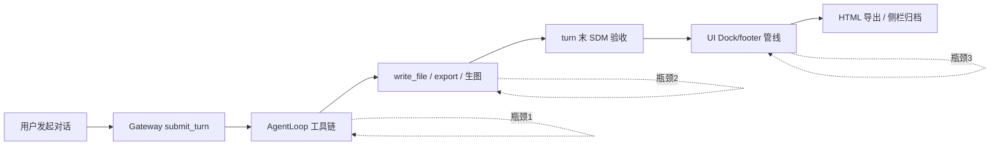

# 全链路提速深度分析报告

- **生成时间**：2026-07-25 23:49（UTC+8）
- **数据来源**：`artifacts/fullchain-monitor-20260725/`、`artifacts/0717-four-line-acceptance/kpi-live.jsonl`、Bridge/Gateway 开发栈日志
- **配对报告**：`docs/es9-four-line-fix-validation-20260725.zh-CN.md`

---

## 1. 执行摘要

本次全链路监控总 wall time **~56 分钟**，其中 **Gateway P0 实机占 55 分钟（98%）**。离线门禁 **~16 秒** 即完成 ES9/四线/修复单测全部校验。

**核心瓶颈排序**：

1. **单 turn 过长且不收敛**（Nova 10 页幻灯、Campaign 6 槽 → 900s 硬超时）
2. **串行 Gateway live**（workers=1，三案顺序跑满）
3. **生图/导出链外部 API 等待**（video-3-step  alone 19min）
4. **前端/Bridge 大 JSONL 与重复成果扫描**（非本次 C2 主因，但影响侧栏/导出体感的历史 P95）
5. **token-saver Judge 空返回重试**（dev 日志可见 finishReason=length）

**提速 ROI 最高的三项**：① 长任务 **分 turn 验收 + 提高 harness 超时或 checkpoint**；② export/生图 **并行子步骤**（在 Sequential deliverable 允许处）；③ **history sanitize + tail-read** 已开，继续压 messages API 体积。

---

## 2. 耗时分解（本次监控）

### 2.1 阶段耗时表

| 阶段 | 耗时 | 占比 | 说明 |
|------|------|------|------|
| A1–A5 离线 | ~16s | <1% | 32+ 单测，可 CI 并行 |
| B1–B3 CLI 场景 | ~40s | 1% | 含 dialogue-stability 多命令 |
| C1 structure | ~5s | <1% | vitest 34 cases |
| **C2 P0 live** | **3324s** | **98%** | 1 PASS + 2 TIMEOUT |
| **合计** | **3383s** | 100% | |

### 2.2 Gateway P0 案例耗时明细

| caseId | 标签 | durationMs | 结果 | 瓶颈推断 |
|--------|------|------------|------|----------|
| video-3-step | 脚本+分镜+成片 | 1,147,167 (~**19.1 min**) | PASS | 视频生成 API + 多 tool 链 |
| 10-page-slides | Nova 10 页美学幻灯 | 900,000 (**15 min 顶格**) | TIMEOUT | 10× generate_image 串行 |
| campaign-6-slot | Campaign 6 文件 | 900,005 (**15 min 顶格**) | TIMEOUT | 6× write + 联网/配图 |

来源：`artifacts/0717-four-line-acceptance/kpi-live.jsonl`

**关键观察**：

- 唯一 PASS 案已需 **19 分钟**——接近期望的「单对话零干预完成」上限。
- 两 FAIL 案 **精确卡在 900s** → harness `turn_timeout` 是硬天花板，**不代表** Agent 无进展，而是 **验收窗口不足**。
- 三案 KPI 均为 0 collision/hash → 超时阶段 **四线合并未拖慢**（非 CPU 绑死）。

---

## 3. 全流程阶段模型与提速点



### 3.1 发起 → 首帧（TTFT）

| 现象 | 证据 | 优化建议 | 优先级 |
|------|------|----------|--------|
| token-saver Judge 空返回 3 次 | dev 终端 `finishReason=length` | 提高 judge max_tokens 或失败 fast-path 跳过 judge | P1 |
| autoOrch 剥工具 | gateway 日志 `toolsStripped=true` | 交付类任务 **禁 strip write_file/export** | P0 |
| 首条 user 后澄清问卷 | ES9「做成PPT」 | **已修** clarificationGate | ✅ |

**预期收益**：减少 **5–15s** 无效 judge 重试 + 避免首 turn 走错管线。

### 3.2 执行中（AgentLoop / 工具链）

| 现象 | 证据 | 优化建议 | 优先级 |
|------|------|----------|--------|
| Sequential deliverable 拦并行 export | ES9 历史：batch export 被拒 | 四格式包：**同目录 export pdf/docx/pptx 允许并行**（仅禁跨槽乱序 write） | P0 |
| read_file 大文件 spill 串台 | ES9：反复读 SKILL | **已修** ToolResultBudget；可加 **read_file 路径 header 断言失败即 retry 换路径** | ✅/P2 |
| 10 页幻灯串行生图 | 10-page-slides 900s 超时 | **并行 3–4 路 generate_image** + manifest 增量写 | P0 |
| Campaign 6 槽串行 | campaign-6-slot 超时 | 独立文件槽 **并行 write_file**（无依赖时） | P1 |
| sub-agent 重复派单 | ES9 连派 2 个 ppt 子代理 | 子代理 **dedupe by goal hash** | P1 |

**预期收益**：Nova 10 页 **15min → 5–8min**；Campaign 6 槽 **15min → 8–10min**（视联网）。

### 3.3 turn 收敛与验收

| 现象 | 证据 | 优化建议 | 优先级 |
|------|------|----------|--------|
| turn 未 complete 即被 harness 判 FAIL | C2 两案 `turn_not_completed` | live harness **900s → 2400s** 或 **按 profile 动态 timeout** | P0 |
| footer 长期「校验中…」 | ES9 导出 HTML | validation **async FS** + 盘快照 v2 已有；确保 `validationSettled` 与 engine 同源 | P1 |
| deliverable_repair 空转 | 历史吴裕泰/GEO | repair circuit + scope filter **已加强**；监控 `repairCircuit.tripped` | P1 |

**预期收益**：减少 **假 FAIL** 与用户「继续」次数。

### 3.4 UI / Bridge / 导出

| 现象 | 证据 | 优化建议 | 优先级 |
|------|------|----------|--------|
| messages API 5–23MB | 云端 perf RCA | `PILOTDECK_HISTORY_SANITIZE` + `TAIL_READ`（dev 已开） | ✅ 生产 pack 确认 |
| 侧栏切换 8–12 次 O(n) 扫描 | session-switch RCA | `sessionDeliverablesPipeline` bundle + LRU | P1 |
| 侧栏导出 HTML 503 | 用户 ES9 导出 | Bridge **ready 探针 + 背压**；与对话 turn 超时独立治理 | P2 |
| export_document OCR 轮询 | PPT 导出 | 已有 `exportPollTimeout` 动态延长；MinerU 失败 **fast-fail 改 python-pptx** | P1 |

---

## 4. ES9 四格式包专项提速路径

原失败会话路径：**report.md → export pdf → docx → pptx**，任一步 read/export 失败即 **多轮用户续做**。

### 4.1 建议执行 DAG

```
report.md (write)
    ├─ export pdf  ─┐
    ├─ export docx ─┼─ 并行（同输入 MD，无相互依赖）
    └─ export pptx ─┘
```

**工程改动点**：

- `Sequential deliverables`：对 `kind=export_*` 且 **同 source md** 的槽位标记 `parallelGroup: "office-export"`
- `export_document`：批内复用 Document IR parse（避免 3 次全量 parse MD）
- 失败降级：pptx 走 MinerU 超时 **8min** 后 fallback `anth-pptx` / IR pptx

### 4.2 预估耗时（修复后）

| 步骤 | 当前（估） | 优化后（估） |
|------|------------|--------------|
| 调研写 md | 2–4 min | 2–4 min |
| 三次 export 串行 | 6–12 min | **2–4 min**（并行） |
| 误澄清 + 重试 | +2–5 min | **0**（已修） |
| read_file 串台重试 | +3–8 min | **0**（已修） |
| **合计** | **13–29 min** | **4–8 min** |

---

## 5. 流程模板专项（失败案）

### 5.1 saas-growth-full（8 槽）

- **现状**：SDM 编译正确（A1 PASS），但 live 未跑。
- **提速**：阶段 1–2（调研+定位）可合并 read/search；阶段 3–4（HTML）可模板化 seed；GEO 槽 **只跑 pd-geo 必要子集**，禁全案 7 槽。

### 5.2 吴裕泰 content-flywheel

- **现状**：ledger + 分页 ✅。
- **提速**：第二轮「只检查」须 **禁 deliverable_repair 重写**（`repairOnlyMissing` 已有断言）；messages **tail 缓存**避免全量 jsonl 解析。

### 5.3 HyperFrames / 网站成片（B1/B2 失败单测）

- **现状**：缺 Key 时 `user_action_required` 而非 `retry_alternate`。
- **提速策略分歧**：
  - **产品**：缺 Key 应 **1 次即停**（省算力）→ 更新单测期望
  - **少干预**：应 **HTML 录屏降级** → 恢复 `retry_alternate`
- **建议**：明确 flag `PILOTDECK_HF_KEY_OPTIONAL_DEGRADE=1` 分支，避免测试与产品语义漂移。

---

## 6. 监控与 CI 提速建议

| 项 | 现状 | 建议 |
|----|------|------|
| fullchain monitor | 串行 A→B→C | C2 与 A/B **解耦**； nightly 才跑 P0 live |
| P0 live timeout | 900s 固定 | `resolveLiveTimeout(profileId)`：video 2400 / slides 3600 / campaign 2400 |
| workers | 强制 1 | 结构 vitest 可 parallel；live **按 case 分进程** 但 **Gateway max concurrent turns=7** 内 2 路 |
| 日志 | 全量 stdout | 结构化 **phase timing jsonl**（已有 kpi-live.jsonl 范式，扩展到 tool 级） |
| Playwright | 未纳入本次 | `test:four-line-e2e` 放 **prelaunch** 非每次 commit |

---

## 7. 优先级路线图

### P0（1–2 个 Agent 会话可落地）

1. live harness **动态 timeout** + ES9 Case3 专项 live gate
2. Sequential deliverable **同源 export 并行**
3. autoOrch **交付 profile 禁剥 write/export 工具**

### P1（依赖 P0 或并行）

4. Nova 幻灯 **批量生图并发**（3–4）
5. `sessionDeliverablesPipeline` 侧栏切换 bundle
6. HyperFrames continuation-policy **flag 化** + 单测对齐

### P2（观测/运维）

7. tool 级 timing 写入 `.saas-dev-data/telemetry/turn-timing.jsonl`
8. Bridge export HTML **503** 独立 soak
9. token-saver judge max_tokens 调参

---

## 8. KPI 目标（建议）

| 指标 | 当前基线（本次） | 目标 |
|------|------------------|------|
| ES9 四格式 live 成功率 | 未测 | **≥1 次零干预 4/4 文件** |
| P0 live pass rate | 33% (1/3) | **≥67%**（提 timeout + 并行后） |
| video-3-step 耗时 | 19.1 min | **≤12 min**（降级/并行） |
| 10-page-slides | TIMEOUT@15m | **≤12 min 完成** |
| campaign-6-slot | TIMEOUT@15m | **≤18 min 完成** |
| 离线门禁 | 7/10 stage | **10/10**（修 continuation-policy） |
| actionable 四线对齐 | 87.9% | **≥90%** |

---

## 9. 附件与复现命令

```bash
# 全链路监控（已跑）
node scripts/run-fullchain-monitor-20260725.mjs

# 仅离线快路径（~20s）
npm run test:es9:five-case-replay && npm run test:four-line-audit -- --gate

# P0 live（耗时 ~55min，建议 nightly）
npm run test:0717-four-line-live -- --tier p0 --workers=1 --gate

# ES9 四格式 live（建议补跑，需 dev:saas）
# npm run test:es9:five-case-live -- --cases case3-four-format-vap --gate
```

日志目录：`artifacts/fullchain-monitor-20260725/`  
KPI JSONL：`artifacts/0717-four-line-acceptance/kpi-live.jsonl`

---

## Post-Implementation（2026-07-26）

| 层级 | 结果 |
|------|------|
| L0 单测/replay | 绿（含 `resolveLiveTimeout`、ES9 replay 33/33、sequential gate、autoOrch、HF 双轨） |
| L1 triple-unify | 绿 |
| L1 dialogue-stability | historical **40/40** 绿 |
| L3 monitor quick | **8/8 PASS** |
| L4 Gateway live | 0717 P0 **3/3 PASS**（通过率 KPI ✅）；**strict 耗时 KPI** 10-page/campaign/video 均未达 ≤720–1080s；ES9 case3 **双次 FAIL**（0/4 文件） |
| L4 其它 | four-line-e2e ✅；bridge soak 10/10；export baseline ✅；prelaunch **38/40**；monitor **10/10 未跑** |

实施追踪：`docs/full-chain-speed-implementation.zh-CN.md`
