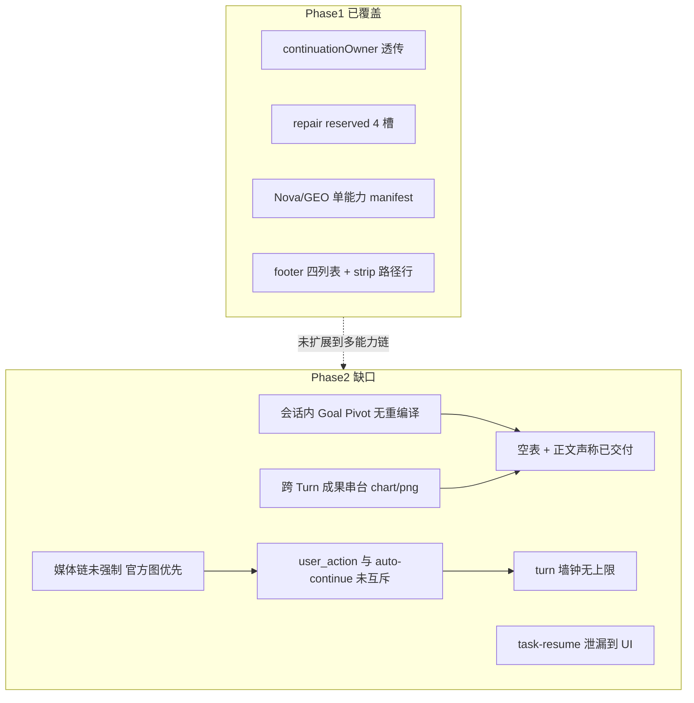
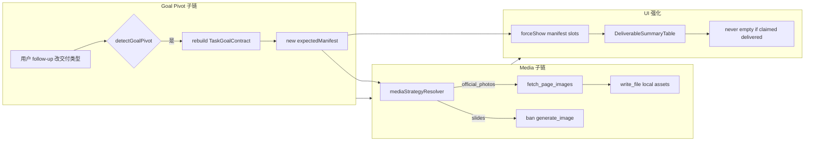
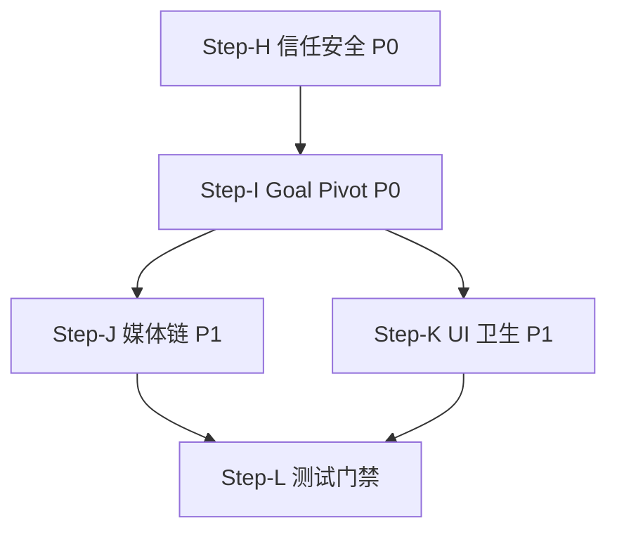
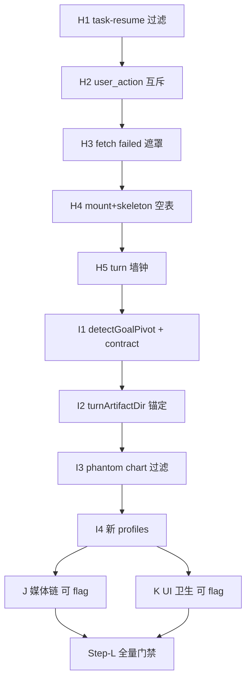

# Goal-Loop Phase 2 — 阿根廷五案深度分析与优化计划

> **v2 执行稿（本地）**：[`goal-loop-phase2-v2-plan-20260701.zh-CN.md`](goal-loop-phase2-v2-plan-20260701.zh-CN.md) · H0 复盘 [`goal-loop-h0-network-resilience-postmortem-20260701.zh-CN.md`](goal-loop-h0-network-resilience-postmortem-20260701.zh-CN.md)  
> **延续基线**：[`goal-loop_生产终案_a4df4096.plan.md`](file:///c:/Users/rufen/.cursor/plans/goal-loop_生产终案_a4df4096.plan.md)（Step-A～G 已落地）  
> **分析视角**：测试总监 · 系统架构师 · 产品经理 · 用户代表  
> **案例来源**：「测试阿根廷项目」同会话多能力链（2026-06-30 实机反馈）  
> **原则不变**：单链 Goal Contract → 引擎验收 → 自动修复 → UI 终端收口；**禁止**第四套续跑轨

---

## 0. 执行摘要

Goal-Loop 第一阶段显著改善了 **Nova 6 页 PNG / GEO 9 文件 / 脑爆无交付** 等「单能力、单目录、契约清晰」场景（prelaunch live **4/4 PASS**）。  
但用户在同一项目内串联 **深度分析 → PPTX、投放创意 → 落地页、PDF、杂志长文、广告文案 → HTML** 时，仍出现 **五类系统性缺陷**：

| 层级 | 典型现象 | 用户一句话 |
|------|----------|------------|
| **契约** | 中途改目标（分析→PPTX）、无 manifest | 「我要 PPTX，表里只有一张 chart.png」 |
| **展示** | 底部表空、路径串台、状态反复 | 「文件夹里有，表格里没有 / 落地页在哪？」 |
| **内容** | 正文重复表、task-resume 外露、fetch failed | 「？？ / 为什么同一行抄了五遍？」 |
| **恢复** | Key 无效仍续跑、270min 空转 | 「说了继续还是在报 Key / 自动恢复要确认发布？」 |
| **媒体** | 生图失败未切官方图链 | 「不要生成图，要找官方摄影作品」 |

本计划为 **Phase 2（P0 优先）**，在既有架构上增量扩展，**不推翻** continuationOwner / repair 子预算 / footer 四列表。

---

## 1. 五案逐条深析

### 案例 1：「深度分析」→「8 页 PPTX（官方图 + 图表）」

#### 用户旅程还原

1. 能力「深度分析」产出 md 报告（53s）— 正常。  
2. 用户追加：**带官方图、图表、南美风情 PPTX** → 系统追问页数 → 用户「8页，直接开始」。  
3. 多轮：抓官方图 → `fetch failed` → 降级无图报告 → 尝试 HTML→PPTX 导出 → 再次 `fetch failed`。  
4. **每轮底部表仅 `chart-1782688899694.png`**，与用户要的 PPTX 无关；正文表格 **同一摘要块重复 5 次**。

#### 四角色诊断

| 角色 | 结论 |
|------|------|
| **测试总监** | 缺少「分析→二次交付 PPTX」跨 turn 契约用例；未断言 **expectedManifest 含 `.pptx`**；未覆盖 **正文重复表** 回归；`chart-*.png` 无 profile 却进 summary 表属 **phantom deliverable**。 |
| **架构师** | 会话内 **Goal  pivot** 未触发 `buildTaskGoalContract` 重编译；第二目标无 `minCount=8` + manifest slots；`turnArtifactDir` 锚在 chart 产物目录而非 slides/deck；**stripRedundantDeliverableProse** 未处理「重复 Markdown 表块」。 |
| **产品经理** | 「深度分析」与「PPTX」是 **两阶段产品承诺**，UI 却像已完成；页数澄清后应 **Launch Registry 锁定 8 页 + 画幅**，而非纯聊天追问；用户看到 `chart.png` 会认定 **系统交付错了东西**。 |
| **用户代表** | 「？？？」= **信任崩塌**：表与文件夹对不上、正文像坏了的打印机、fetch failed 像甩锅；我要的是 **能打开的 PPTX**，不是过程图。 |

#### 根因链（按优先级）

1. **P0 — 无二次 Goal Contract**：follow-up「做 PPTX」未写入 session 级 contract / expectedManifest（`presentation.pptx` 或 `slide-manifest.json` + PNG 包）。  
2. **P0 — 跨 turn 成果串台**：历史 turn 的 `chart-*.png` 被 `collectTurnFinalDeliverables` / validate 误收为本回合主成果。  
3. **P1 — 正文 strip 不完整**：`stripRedundantDeliverableProseForSummaryTable` 未 dedupe **整段 Markdown table**（非仅路径行）。  
4. **P1 — 媒体策略未强制**：PPT 场景应 **fetch_page_images → write_file HTML → export_document**，而非 generate_image；失败后须 **占位 + 继续 export**，禁止裸 `fetch failed` 终局。  
5. **P2 — 澄清门控位置不当**：页数应用 Launch Sheet / capability binding 一次收齐，减少「已完成 · 12s 只问页数」的假完成感。

---

### 案例 2：「投放创意」→ 南美落地页 + task-resume 外露

#### 用户旅程还原

1. 生图/抓图失败 → 改 CSS/SVG 方案，交付 `artifacts/south-america-travel/index.html`。  
2. **用户气泡出现完整 `<task-resume>…</task-resume>` XML**（含 S3/imgix URL、missing_paths）。  
3. 助手宣称完成，用户问「落地页在哪？」— 路径 **south-america-travel** vs **south-america-landing** 不一致。  
4. 长续跑后表项 **HTML 已交付 ↔ 未完成** 横跳；末尾 `fetch failed`。

#### 四角色诊断

| 角色 | 结论 |
|------|------|
| **测试总监** | **P0 泄漏**：task-resume 必须在 UI/API **零可见**（现仅引擎侧过滤不足）；E2E 缺 **「用户消息不含 `<task-resume`」** 断言。 |
| **架构师** | `buildTaskResumeMessage` 注入通道与 **user 消息渲染** 未完全隔离；`verified_paths` 含 URL 导致 **missing_paths` 误判 `*.html`；目录命名无 **artifactDir 单槽约束**。 |
| **产品经理** | 投放创意承诺「文案+配图+落地页」，表只列 HTML 且链接 `/artifacts/...` **不可点**；用户合理预期 **预览入口 = 表内链接**。 |
| **用户代表** | 看到 XML =「我在看后台日志」；路径两个名字 = **故意躲猫猫**。 |

#### 根因链

1. **P0 — task-resume / synthetic user 消息未过滤**：Bridge 或 `readSessionMessages` 将 infra 续跑写进 **user 可见 transcript**。  
2. **P0 — turnArtifactDir 漂移**：同会话 `south-america-travel` 与 `south-america-landing` 并存，summary 解析跟错 hintDir。  
3. **P1 — expectedManifest 缺失**：落地页任务应有 `[['index.html']]` + 可选 hero 图 basename group。  
4. **P1 — repair 与 validate 竞态**：长 turn 末 meta 未 settled → 表状态 **checking ↔ 未完成** 闪烁。  
5. **P2 — 外链图当交付**：CDN URL 写入 artifacts 块但未 `write_file` 本地化，validate 不稳定。

---

### 案例 3：「高视觉质量 PDF」— Key 无效 + 270min 空转

#### 用户旅程还原

1. 首条即 **UserActionRequiredCard**（API Key 无效）— 正确。  
2. 用户「继续 / 再试试」→ 仍 Key 卡；出现 **270min** 级 turn；中间 **「公开发布/删除」确认卡**（与 PDF 无关）。  
3. 正文出现 **「替代方案」无限重复**；最终 `fetch failed` 外露。

#### 四角色诊断

| 角色 | 结论 |
|------|------|
| **测试总监** | **硬失败 1 次即停** 规则被 bypass；`userActionBlockerStreak` 未对 **同 session 重复「继续」** 生效；缺 **turn 墙钟超时**（如 45min 硬停 + 终端说明）。 |
| **架构师** | `user_action_required` 时 **UI auto-continue / task-resume 仍触发**；generate_image/pdf 工具链未 **preflight Key**；dangerous-action gate **误匹配** 文档导出。 |
| **产品经理** | Key 问题应 **一次说清 + 禁用输入框续跑**，而非让用户试 270 分钟；PDF 高视觉应对齐 **export_document IR**，不是无限生图。 |
| **用户代表** | 「确认公开发布」吓死人；重复「替代方案」像 **模型卡死**。 |

#### 根因链

1. **P0 — user_action 与 auto-continue 互斥未 enforced**：`clarificationGate` / `useAutoRecoveryContinue` 在 Key blocker 时仍注入 `<task-resume>`。  
2. **P0 — 无 turn 墙钟预算**：仅 token/tool 次数，无 **wallClockMaxMs** → 270min。  
3. **P1 — 工具 preflight 缺失**：调 generate_image / MinerU 前未 **sync 检查 modelPool**，失败应 **立即 terminal + UserActionRequiredCard**，不进入 repair 轨。  
4. **P1 — 流式重复未截断**：provider 重复 token 无 **dedupe guard**（UI 侧 `isDegenerateAssistantText`）。  
5. **P2 — 危险操作分类过宽**：export/publish 确认器误伤 **本地 write_file + export_document**。

---

### 案例 4：「杂志长文」— 空表、要官方图、222min

#### 用户旅程还原

1. 声称「PNG 程序化渲染成功」— **表为空**。  
2. 用户：「不要生成图，要官方摄影；长文在哪？」  
3. 222min 后口述「已有完整 md 六章」— **侧栏/表仍无文件**；改做 HTML 动效 → 又只出现 `chart.png` → `fetch failed`。

#### 四角色诊断

| 角色 | 结论 |
|------|------|
| **测试总监** | 违反 **footer 表唯一权威**：`forceShow` + expectedManifest 未触发；缺 **「声称交付但 validate 0 文件」** 自动 fail 门禁。 |
| **架构师** | `shouldMountDeliverableSummary` 依赖 `validatedTurnDeliverables`，validate 慢/失败 → **return null 整表消失**；与计划 §3.3「空行也展示 skeleton」仍有差距。 |
| **产品经理** | 「杂志长文」产品定义 = **md/docx + 官方图 embedding**；Agent 用 Unsplash 关键词敷衍 = **未交付**。 |
| **用户代表** | 空表 + 长文只在气泡里 = **诈骗感**；222min 不可接受。 |

#### 根因链

1. **P0 — 空表假完成**：`tableRows.length===0 && !forceShow` → 表隐藏，但 assistant 仍输出「✅ 已交付」。  
2. **P0 — 媒体策略与用户意图冲突**：`userGoal` 含「官方摄影/配图」须 **binding prompt 禁止 generate_image**，强制 fetch_page_images + write_file。  
3. **P1 — profile 缺失**：`magazine-longform` → required `article.md` + `article.html` optional。  
4. **P1 — 正文/表不一致**：引擎 `acceptanceStatus=passed` 但磁盘 0 字节 — **completionGate 未对齐磁盘**。  
5. **P2 — chart.png 再次串台**（同案例 1）。

---

### 案例 5：「广告文案」→ HTML — 表延迟、edit_file 误用

#### 用户旅程还原

1. 首 turn **纯文案**（无文件）— 合理。  
2. 用户「需 HTML 版本」→ 多轮 **表空**、用户三次「交付物在哪」。  
3. 模型自述 **用 edit_file 创建新文件**（工具语义错误）→ 最后表出现 `landing-south-america-tour/index.html`，但又冒 **Markdown 未完成**。

#### 四角色诊断

| 角色 | 结论 |
|------|------|
| **测试总监** | 缺 **write_file 后 1s 内 summary 行出现** 的 E2E；工具误用应 **lint 在 Recovery 注入** 而非让用户发现。 |
| **架构师** | validate 异步 → 文件已落盘但 **acceptanceRows 未刷新**；`reconcileTurnDeliverables` 未监听 **同 turn 多次 write**。 |
| **产品经理** | 文案→HTML 是 **明确二段式**；第二段应 **新 expectedManifest** 仅 `index.html`，不应出现 phantom Markdown 行。 |
| **用户代表** | 「文件夹里有、表里没有」= **UI 撒谎**；解释 edit_file 是 **开发者道歉**，用户不关心。 |

#### 根因链

1. **P1 — validate 与 UI 刷新延迟**：`useValidatedDeliverables` settled 前表为空。  
2. **P1 — 工具选择无约束**：saasCoreStrategy 须 **write_file 新建 / edit_file 仅改** 硬规则 + 违反时 engine veto。  
3. **P2 — 同 turn 多 assistant 气泡**：仅最后一条挂表，前条已说「完成」— **turn 内假终局**。  
4. **P2 — phantom Markdown 行**：expectedManifest 或 profile 泛化过度。

---

## 2. 跨案根因总图



### 根因归类表

| ID | 根因 | 影响案例 | 严重度 |
|----|------|----------|--------|
| R1 | 会话内 **Goal Pivot** 未重编译 expectedManifest | 1,4,5 | P0 |
| R2 | **跨 turn / 跨目录** 成果串台（chart、旧 html） | 1,2,4 | P0 |
| R3 | **task-resume / synthetic** 用户可见 | 2 | P0 |
| R4 | **user_action_required** 仍 auto-continue / task-resume | 3,4 | P0 |
| R5 | **空 summary 表** + 正文「已交付」 | 4,5 | P0 |
| R6 | **fetch failed / 英文错误** 终局外露 | 1,2,3,4 | P0 |
| R7 | **媒体策略** 未绑定（生图 vs 官方图） | 1,3,4 | P1 |
| R8 | **turnArtifactDir** 多目录漂移 | 2,5 | P1 |
| R9 | **正文重复块** 未 strip | 1,2 | P1 |
| R10 | **turn 墙钟** 无硬上限 | 3,4 | P1 |
| R11 | validate **异步 settled** 导致表延迟/空 | 5 | P1 |
| R12 | **危险操作确认** 误触发 | 3 | P2 |

---

## 3. Phase 2 优化架构（延续单链）

**不变**：引擎 owner 验收与 repair；Bridge 镜像 meta；UI 仅终端态；禁止第四套续跑。

**新增三条子链**：



---

## 4. 分阶段开发计划

### Step-H：P0 信任与安全（优先合并）

| 项 | 改动要点 | 关键文件 |
|----|----------|----------|
| H1 task-resume 零可见 | user/assistant 渲染前 `stripTaskResumeMarkup`；messages API `synthetic` 过滤；Playwright 断言 | `readSessionMessages.ts`, `messages.js`, `MessageRowV2.tsx`, `stripLeakedToolMarkup.ts` |
| H2 user_action 硬互斥 | `user_action_required` → 禁 `useAutoRecoveryContinue` / `useIncompleteDeliverableAutoContinue` / task-resume 注入；同错 3 次快停 | `clarificationGate.ts`, `useAutoRecoveryContinue.ts`, `userActionBlockerStreakTracker` |
| H3 fetch failed 终局禁止 | 助手气泡 `isBareTransientErrorText` → 替换为弱提示；turn 未 verified 不得 `turn_completed` | `userFacingErrors.ts`, `AgentLoop.ts`, `saasCoreStrategy.ts` |
| H4 空表假完成 | `shouldMountDeliverableSummary && forceShow` 当 `userGoalImpliesDeliverable`；`acceptanceStatus=passed` 且 rows=0 → engine **reject** | `MessageRowV2.tsx`, `DeliverableSummaryTable.tsx`, `validateDeliverablesEngine.ts` |
| H5 turn 墙钟 | `PILOTDECK_TURN_WALL_CLOCK_MS`（默认 45min dev / 30min prod）；耗尽 → terminal + 温和原因 | `AgentLoop.ts`, `stageRecoveryBudget.ts` |

**验收**（见 **§10 测试矩阵 Step-H**；原 `--filter` 语法不存在，已修正）

```bash
npm run test:goal-loop:phase2 -- --step=H
npm run test:dialogue-stability:historical -- --ids=argentina-ad-creative-resume-leak,argentina-pdf-key-blocker
npm run test:goal-loop:acceptance
```

**新增 fixture**（`tests/fixtures/goal-loop/`）：

| 文件 | 用途 |
|------|------|
| `task-resume-leak.jsonl` | user 气泡含 `<task-resume>` 泄漏 |
| `empty-table-false-complete.jsonl` | acceptance passed + 0 行 summary |
| `fetch-failed-terminal.jsonl` | 助手终局裸 `fetch failed` |
| `user-action-auto-continue.jsonl` | Key 无效仍注入 resume |

---

### Step-I：P0 Goal Pivot + 防串台

| 项 | 改动要点 |
|----|----------|
| I1 **detectGoalPivot** | 同 session 新 user 消息若引入 **新 requiredKinds**（pptx/pdf/html/md）且与当前 contract 不兼容 → `rebuildTaskGoalContract` append-only |
| I2 **turn 级 artifact 锚定** | 每 turn 写 `turnArtifactDir` 到 acceptance meta；collect 仅扫 **本 turn meta 目录**，禁止 mtime 全树 |
| I3 **phantom 过滤** | `chart-*.png`、无 profile 的过程图 **不得** 进 `collectTurnFinalDeliverables`；仅 process 区 |
| I4 **follow-up manifest** | 「8页 PPTX」→ `presentation.pptx` 或 Nova deck profile；「HTML 落地页」→ `[['index.html']]` |

**新增 profile（`deliverableCapabilityProfiles.ts`）**

| profile | 触发 | requiredBasenameGroups | 备注 |
|---------|------|------------------------|------|
| `presentation-pptx` | pptx/幻灯/演示文稿 | `[['presentation.pptx']]` 或走 `nova-slide-deck` | **禁止** `*.pptx` 通配（registry 不支持 glob） |
| `landing-html` | 落地页/html | `[['index.html']]` | 单槽 `turnArtifactDir` 强制 |
| `magazine-longform` | 杂志长文 | `[['article.md','longform.md','report.md']]` 任一组 | 不用 `*.md` |
| `high-visual-pdf` | 高视觉 pdf | `[['report.pdf','document.pdf']]` 任一组 | 对齐 export_document |

**验收**（见 **§10 Step-I**）：

```bash
npm run test:goal-loop:phase2 -- --step=I
npm run test:four-line-audit
node scripts/replay-goal-loop-fixture.mjs tests/fixtures/goal-loop/argentina-pivot-pptx.jsonl
```

### Step-J：P1 媒体与工具链

| 项 | 改动要点 |
|----|----------|
| J1 **mediaStrategyResolver** | goal 含「官方图/摄影/配图」→ `strategy=official_fetch`；含「PPT/PDF 报告」→ `export_document` 主路径 |
| J2 **binding prompt 强化** | 能力中心 slug + `capabilityBindingPrompt`：禁止 generate_image；必须 fetch_page_images → write_file 本地化 |
| J3 **工具 preflight** | generate_image / export_document 前 **sync** modelPool Key；失败 → `user_action_required` 一次 |
| J4 **工具语义 lint** | 新建文件仅 `write_file`；Recovery 注入若检测 edit_file create → 改 write_file |
| J5 **降级模板** | 抓图失败 → CSS/SVG/占位图 **仍写入 html/pptx**；meta 标记 `degradedMedia=true` |

**验收**：`npm run smoke:document-export`；live T-06「南美 PPTX 官方图」。

---

### Step-K：P1 UI 与正文卫生

| 项 | 改动要点 |
|----|----------|
| K1 **重复块 strip** | `stripRedundantDeliverableProseForSummaryTable` 增加 **Markdown 表 dedupe**（相同 header 连续 ≥2 次删除） |
| K2 **validate 即时刷新** | write_file 事件 → Bridge 增量 invalidate validate cache；summary **checking 行** 直至 settled |
| K3 **链接列可点** | summary 表 `linkable` 必须 `resolvedPath`；禁止仅 `/artifacts/...` 不可解析 |
| K4 **turn 内单终局** | 同 turn 多条 assistant 仅 **最后一条** 可 `turn_completed`；前条标 `superseded` 不挂表 |
| K5 **危险操作收窄** | 仅 **对外 publish/send/delete** 弹确认；本地 export_document 不弹 |

**验收**（见 **§10 Step-J/K**）

---

### Step-L：测试编排与门禁（与 §10 合并为权威）

**新增 npm scripts**（`package.json`）：

```json
"test:goal-loop:phase2": "node scripts/run-goal-loop-phase2-acceptance.mjs",
"test:goal-loop:phase2:unit": "node scripts/run-goal-loop-phase2-acceptance.mjs --layer=unit",
"test:goal-loop:phase2:replay": "node scripts/replay-goal-loop-fixture.mjs",
"test:goal-loop:acceptance:full": "npm run test:goal-loop:acceptance && npm run test:goal-loop:phase2"
```

**实任务 T-06**（`scripts/integration-prelaunch-live-tasks.mjs` 增项）：

| 字段 | 值 |
|------|-----|
| ID | T-06 |
| 名称 | 南美多能力链（分析 md → 8 页 pptx 官方图） |
| timeout | `LIVE_T06_TIMEOUT_MS` 默认 1500000 |
| 验收 | manifest 含 pptx 或 nova deck；无 chart phantom；无 task-resume 泄漏 |

---

## 5. 产品/UX 契约补充（§3.3 延伸）

1. **Goal Pivot 明示**：检测 pivot 时过程区一行弱提示「已切换为 PPTX 交付目标」（i18n，非错误色）。  
2. **表为空禁止「✅ 已交付」**：引擎 `saasCoreStrategy` 增补 **hard ban** 文案模板。  
3. **Key/权限卡唯一入口**：出现 `UserActionRequiredCard` 时 Composer 占位「请先完成上方配置」，禁发「继续」。  
4. **降级徽章**：summary 表状态 `已交付（配图降级）` 可选第三态，避免用户以为全质量。  
5. **Launch Registry 扩展**：html-ppt / 高视觉 pdf / 杂志长文 纳入 `shouldOpenLaunchSheet`（页数、画幅、是否要官方图）。

---

## 6. 优先级与依赖



| 步骤 | 可并行 | 阻断发版 |
|------|--------|----------|
| Step-H | — | **是** |
| Step-I | 与 H 部分重叠 | **是** |
| Step-J | 依赖 I | 否（可 flag） |
| Step-K | 依赖 I | 否 |
| Step-L | 依赖 H～K | **是**（Phase2 DoD） |

---

## 7. Phase 2 Definition of Done（摘要；明细见 §12）

- [ ] 五案各有一条 **historical scenario PASS**（replay + Playwright）  
- [ ] task-resume / fetch failed **零用户可见**（抽检 20 会话 JSONL + H1 单测）  
- [ ] user_action 场景 **零 auto-continue**（telemetry + H2 单测）  
- [ ] Goal Pivot 后 **expectedManifest 与磁盘一致**（四线 audit aligned ≥ 基线）  
- [ ] `npm run test:goal-loop:phase2 -- --layer=all --retest` **两遍**全绿  
- [ ] 阿根廷 T-06 live **PASS** 或 **BLOCKED**（Key 缺失须文档化）  
- [ ] 报告：`docs/goal-loop-phase2-acceptance-YYYYMMDD.md`

---

## 8. 风险与不做项

| 风险 | 缓解 |
|------|------|
| pivot 检测误伤「继续」 | 仅结构变化（new file kinds）触发；「继续」走 session 首条 goal |
| 过度 strip 误删结论 | 只 dedupe **完全相同** 表块；保留首段摘要 |
| profile 膨胀 | 仅双命中 profile+goal；不泛化到全任务 |

**明确不做（与终案一致）**

- 第四套 UI 汇总表驱动续跑  
- 历史 JSONL 批量 backfill  
- 为用户可见层改 PilotDeck 内部标识  

---

## 9. 与现网发版关系

- Phase 1 Goal-Loop **可候选发版**（自动化 4/4 live + 32/32 稳定性）。  
- Phase 2 **建议作为 v2.0.1 硬门禁**：南美多能力链为 **P0 真实用户路径**，未过 Step-H/I 不宣称「交付闭环完成」。  
- 生产 env：Step-H 的 `PILOTDECK_TURN_WALL_CLOCK_MS` 经 `pack.mjs` 注入，禁止手改 `.env`。

---

---

## 10. 计划审阅：问题、冲突与修正（可执行前必读）

### 10.1 原稿硬伤（已修正）

| # | 问题 | 冲突/后果 | 修正 |
|---|------|-----------|------|
| C1 | `test:dialogue-stability:historical -- --filter=…` | runner **无 `--filter`**，只有 `--suite=` | 扩展 `dialogueStabilityScenarioRunner` 支持 `--ids=id1,id2`；或专用 replay 脚本 |
| C2 | profile 使用 `*.pptx` / `*.md` | `deliverableCapabilityProfiles` **仅 basename 精确/别名组**，无 glob | 改为 `requiredBasenameGroups` 显式列表 |
| C3 | H4「passed 且 rows=0 → reject」 | 与 Phase1 **脑爆/chat-first** 冲突 | 加门控：`userGoalImpliesDeliverable(goal) && expectedManifest.length>0` 才 reject |
| C4 | I1 pivot vs AGENTS「继续锚首条 goal」 | 「继续」不应触发 pivot | `detectGoalPivot` **排除** `isContinuationOnlyUserText`；pivot 仅 **新 kinds 且非纯继续** |
| C5 | `forceShow` 已存在但仍空表 | 根因是 `shouldMountDeliverableSummary=false`，非 forceShow | H4 改为：**mount 条件**含 pivot 后 manifest；forceShow 仅保证 mount 后 skeleton |
| C6 | Step-L 与 §6.1 终案重复 | 两套门禁易漂移 | Phase2 统一 **§10 测试矩阵** + `test:goal-loop:phase2` 单编排 |
| C7 | T-06 live 25min vs Nova 669s | 多能力链 25min 过紧 | 默认 **25min** 改为 **1500000ms（25min）** 仅 T-06 单段；全链 live 另设 `--skip-live` |
| C8 | J3 preflight「sync modelPool」 | Bridge 无 tenant modelPool 同步 API | 改为 **Gateway 侧** `resolveModelPoolCredential` + 缓存 1 turn；单测 mock |

### 10.2 架构一致性检查（与 Phase1 终案）

| 检查项 | 结论 |
|--------|------|
| 单链 owner | ✅ 仍仅引擎 repair；Phase2 不新增 UI 续跑轨 |
| continuationOwner | ✅ H2 禁 auto-continue 时 **不**改 owner 语义 |
| GEO/Nova 回归 | ⚠️ I 增 profile 须 **单测** `isBrandGeoFullCaseGoal` / `isNovaImageSlideDeckGoal` 不变 |
| 历史 JSONL | ✅ 无 backfill；replay fixture **新建**不修改旧 jsonl |
| pack env | ✅ H5 墙钟、`PILOTDECK_ACCEPTANCE_REPAIR_RESERVED` 经 `pack.mjs` 文档化 |

### 10.3 实施顺序（可执行 DAG）



**每步合并前最小命令**：

```bash
npm run test:goal-loop:phase2 -- --step=H   # 仅 H 相关单测+replay
npm run test:goal-loop:acceptance            # Phase1 回归不退化
```

---

## 11. 测试体系（单元 · 集成 · 实机 · 辐射）

> **原则**：每个根因 R1–R12 至少 **1 单元 + 1 集成/replay + 1 UI/Playwright（若用户可见）**；每 Step 合并跑 **Phase1 回归 + Phase2 增量 + 辐射矩阵子集**。

### 11.1 单元测试矩阵（按 Step，改完即跑）

#### Step-H 单元（P0）

| 测试文件（新建/扩展） | 用例 ID | 断言要点 | 覆盖根因 |
|----------------------|---------|----------|----------|
| `ui/src/shared/stripLeakedToolMarkup.test.ts` | H1-a | `<task-resume>…</task-resume>` 整段剔除 | R3 |
| `ui/src/shared/stripLeakedToolMarkup.test.ts` | H1-b | assistant 内 `<artifacts>` URL 块不泄漏 | R3 |
| `tests/web/server/readSessionMessages.goal-loop.test.ts`（新） | H1-c | synthetic user + metadata.synthetic 不进入 messages API | R3 |
| `ui/server/routes/messages.synthetic.test.js`（新） | H1-d | GET messages 过滤 task-resume user 行 | R3 |
| `ui/src/components/chat-v2/hooks/useAutoRecoveryContinue.test.tsx`（扩） | H2-a | `user_action_required` → shouldFire=false | R4 |
| `ui/src/components/chat-v2/hooks/useIncompleteDeliverableAutoContinue.test.tsx`（扩） | H2-b | 同上 | R4 |
| `ui/src/components/chat-v2/hooks/taskResumeCoordinator.test.ts`（扩） | H2-c | user_action 时不 buildTaskResumeMessage | R4 |
| `src/saas/userActionBlockerStreakTracker.test.ts`（新/扩） | H2-d | 同 Key 错 3 次 → block auto-continue | R4 |
| `src/agent/errors/userFacingErrors.test.ts`（扩） | H3-a | `isBareTransientErrorText('fetch failed')` true | R6 |
| `ui/src/shared/userFacingErrors.test.ts`（扩） | H3-b | 气泡替换为弱提示 copy，无「重试」 | R6 |
| `src/agent/loop/completionGate.test.ts`（新） | H3-c | verified=0 且 goal 要交付 → 不得 turn_completed | R6,R5 |
| `ui/src/components/chat/deliverables/DeliverableSummaryTable.acceptance.test.tsx`（扩） | H4-a | forceShow + expectedManifest → 表头+checking 行 | R5 |
| `ui/src/components/chat-v2/MessageRowV2.deliverable-mount.test.tsx`（新） | H4-b | pivot 后 manifest 存在 → shouldMount=true | R5,R1 |
| `src/agent/loop/turnWallClock.test.ts`（新） | H5-a | 超 wallClock → terminal reason=wall_clock_exceeded | R10 |
| `src/saas/resilience/stabilityFlags.test.ts`（扩） | H5-b | env 解析默认 45min dev | R10 |

**Step-H 单元命令**：

```bash
npx vitest run ui/src/shared/stripLeakedToolMarkup.test.ts ui/src/shared/userFacingErrors.test.ts
npx vitest run ui/src/components/chat/deliverables/DeliverableSummaryTable.acceptance.test.tsx
npx vitest run ui/src/components/chat-v2/hooks/useAutoRecoveryContinue.test.tsx ui/src/components/chat-v2/hooks/taskResumeCoordinator.test.ts
npx tsx --test tests/web/server/readSessionMessages.goal-loop.test.ts
npx tsx --test src/agent/loop/turnWallClock.test.ts src/agent/loop/completionGate.test.ts
```

#### Step-I 单元（P0）

| 测试文件 | 用例 ID | 断言要点 | 覆盖根因 |
|----------|---------|----------|----------|
| `src/saas/taskState/detectGoalPivot.test.ts`（新） | I1-a | 「分析 md」→「8页 pptx」→ pivot=true, goalVersion+1 | R1 |
| `src/saas/taskState/detectGoalPivot.test.ts` | I1-b | 纯「继续」→ pivot=false | C4 |
| `src/saas/taskState/taskGoalContract.test.ts`（扩） | I1-c | previousContract + pptx → requiredFiles 含 presentation.pptx | R1 |
| `src/saas/taskState/taskGoalContract.test.ts`（扩） | I1-d | GEO 全案 goal **不变**（回归） | C2 |
| `src/saas/taskState/taskGoalContract.test.ts`（扩） | I1-e | Nova 6页 **不变**（回归） | C2 |
| `ui/src/shared/collectFinalDeliverables.test.ts`（扩） | I2-a | turnMeta.turnArtifactDir 限定 collect 范围 | R2,R8 |
| `ui/src/shared/reconcileTurnDeliverables.test.ts`（扩） | I2-b | 双目录 travel/landing → hintDir 跟 meta | R8 |
| `ui/src/shared/nonDeliverablePaths.test.ts`（扩） | I3-a | `chart-1782688899694.png` → non-user deliverable | R2 |
| `ui/src/shared/collectFinalDeliverables.test.ts`（扩） | I3-b | chart 仅进 process 不进 final | R2 |
| `src/saas/deliverableCapabilityProfiles.test.ts`（新） | I4-a | landing-html / magazine-longform profile 命中 | R1 |
| `src/saas/deliverables/profileRequiredDeliverables.test.ts`（扩） | I4-b | 新 profile basename 组解析 | R1 |

**Step-I 单元命令**：

```bash
npx vitest run src/saas/taskState/detectGoalPivot.test.ts src/saas/taskState/taskGoalContract.test.ts
npx vitest run ui/src/shared/collectFinalDeliverables.test.ts ui/src/shared/nonDeliverablePaths.test.ts ui/src/shared/reconcileTurnDeliverables.test.ts
npm run test:deliverable-partial:unit
```

#### Step-J 单元（P1）

| 测试文件 | 用例 ID | 断言要点 |
|----------|---------|----------|
| `src/saas/media/mediaStrategyResolver.test.ts`（新） | J1-a | 「官方摄影」→ official_fetch |
| `src/saas/media/mediaStrategyResolver.test.ts`（新） | J1-b | 「高视觉 PDF」→ export_document |
| `src/context/prompt/capabilityBindingPrompt.test.ts`（扩） | J2-a | 官方图 goal 含禁止 generate_image |
| `src/tool/builtin/generateImage.preflight.test.ts`（新） | J3-a | 无 Key → user_action 不调用 API |
| `src/agent/recovery/toolSemanticLint.test.ts`（新） | J4-a | edit_file 新建路径 → lint 失败 |
| `src/saas/final-acceptance/degradedMedia.test.ts`（新） | J5-a | meta.degradedMedia=true 时仍 passed+徽章 |

#### Step-K 单元（P1）

| 测试文件 | 用例 ID | 断言要点 |
|----------|---------|----------|
| `ui/src/shared/deliverableSummaryBodyStrip.test.ts`（扩） | K1-a | 相同 Markdown 表重复 5 次 → 留 1 |
| `ui/src/shared/deliverableSummaryBodyStrip.test.ts`（扩） | K1-b | 不同表保留 |
| `ui/src/shared/deliverableValidationCache.test.ts`（扩） | K2-a | write_file 事件 invalidate cache |
| `ui/src/shared/buildDeliverableSummaryRows.test.ts`（扩） | K3-a | 无 resolvedPath → linkable=false |
| `src/session/transcript/turnSuperseded.test.ts`（新） | K4-a | 同 turn 前 assistant 标 superseded |
| `ui/src/shared/formalRecoveryInterrupt.test.ts`（扩） | K5-a | export_document 不触发 publish 确认 |

---

### 11.2 集成 / Replay / Harness（分钟级）

#### Fixture 清单（`tests/fixtures/goal-loop/`）

| 文件 | 模拟案例 | 回放断言 |
|------|----------|----------|
| `argentina-pivot-pptx.jsonl` | 案例1 | turn2 manifest 含 pptx；collect 无 chart |
| `argentina-resume-leak.jsonl` | 案例2 | readSessionMessages 0 条 user task-resume |
| `argentina-key-blocker-loop.jsonl` | 案例3 | 0 条 auto_continue；wallClock 终止 |
| `argentina-magazine-empty.jsonl` | 案例4 | UI meta rows≥1 或 engine reject passed |
| `argentina-copy-html-delay.jsonl` | 案例5 | write index.html 后 acceptance 行出现 |
| `task-resume-leak.jsonl` | H1 | 同案例2 最小 |
| `cross-turn-chart-bleed.jsonl` | I3 | turn2 summary 无 turn1 chart |
| `dual-artifact-dir.jsonl` | I2 | 五入口同 hintDir |

**Replay 脚本**（新建 `scripts/replay-goal-loop-fixture.mjs`）：

```bash
node scripts/replay-goal-loop-fixture.mjs tests/fixtures/goal-loop/argentina-pivot-pptx.jsonl --assert=manifest,phantom,resume
node scripts/replay-goal-loop-fixture.mjs tests/fixtures/goal-loop/ --all
```

**引擎 Harness**（Gateway session，可选 live）：

| 场景 | 脚本 | 收敛条件 |
|------|------|----------|
| Key 无效不续跑 | `scripts/integration-goal-loop-key-blocker.mjs`（新） | 1 turn 内 UserActionRequired；无 task-resume |
| Pivot pptx | 扩 `integration-prelaunch-live-tasks.mjs` T-06 | event.final + manifest |
| 墙钟 | harness + `PILOTDECK_TURN_WALL_CLOCK_MS=60000` | 测试 env 60s 终止 |

**scenarios.json 新增 5 条**（字段对齐现有 schema）：

| id | suites | commands 指向 |
|----|--------|----------------|
| `argentina-deep-analysis-to-pptx` | historical, capabilities | detectGoalPivot.test + replay fixture |
| `argentina-ad-creative-resume-leak` | historical, capabilities | stripLeaked + readSessionMessages |
| `argentina-pdf-key-blocker` | historical, capabilities | userActionBlocker + turnWallClock |
| `argentina-magazine-empty-table` | historical, capabilities | MessageRowV2.mount + completionGate |
| `argentina-copy-to-html` | historical, capabilities | deliverableValidationCache + buildSummaryRows |

**扩展 runner**（`dialogueStabilityScenarioRunner.mjs`）：

```javascript
// 新增 CLI: --ids=argentina-deep-analysis-to-pptx,argentina-pdf-key-blocker
const idsArg = process.argv.find((a) => a.startsWith('--ids='));
```

**集成命令**：

```bash
npm run test:goal-loop:phase2 -- --layer=integration
npm run test:dialogue-stability:historical -- --ids=argentina-deep-analysis-to-pptx,argentina-ad-creative-resume-leak,argentina-pdf-key-blocker,argentina-magazine-empty-table,argentina-copy-to-html
npm run test:recovery-wuyutai
npm run test:four-line-audit
npm run test:display-engine-alignment
npm run test:p0-p2:integration
```

---

### 11.3 Playwright 实机（dev:saas，workers=1）

| Spec | 场景 | 关键断言（data-testid） |
|------|------|-------------------------|
| `ui/e2e/prelaunch/goal-loop-phase2-trust.spec.ts`（新） | 案例2 | 全页无 `text=<task-resume`；user 气泡无 XML |
| `ui/e2e/prelaunch/goal-loop-phase2-pivot.spec.ts`（新） | 案例1/5 | 发 pivot follow-up → `[data-testid=deliverable-summary-table]` 含 pptx/html 行 |
| `ui/e2e/prelaunch/goal-loop-phase2-empty-table.spec.ts`（新） | 案例4 | 交付 goal 回合 **表非空或 skeleton**；无「✅已交付」+空表共存 |
| `ui/e2e/prelaunch/goal-loop-phase2-key-blocker.spec.ts`（新） | 案例3 | UserActionRequiredCard 可见时 Composer 禁续跑（mock 无效 Key fixture） |
| `ui/e2e/prelaunch/deliverable-five-entry.spec.ts`（扩） | 案例2/5 | 五入口同 `resolvedPath`；链接可点 |
| `ui/e2e/prelaunch/goal-loop-repair-terminal.spec.ts`（扩） | Phase1+2 | repair-active「补齐中」；无 fetch failed 文本 |

**Playwright 前置 env**（动态端口）：

```powershell
$env:VITE_URL='http://127.0.0.1:8081'   # 以 dev 输出为准
$env:SERVER_URL='http://127.0.0.1:7990'
$env:PLAYWRIGHT_BASE_URL=$env:VITE_URL
npm run test:prelaunch:e2e-serial -- ui/e2e/prelaunch/goal-loop-phase2-*.spec.ts
```

**JSONL 种子会话**（Playwright 用磁盘 transcript 注入，避免 live 模型波动）：

- `tests/fixtures/goal-loop/playwright/argentina-resume-leak-session/`
- `tests/fixtures/goal-loop/playwright/argentina-empty-table-session/`

---

### 11.4 辐射测试矩阵（改 A 必测 B）

> 实施任一 Step 时，须跑对应 **辐射行** + **Phase1 全量 acceptance**。

| 改动域 | 直接测试 | 辐射必跑 | 辐射理由 |
|--------|----------|----------|----------|
| H1 strip/readSessionMessages | H1 单测 | `turnAcceptanceMeta.test.ts`, `test:history-messages:quick`, MessagesPane render | meta 合并链 |
| H2 auto-continue 互斥 | H2 单测 | `test:recovery-wuyutai`, `test:dialogue-stability:adversarial`, resilience Playwright | 双轨 recovery 不退化 |
| H3 completionGate | H3 单测 | `validate-deliverables-engine.test.ts`, `test:goal-loop:acceptance` | 引擎终局语义 |
| H4 MessageRow mount | H4 单测 | `DeliverableSummaryTable.acceptance`, `test:four-line-e2e`, deliverable-doc spec | 四线对齐 |
| H5 wallClock | H5 单测 | `recoveryBudget.test.ts`, `stageRecoveryBudget` 单测 | 与 reserved 槽共存 |
| I1 detectGoalPivot | I1 单测 | **GEO/Nova 回归**, `taskDeliverableLedger.test.ts`, wuyutai scenario | 契约误伤 |
| I2 turnArtifactDir | I2 单测 | `test:deliverable-paths`, `audit-four-line`, nova-slides-cross-deck | 路径串台 |
| I3 phantom chart | I3 单测 | `collectTurnProcessArtifacts`, `deliverableDisplayPolicy`, process-ux e2e | 过程/成果分界 |
| I4 新 profiles | I4 单测 | `verify:marketing-saas`, `smoke:capability-hub`, `profileRequiredDeliverables` | 能力中心 taxonomy |
| J mediaStrategy | J 单测 | `smoke:document-export`, `presentationDeliverablePolicy`, media smoke | 文档/PPT 链 |
| K body strip | K 单测 | `MessagesPaneV2.render`, 脑爆 scenario（**无表**） | 勿误伤 chat-first |
| K validate cache | K 单测 | `useValidatedDeliverables.test.tsx`, SaaS storage smoke | 云端 validate 延迟 |

**辐射一键命令**（写入 `run-goal-loop-phase2-acceptance.mjs`）：

```bash
npm run test:goal-loop:phase2 -- --radiation=H
npm run test:goal-loop:phase2 -- --radiation=I
npm run test:goal-loop:phase2 -- --radiation=all   # Step-L 终验
```

---

### 11.5 非功能 / 对抗 / telemetry

| 类型 | 命令 | 断言 |
|------|------|------|
| 对抗 recovery | `npm run test:dialogue-stability:adversarial` | 无 270min 级 turn（mock 墙钟） |
| 破坏性断连 | `npm run test:recovery:breakdown` | infra 续跑 **不**泄漏 task-resume 给用户 |
| telemetry 审计 | 解析 `.saas-dev-data/telemetry/recovery-events.jsonl` | `user_action` 时无 `auto_continue_engine` |
| 任务完成度 KPI | `npm run analyze:task-completion -- --gate` | 干预率不升 |
| 内存 | `npm run test:memory-leak:audit`（可选 nightly） | session slot 无新增泄漏 |
| 安全 | `pathInProject` + strict 轨单测 | pivot 新目录不越界 |

---

### 11.6 编排脚本规范（`scripts/run-goal-loop-phase2-acceptance.mjs`）

**CLI 接口**：

```
--step=H|I|J|K|L|all
--layer=unit|integration|playwright|live|radiation|all
--ids=scenario-id,...          # 仅跑指定 scenario
--skip-live                    # 跳过 T-06 / gateway harness
--retest                       # Step-L 第二遍复测
```

**步骤顺序（layer=all）**：

1. Phase1 `test:goal-loop:acceptance`（回归）
2. Phase2 unit（按 --step 过滤）
3. replay fixtures `--all`
4. dialogue-stability 五案 `--ids=…`
5. radiation 矩阵
6. Playwright prelaunch phase2 specs（需 dev:saas）
7. 可选 live T-06
8. `--retest` 重复 1–5

**报告输出**：

- `artifacts/goal-loop-acceptance/phase2-suite-log.jsonl`
- `docs/goal-loop-phase2-acceptance-YYYYMMDD.md`

---

## 12. 可执行 DoD 检查表（Step 级）

### Step-H DoD

- [ ] H1–H5 单元 **全部绿**
- [ ] 4 个 replay fixture 绿
- [ ] Phase1 `test:goal-loop:acceptance` 绿
- [ ] 辐射：`turnAcceptanceMeta` + `recovery-wuyutai` 绿
- [ ] Playwright `goal-loop-phase2-trust.spec.ts` 绿
- [ ] 人工抽检：10 条历史 jsonl 无 task-resume 用户可见

### Step-I DoD

- [ ] I1–I4 单元 + GEO/Nova **回归** 绿
- [ ] 5 个阿根廷 replay fixture 绿
- [ ] `test:four-line-audit` aligned **≥ 基线**（历史 legacy 不降）
- [ ] scenarios.json 新增 5 条 + matrix ≥12 historical
- [ ] Playwright pivot + five-entry 绿

### Step-J/K DoD（可 feature flag）

- [ ] J/K 单元绿；`smoke:document-export` 绿
- [ ] 脑爆 scenario：**无** summary table（辐射）
- [ ] body strip 重复表用例绿

### Step-L 终验 DoD

- [ ] `npm run test:goal-loop:phase2 -- --layer=all --retest` **两遍**全绿
- [ ] `npm run test:goal-loop:acceptance:full` 绿
- [ ] T-06 live PASS 或 **BLOCKED**（Key 缺失文档化，禁止标 PASS）
- [ ] 报告 `docs/goal-loop-phase2-acceptance-YYYYMMDD.md` 含：五案表、辐射表、复测对比、未闭项

---

## 13. 根因 ↔ 测试追溯表（RTM）

| 根因 | 单元 | 集成/replay | Playwright | Live |
|------|------|-------------|------------|------|
| R1 Pivot | detectGoalPivot, taskGoalContract | argentina-pivot-pptx.jsonl | goal-loop-phase2-pivot | T-06 |
| R2 串台 | nonDeliverablePaths, collectFinal | cross-turn-chart-bleed.jsonl | five-entry | — |
| R3 resume 泄漏 | stripLeaked, readSessionMessages | argentina-resume-leak.jsonl | goal-loop-phase2-trust | — |
| R4 user_action | useAutoRecoveryContinue, blocker | argentina-key-blocker-loop.jsonl | goal-loop-phase2-key-blocker | — |
| R5 空表 | DeliverableSummaryTable, completionGate | argentina-magazine-empty.jsonl | goal-loop-phase2-empty-table | — |
| R6 fetch failed | userFacingErrors, completionGate | fetch-failed-terminal.jsonl | resilience-recovery | — |
| R7 媒体 | mediaStrategyResolver, bindingPrompt | degradedMedia fixture | — | T-06 |
| R8 目录漂移 | reconcileTurnDeliverables | dual-artifact-dir.jsonl | five-entry | — |
| R9 重复表 | deliverableSummaryBodyStrip | footer-table-strip-prose.jsonl | — | — |
| R10 墙钟 | turnWallClock | key-blocker-loop | — | — |
| R11 validate 延迟 | deliverableValidationCache | argentina-copy-html-delay.jsonl | pivot spec | — |
| R12 危险确认 | formalRecoveryInterrupt | — | — | — |

---

**文档版本**：2026-06-30 rev.2（审阅 + 测试体系）  
**下一步**：确认 §10 冲突修正后，Agent 先实现 **Step-H 代码 + §11.1 H 单测 + replay fixture**，合并门槛以 **§12 Step-H DoD** 为准。
