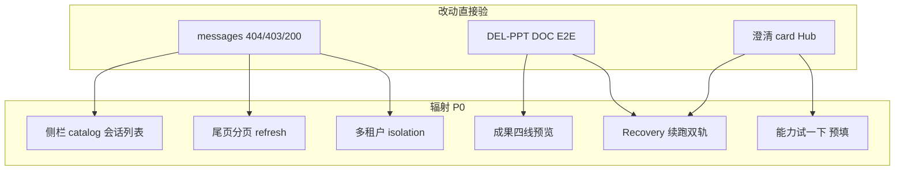

# 发版后代码开发计划（项 4 / 5 / 9 / 10）

> **状态**：**待命** — 仅当用户明确下令「开始开发」后执行  
> **原则**：稳定第一；**默认行为向后兼容**；可回滚；每项独立 PR/提交；**开发完成后必须跑 §6 复测矩阵**  
> **关联**：[prelaunch-production-gate-2026-06-22.md](prelaunch-production-gate-2026-06-22.md)

---

## 实施顺序（严禁跳步）


| 顺序 | 项 | 预估 | 风险 | 可独立发版 |
|------|-----|------|------|------------|
| 1 | **4** SEC-12 | 0.5–1d | 低 | 是（热补丁） |
| 2 | **5** 门禁脚本 | 1–2d | 无运行时 | 是（仅 dev/CI） |
| 3 | **9** 交付 E2E | 3–5d | 中 | 是（测试+小幅策略） |
| 4 | **10** 澄清+Hub | 2–4w | 中高 | 须分阶段+开关 |

**项 10 不得与项 4 同 PR**，避免安全补丁被大改牵连。

---

## 项 4 — SEC-12：未知 session 返回 404

### 目标

伪造/不存在 sessionId 访问 `GET /api/sessions/:id/messages` → **404**，禁止 **200 + 空 messages**（信息枚举）。

### 安全边界（必须满足）

| 场景 | 期望状态 | 说明 |
|------|----------|------|
| 伪造 ID `web-s_fake999` | **404** | 主修复目标 |
| 软删会话 | **403** | 已有，不动 |
| 跨租户 project | **403** | 已有，不动 |
| **新建对话 pending**（catalog 有 pending/active 行，jsonl 尚未落盘） | **200** 空或后续有消息 | **不可误伤** |
| 真实会话有 jsonl | **200** | 不变 |
| Gateway 断连 disk fallback | **200** | 不变 |
| 单机 `!IS_SAAS_MODE` | 行为与现网单机一致 | 仅 SaaS+catalog 路径收紧 |

### 实现要点

**文件**：[`ui/server/routes/messages.js`](ui/server/routes/messages.js)（`PD-SAAS-FORK`）

在软删检查之后、读消息之前：

1. `isSaasMode() && shouldReadConversationCatalog(ctx)` 时：
   - `catalogRow = await getCatalogEntryForSession(sessionId)`
   - `transcriptAbsPath = await resolveSessionTranscriptAbsPath(...)`（已有逻辑可复用）
   - **若 `!catalogRow && !transcriptAbsPath`** → `404` + `{ error: 'Conversation not found.' }`（勿返回 messages 数组）
   - **若 `catalogRow` 存在（含 pending/active）** → 继续现有流程（允许空 messages）
2. **勿**对 `resume-context` 路由误改（同步规则或共用 helper `assertSessionReadable`）

**可选同 PR**：SEC-11 路径穿越统一 **403**（当前 400 已拒绝对路径，低优先级）

### 测试（开发完成必跑）

| 类型 | 命令/文件 |
|------|-----------|
| 单元/路由 | 新增 `ui/server/routes/messages.sessionAccess.test.mjs` 或扩展现有 sanitize 测试 |
| 安全清单 | 扩展 [`scripts/security-regression-checklist.mjs`](scripts/security-regression-checklist.mjs) SEC-12 断言 404 |
| 回归 | `npm run test:saas:conversation-catalog` |
| 回归 | Playwright `isolation.spec.ts` + `long-session.spec.ts` |

### 回滚

Revert 单 PR；无数据迁移；无 env 依赖。

---

## 项 5 — 门禁脚本与 vitest 路径修复

### 目标

Windows 下一键跑通发版前检查；压测口径文档化；**不改变运行时产品行为**。

### 实现要点

**5.1 修复 vitest 调用**

[`package.json`](package.json) 中失败项：

- `test:deliverable-paths`：`npm --workspace ui exec vitest` → `npm --workspace ui run test -- <files>`
- `test:process-ux`：UI 段同样改为 `npm --workspace ui run test --`

**5.2 新增编排器**

[`scripts/run-production-gate-full.mjs`](scripts/run-production-gate-full.mjs)（新建）：

- 顺序：build → fork/brand → history-messages:quick → p0-p2:full → saas:storage/folder → process-ux → security-regression → http-load smoke（`SERVER_URL` 默认 **3002 或 API upstream**，非 5173）
- 可选 `--skip-live` / `--skip-load`
- 输出：`artifacts/pre-production-test/gate-full-summary.json` + 控制台 PASS/FAIL

**5.3 文档**

- [`docs/prelaunch-production-gate-checklist.zh-CN.md`](prelaunch-production-gate-checklist.zh-CN.md) J 章注明：`SERVER_URL=http://127.0.0.1:3002`（或 Bridge 实际端口）
- [`scripts/load/http-load.mjs`](scripts/load/http-load.mjs) 文件头注释补充

### 测试

- 本机：`node scripts/run-production-gate-full.mjs --skip-live` 全绿
- 原分项命令仍可用（向后兼容）

### 回滚

Revert；纯工具链。

---

## 项 9 — 交付类 E2E 门禁（DEL-PPT / DEL-DOC）

### 目标

自动化验证：**turn 结束必须有真交付物**；零用户手动「继续」；与现有 `incompleteDeliverable` 续跑一致。

### 非目标（本项不做）

- 不重写 AgentLoop 主流程
- 不默认开启需外部 API Key 的全 live 回归（无 Key 时 skip 并报告）

### 实现要点

**9.1 Playwright 黄金路径**（[`ui/e2e/saas/`](ui/e2e/saas/) 新增或扩展 `deep-uat.spec.ts`）

| ID | 场景 | 通过标准 |
|----|------|----------|
| DEL-PPT-01 | Hub/Composer 选 PPT 能力 + 夹具 docx 附件 | 最终存在 `.pptx`；`validateDeliverables` API ok；正文无 sole HTML 充数 |
| DEL-DOC-01 | anth-docx 或 export 路径 | 存在 `.docx` 或 `.pdf`（按能力 profile） |

- 使用 **mock/fixture 附件**（仓库内小文件），避免依赖外部服务
- 超时：单用例 ≤10min；失败保存 trace 到 `artifacts/e2e-deliverable/`
- 断言：**无** synthetic Recovery 英文用户气泡

**9.2 集成脚本（可选加强）**

- 扩 [`scripts/integration-recovery-wuyutai.mjs`](scripts/integration-recovery-wuyutai.mjs) 或新增 `integration-deliverable-e2e.mjs`
- 复用 [`presentationDeliverablePolicy.ts`](ui/src/shared/presentationDeliverablePolicy.ts)、[`validateDeliverablesEngine.ts`](src/agent/deliverables/validateDeliverablesEngine.ts)

**9.3 编排接入**

- `run-production-gate-full.mjs` 增加 `--with-deliverable-e2e`（默认 off，因耗时长）
- `test:pre-production` **不默认**跑 DEL（避免 lean 门禁 >45min）

### 安全与稳定

- E2E 仅打本地 `127.0.0.1:5173`；**禁止**生产 URL
- 不修改 `RecoveryBudget` 默认值
- 若加强 `shouldAutoContinueAfterIncompleteDeliverableStop`：仅当 DEL 测试证明漏判时小步补；每项变更带单测

### 测试（开发完成必跑）

| 层级 | 命令 |
|------|------|
| 单元 | `npm run test:p0-p2:full` |
| 策略 | `ui/src/shared/presentationDeliverablePolicy.test.ts`（已有则扩） |
| E2E | `npx playwright test ui/e2e/saas/deliverable-*.spec.ts` |
| 长任务 | `npm run test:recovery-wuyutai:run`（可选 nightly） |
| 报告 | `npm run test:recovery-beijing-ai-report`（offline jsonl） |

### 回滚

Revert E2E 与编排开关；引擎策略改动独立 revert。

---

## 项 10 — 澄清门控 + Hub 预期文案

### 目标

缺附件/缺 Key/缺页数时 **最多 1 条** structured 提问；**禁止**与 `auto_continue` 同时狂续跑；Hub 写清前置条件。

### 产品裁决（开发前须确认）

| 问题 | 建议默认 |
|------|----------|
| 用户写了「直接开始做」 | **不澄清**（已有 [`clarificationGate.ts`](src/saas/clarificationGate.ts) `DIRECT_START_PATTERN`） |
| 缺 Key | `UserActionRequiredCard`，**不** auto_continue |
| 缺附件但用户 insist 直接做 | 允许继续但 validate 不通过 → incompleteDeliverable 续跑 |

### 分阶段实施（降低风险）

**阶段 10a — 仅 UI/Hub（1 周，无引擎行为变化）**

- [`CapabilityHub.tsx`](ui/src/components/main-content-v2/CapabilityHub.tsx) / [`CapabilityCard`](ui/src/components/capability-hub/CapabilityCard.tsx) hover 或 try-prompt：PPT/文档类补充「需附件或主题；缺 Key 请在设置配置」
- i18n：[`config/capabilities.i18n.json`](config/capabilities.i18n.json) + `npm run capabilities:gen`
- **开关**：无；纯文案

**阶段 10b — 引擎澄清门控（2–3 周）**

- 在 [`AgentLoop.ts`](src/agent/loop/AgentLoop.ts) turn 开始前或首条 user 后调用 `detectClarificationNeeded`（已有单测 [`clarification-gate.test.ts`](tests/saas/clarification-gate.test.ts)）
- 触发时：emit `user_action_required` / 展示 [`UserActionRequiredCard`](ui/src/components/chat-v2/UserActionRequiredCard.tsx)；**跳过** `useAutoRecoveryContinue` / incompleteDeliverable 续跑（对齐 AGENTS.md）
- 与 [`taskContinuationPolicy.ts`](src/saas/taskContinuationPolicy.ts)、[`userActionBlockerStreakTracker.ts`](src/saas/userActionBlockerStreakTracker.ts) 对齐：同类硬失败 3 次快停
- **可选 env 开关**：`PILOTDECK_CLARIFICATION_GATE=1`（dev:saas 默认开，生产 pack 默认开但可回滚为 0）

**阶段 10c — 能力 binding 强化（与 P0-1 路线图对齐，可并入 10b 后期）**

- [`capabilitySessionBinding.ts`](ui/src/shared/capabilitySessionBinding.ts) 多轮 Hub 续做不丢 slug

### 禁止行为

- 澄清问题不得渲染为普通 assistant 长文（须 structured card）
- 不得注入「继续」类 synthetic 用户消息
- 不得增加 Recovery 预算消耗

### 测试（开发完成必跑）

| 层级 | 内容 |
|------|------|
| 单元 | `clarification-gate.test.ts`、`user-action-blocker-streak.test.ts`、`taskContinuationPolicy.test.ts` |
| 集成 | `test:p0-p2:full` |
| Playwright | 新用例：缺附件 → 出现中文 card → **无** auto 续跑；补附件后正常交付 |
| 人工 | 2 条：PPT 无附件、GEO 无 Key |

### 回滚

- 10a：revert i18n/Hub
- 10b：`PILOTDECK_CLARIFICATION_GATE=0` 或 revert AgentLoop 注入点

---

## §6 每项 PR 合并后 — 增量复测（必做）

> **时机**：PR-A / B / C / D **各自合并后**立即执行（仅覆盖该 PR 相关段 + 最小回归）。  
> 报告可写入 `docs/post-gate-dev-retest-PR-*.md` 或同一文件按 PR 分节。

### A. 全量静态（FAIL 即停）

```bash
npm run build
npm run check:saas-fork
npm run brand:check
npm run test:history-messages:quick
npm run test:p0-p2:full
npm run test:deliverable-paths
npm run test:four-line-audit
```

### B. 本次改动专项

| 改动项 | 必跑 |
|--------|------|
| 项 4 | `node scripts/security-regression-checklist.mjs` + 新 session 404 单测 |
| 项 5 | `node scripts/run-production-gate-full.mjs --skip-live` |
| 项 9 | Playwright deliverable E2E + `test:recovery-wuyutai` |
| 项 10 | clarification 单测 + Playwright 澄清 card + `test:process-ux` |

### C. SaaS 核心 live（dev:saas）

```bash
npx playwright test -c ui/playwright.config.ts ui/e2e/saas/isolation.spec.ts ui/e2e/saas/resilience-recovery.spec.ts ui/e2e/saas/long-session.spec.ts ui/e2e/saas/deep-uat.spec.ts ui/e2e/chat-experience.spec.ts
```

### D. 云端与存储

```bash
node scripts/integration-saas-storage-comprehensive.mjs
npm run test:saas:conversation-catalog
```

### E. 精益门禁

```bash
npm run test:pre-production
```

### 增量签收标准

- 该 PR 对应 B 段 + A 段静态 **全绿**
- C/D 至少跑与改动域相关的子集（见 §7 辐射表）
- **不等同于最终综合验收** — 全部 PR 合并后须再跑 **§7**

---

## §7 全部开发合并后 — 综合验收测试（必做，严格）

> **时机**：项 4/5/9/10 **全部合并**（或用户指定范围内最后一笔 PR 合并）后，**打包发版前**执行。  
> **目的**：严格验证 **改动点本身** + **所有可能受影响的辐射链路**；FAIL 任一 P0 即 **不具备发版能力**。  
> **产出**：`docs/post-gate-dev-acceptance-YYYYMMDD.md`（含辐射矩阵打勾 + 命令输出摘要）。

### 7.1 验收哲学

| 级别 | 含义 |
|------|------|
| **P0** | 改动域 + 辐射域核心路径；任一 FAIL → 阻断打包 |
| **P1** | 扩展回归；FAIL 须豁免单（≤2 项）方可打包 |
| **P2** | 记录 backlog，不阻断 |

**环境**：本地 `dev:saas`（PG+Redis 与生产一致为佳）；`PILOTDECK_HISTORY_SANITIZE=1`、`TAIL_READ=1`；Playwright 用 `PLAYWRIGHT_BASE_URL=http://127.0.0.1:5173`。

### 7.2 改动点 → 辐射范围矩阵

| 改动 | 直接验证（P0） | 辐射范围（P0 必回归） |
|------|----------------|----------------------|
| **4 messages 404** | 伪造 sessionId→404；真实 session→200；软删→403 | 侧栏点会话加载、尾页 `direction=backward`、`refreshFromServer`、新建对话 30s 内可见、`GET resume-context`、跨租户 isolation、Gateway 断连 disk fallback |
| **5 门禁脚本** | `run-production-gate-full.mjs` 全绿（含 live 可选） | 间接覆盖：build/fork/brand/history/storage/security/load —— **作为综合验收编排入口** |
| **9 交付 E2E** | DEL-PPT/DEL-DOC 黄金路径绿 | `incompleteDeliverable` 引擎+UI 续跑、成果四线、`validateDeliverables`、`presentationDeliverablePolicy`、Recovery 无英文泄漏、无多余用户「继续」 |
| **10 澄清+Hub** | 缺附件→UserActionRequiredCard、无 auto_continue；「直接开始做」不拦截 | Hub「试一下」预填、`capabilityTryBridge`、与 `useAutoRecoveryContinue`/`useIncompleteDeliverableAutoContinue` **不叠乘**、core-strategy 勿停与澄清 **不冲突**、i18n 中英文 |



### 7.3 综合验收执行顺序（约 2–4h）

**阶段 1 — 编排一键（P0）**

```bash
# 项 5 编排器；首次建议含 live+load
node scripts/run-production-gate-full.mjs
# 若超时则：--skip-load 后单独跑 http-load（SERVER_URL=127.0.0.1:3002）
```

**阶段 2 — 安全 + 会话 API 辐射（P0，项 4 核心）**

```bash
node scripts/security-regression-checklist.mjs
npm run test:saas:conversation-catalog
npm run test:history-messages:quick
```

**手工/API 探针（P0，记录到 acceptance 报告）**

| ID | 操作 | 通过标准 |
|----|------|----------|
| ACC-4a | 伪造 `web-s_fake999` GET messages | **404** |
| ACC-4b | 新建对话后立即 GET messages | **200**（允许空，非 404） |
| ACC-4c | 软删会话 GET messages | **403** |
| ACC-4d | 真实重会话 tail120 | <500KB，<1.5s |
| ACC-4e | `GET .../resume-context` 伪造 id | 与 messages **同规则**（404/403） |

**阶段 3 — Playwright 综合套件（P0）**

```bash
$env:PLAYWRIGHT_BASE_URL='http://127.0.0.1:5173'
$env:DIAG_USER='admin'; $env:DIAG_PASS='admin123'

npx playwright test -c ui/playwright.config.ts \
  ui/e2e/saas/isolation.spec.ts \
  ui/e2e/saas/resilience-recovery.spec.ts \
  ui/e2e/saas/long-session.spec.ts \
  ui/e2e/saas/deep-uat.spec.ts \
  ui/e2e/saas/history-messages-perf.spec.ts \
  ui/e2e/chat-experience.spec.ts \
  ui/e2e/saas/deliverable-*.spec.ts \
  ui/e2e/phase3/admin-dashboard.spec.ts
```

（`deliverable-*.spec.ts` 在项 9 未合并时可跳过并记 P1 豁免。）

**阶段 4 — 对话链路 + 交付辐射（P0）**

```bash
npm run test:p0-p2:full
npm run test:recovery-wuyutai
npm run test:four-line-audit
npm run test:deliverable-paths
npm run test:process-ux
npm run smoke:resilience
npm run smoke:project-memory
FORCE_MULTI_USER_SIM=1 npm run test:multi-user:sim
```

**阶段 5 — 云端存储 + 负载（P0）**

```bash
node scripts/integration-saas-storage-comprehensive.mjs
node scripts/integration-saas-folder-scenarios.mjs
$env:SERVER_URL='http://127.0.0.1:3002'
node scripts/load/http-load.mjs --scenario smoke
node scripts/load/http-load.mjs --scenario stress
```

**阶段 6 — 项 10 澄清辐射（P0，仅 10b/10c 合并后）**

| ID | 场景 | 通过标准 |
|----|------|----------|
| ACC-10a | PPT 能力无附件发送 | 出现 **UserActionRequiredCard**（或澄清 card），**无** silent auto_continue |
| ACC-10b | 同场景用户回复「直接开始做」 | 可进入执行；若无交付则 incompleteDeliverable 续跑 |
| ACC-10c | Hub「试一下」PPT 卡片 | 预填含能力语义；hover/简介含前置说明（10a） |
| ACC-10d | 有 Key+附件完整路径 | 与 ACC-9 交付用例一致，不因澄清阻断 |

Playwright 自动化优先；上表不可自动化时 **人工 15min** 记入报告。

**阶段 7 — 精益门禁收尾（P0）**

```bash
npm run test:pre-production
npm run pack:preflight
```

### 7.4 综合验收报告模板（必填）

`docs/post-gate-dev-acceptance-YYYYMMDD.md` 须含：

1. **Git HEAD**、已合并 PR 列表（4/5/9/10）
2. **§7.2 辐射矩阵**：每格 ☑/☒
3. **ACC-4a~e、ACC-10a~d** 探针结果
4. **Playwright** 通过数/总数
5. **run-production-gate-full** 摘要 JSON 路径
6. **结论**：具备 / 不具备 发版能力；P1 豁免 ≤2

### 7.5 综合签收标准

- §7 阶段 1–5 + 7 **全部 P0 绿**
- 项 10 未合并时：阶段 6 标 N/A；项 10b 合并后 **必须**重跑阶段 4+6
- 与 [prelaunch-production-gate-2026-06-22.md](prelaunch-production-gate-2026-06-22.md) 对比：无新增 P0 回退
- 通过后：提醒执行 [next-pack-reminders.zh-CN.md](next-pack-reminders.zh-CN.md) 项 1–3

### F. 发版前（综合验收通过后）

```bash
npm run pack:deploy
# 并执行 docs/next-pack-reminders.zh-CN.md 项 1–3
```

## 本计划外 — 仅提醒（不纳入本次开发）

| 项 | 提醒 |
|----|------|
| 6 | staging 混沌 CH-01~03/07 |
| 7 | 生产 R3 CACHE + Nginx 缓存（看 Gate-B 数据） |
| 8 | weekly `analyze:task-completion` |
| 11+ | Rate limit、soak nightly、production-readiness nightly |

详见 [prelaunch-expert-recommendations-2026-06-22.zh-CN.md](prelaunch-expert-recommendations-2026-06-22.zh-CN.md)。
