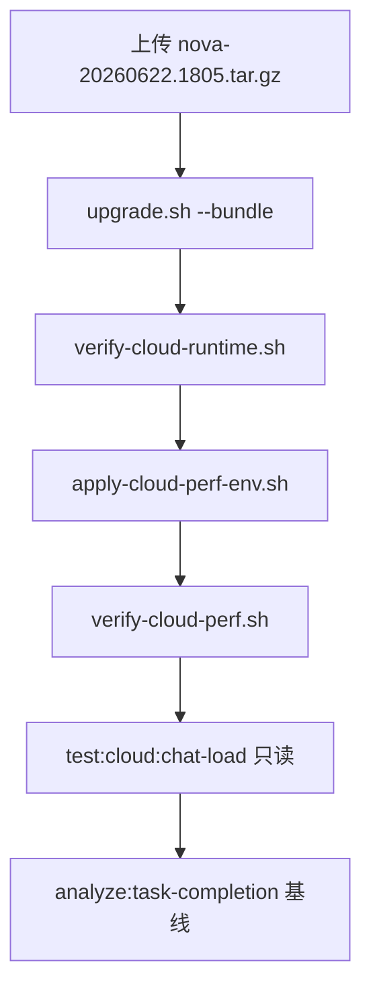

# 生产门禁专家改进建议

**日期**：2026-06-22  
**依据**：Gate-A 本地严苛验收 + `docs/task-driven-dialogue-deep-analysis-2026-06-21.zh-CN.md`  
**发版包**：`dist-release/nova-20260622.1805.tar.gz`

---

## 执行摘要

本地门禁 **P0 全绿**，历史加速与 catalog 在 dev:saas 表现优秀（tail120 **<150KB / <220ms**）。**发版可推进**，但须在 ECS 补跑容器验收。以下按 **UX / 稳定性 / 效率 / 安全** 四维给出优先级建议——重点补「任务完成率」与「生产验收闭环」，而非再堆功能。

---

## 1. 用户体验（UX）

### P0 — 发版后第一周

| 建议 | 理由 | 动作 |
|------|------|------|
| 建立交付类完成率 weekly 基线 | HM/recovery 绿只保证「不崩」，PPT 完成率基线 **5.6%** | `npm run analyze:task-completion`，对比 `docs/task-completion-analysis-baseline-2026-06-21.zh-CN.md` |
| deep-uat 增 2 条真实交付走查 | 「假完成」（turn success 无文件）是用户主诉 | 人工：PPT 附件→`.pptx`；文档→PDF/DOCX；验收 `incompleteDeliverable` 续跑 |
| 过程 UX 弱提示审计 | CH-01 未实杀 Gateway，弱提示未全量验 | 断 Gateway 时确认无「重试/重新进行」、无红色 Recovery 英文 |

### P1 — 下一迭代

| 建议 | 动作 |
|------|------|
| Hub「试一下」与交付预期对齐 | 卡片简介写清「需附件/Key 时会问一句」，减少猜参+HTML 顶替 |
| TTFT 用户感知 | memory_retrieve p95 **5s** 导致首段慢；设置页说明「首条思考中」与 tail 分页已解耦 |

---

## 2. 系统稳定性

### P0 — 发版当日（ECS）

| 建议 | 动作 |
|------|------|
| 容器内双 verify | `sudo bash verify-cloud-runtime.sh` + `verify-cloud-perf.sh` |
| catalog 对齐 | `catalog_rows` 偏低时跑 `backfill-conversation-catalog.mjs` |
| apply-cloud-perf-env | 一键合并 SANITIZE+TAIL_READ+catalog+Redis TTL |

### P1 — 工程债

| 建议 | 理由 | 动作 |
|------|------|------|
| 统一门禁编排器 | Windows 分项跑易漏项；`npm --workspace ui exec vitest` 路径 broken | 实现 `run-production-gate-full.mjs`，修复 ui vitest 双 node_modules 路径 |
| 补跑 CH-01~03/07 | 本次为保护 dev 长任务未杀 Gateway/Redis | staging 或维护窗口专项混沌日 |
| SEC-12 硬化 | 伪造 sessionId → 200 空数组 | messages 路由：未知/跨租户 session → **404** |

### P2

- 补跑 `npm run test:recovery-beijing-ai-report:run`（长报告端到端）  
- 3 tab 并发：Playwright `browser.newContext()` ×3 自动化替代手工  

---

## 3. 效率

### 生产默认（已验证）

| 项 | 建议 |
|----|------|
| 历史加速 | **R2** 默认：SANITIZE=1 + TAIL_READ=1；CACHE=0 先发，P95>2s 再开 R3 |
| 尾部分页 | pack 已注入 `VITE_TAIL_MESSAGE_PAGINATION`（AppShell 含 direction=backward） |
| 压测口径 | **勿经 Vite 5173 跑 spike**；打 API 端口或 Nginx upstream（本次 spike 经 5173 失败 41%） |

### P1

| 建议 | 动作 |
|------|------|
| PG 与生产一致 | 本地已用 PG；发版包为 SQLite 首装——升级 ECS 若用 PG 须 `migrate-control-sqlite-to-pg` + 验收 `test:saas:pg-validation` |
| Nginx 静态缓存 | 确认 `deploy/nginx.conf.cached` gzip + proxy_cache 已部署，二访 JS 走缓存 |
| Redis TTL | capabilities=600 / projects=60 / messages=120（R3 时） |

### P2

- `npm run ttft:baseline` 建 TTFT 门禁，P95>30s 告警  
- soak 15min 内存增幅 <20% 纳入 nightly  

---

## 4. 安全

### P0 — 公网前必做

| 项 | 状态 | 动作 |
|----|------|------|
| 改 admin 默认密码 | 开发 admin/admin123 | ECS 首登强制改密 |
| 注册验证码 | SEC-06 绿 | 确认 Redis 容器存活 |
| 路径/存储越权 | CLOUD 30/30 + SEC-03 绿 | 保持 |
| JWT/篡改 | SEC-04 绿 | 保持 |

### P1 — 7 天内

| 项 | 本次 | 建议 |
|----|------|------|
| SEC-12 伪造 sessionId | 200 空数组 | 改 404/403 |
| SEC-11 路径穿越 | 400 Bad Request | 可接受；统一为 403 更清晰 |
| 开放注册滥用 | 未压测 | 生产监控注册速率 + captcha 失败率 |

### P2

- 遥测默认关（SEC-07 观察项）——公网确认 `telemetry` 未误开  
- Rate limit 登录/captcha（spike 108k 请求/60s 仅 dev 直连通过，生产须 WAF/限流）  

---

## 5. 建议执行顺序（发版周）

1. **Day 0**：ECS upgrade + verify 双脚本  
2. **Day 1**：Gate-B 只读（Q 章）+ tail120 生产 P95/KB 写入运维日志  
3. **Day 2–7**：SEC-12 补丁 + 编排器修复 + 完成率 weekly  

---

## 6. 不必现在做

- 生产 stress/spike/混沌（用户已选 local_only，Gate-B 仅只读）  
- 全量 `test:production-readiness`（4–6h，留 nightly）  
- 为 spike 失败改 Vite 架构（改压测目标即可）  

---

**关联文档**：`docs/prelaunch-production-gate-2026-06-22.md`、`docs/history-messages-deploy-runbook.zh-CN.md`、`docs/conversation-resilience-spec.md`
