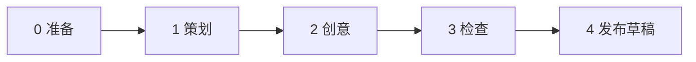

# 社媒矩阵新手引导（小红书 · 抖音 · 微博 · 头条号）

面向**第一次**从「想发什么」到「蚁小二推到各平台草稿」的完整路径。  
你已绑定的平台：**小红书、抖音、新浪微博、头条号**（快手、知乎等本引导不展开，需要时照同样方式加平台名即可）。

句末可加：**「直接开始做，做完告诉我文件在哪或任务结果。」**

---

## 总览：你要走 5 大步

| 大步 | 你在干什么 | 大概多久 | 会不会真的发帖 |
|:----:|------------|----------|----------------|
| 0 准备 | 确认能力、账号正常 | 5–10 分钟 | 否 |
| 1 策划 | 定主题、受众、语气、要不要发 | 5 分钟 | 否 |
| 2 创意 | 生成 4 平台文案 + 配图 | 10–30 分钟（含出图） | 否 |
| 3 检查 | 自己看一眼文案和图 | 5 分钟 | 否 |
| 4 发布 | 经蚁小二推到各 App **草稿箱** | 5–15 分钟 | **默认只进草稿**，不公开 |

---

## 第 0 步：准备（只做一次）

### 0.1 PilotDeck 里要开的能力

| 能力 | 用来干什么 | 你怎么确认 |
|------|------------|------------|
| **图片生成** | 做竖版、方图、横版等配图 | 设置 → 能力接入中心 → 图片类已配置密钥 |
| **社媒发布（蚁小二）** | 上传图、推到各平台草稿 | 能力接入中心 → 社媒发布已填 API 密钥 |

### 0.2 蚁小二网页上要有的账号

登录 [蚁小二](https://www.yixiaoer.cn/)，确认这 4 个平台**已绑定且登录正常**：

- 小红书  
- 抖音  
- 新浪微博  
- 头条号  

> 绑定、扫码、掉线重登都在蚁小二网页完成，**不能在 PilotDeck 对话里新绑号**。

### 0.3 第一次先「查账号」（建议复制进对话）

| 复制提问 |
|----------|
| 帮我查蚁小二里绑了哪些社媒账号，只要小红书、抖音、新浪微博、头条号，标出昵称和是否登录正常，直接查完告诉我。 |

**你要看到的结果：** 4 个平台各有可用账号；若有「失效/掉线」，先去蚁小二网页处理，再继续下面步骤。

---

## 第 1 步：策划（想清楚再让 AI 动手）

在纸上或备忘录里先填下面这张表（填得越清楚，后面越少改）：

| 填空项 | 示例（你可改掉） |
|--------|------------------|
| **活动主题** | 春季新品「轻柠气泡水」上市 |
| **给谁看** | 18–30 岁、爱喝低糖饮料的城市年轻人 |
| **语气** | 活泼、短句、带一点梗 |
| **行动号召** | 评论区领券 / 到店第二杯半价 |
| **这次要发的平台** | 小红书、抖音、新浪微博、头条号 |
| **这次要不要推送** | 建议新手选：**只做文件，第 4 步再发草稿** |
| **有没有禁用** | 不要写医疗功效、不要竞品名 |

### 1.1 可选：让对话帮你整理策划（复制提问）

| 复制提问 |
|----------|
| 我要做一条社媒矩阵，主题是【轻柠气泡水春季上市】，受众是【18–30 岁爱低糖饮料】，语气【活泼短句】，行动号召【到店第二杯半价】。平台只要小红书、抖音、新浪微博、头条号。先不要出图不要发布，帮我把上面整理成一份 brief 要点列表，直接开始做。 |

---

## 第 2 步：创意（文案 + 配图，仍不发布）

### 2.1 你会得到什么

全部在一个文件夹里，路径类似：

`artifacts/social-matrix/你的活动英文名/`

| 文件/文件夹 | 用途 |
|-------------|------|
| `brief.md` | 策划记录 |
| `copy-matrix.md` | **四平台文案**，复制用 |
| `manifest.json` | 平台该用哪张图的清单 |
| `visuals/image-3x4.png` | 小红书笔记竖图 |
| `visuals/image-9x16.png` | 抖音竖版全屏 |
| `visuals/image-1x1.png` | 微博方图 |
| `visuals/image-16x9.png` | 头条横图 |

### 2.2 四平台默认用哪张图

| 平台 | 用哪张文件 | 画面比例 |
|------|------------|----------|
| 小红书 | `image-3x4.png` | 3:4 竖版笔记 |
| 抖音 | `image-9x16.png` | 9:16 竖版 |
| 新浪微博 | `image-1x1.png` | 1:1 方图 |
| 头条号 | `image-16x9.png` | 16:9 横版 |

### 2.3 一键创意（**主流程**，复制进 PilotDeck 对话）

把【】里的内容换成你的策划：

| 复制提问 |
|----------|
| 我要做社媒矩阵：主题是【轻柠气泡水春季上市】，受众【18–30 岁爱低糖饮料】，语气【活泼短句】，行动号召【到店第二杯半价】。平台只要小红书、抖音、新浪微博、头条号。请为这四个平台各写标题和正文（含话题建议），并用同一创意生成 3:4、9:16、1:1、16:9 四套配图。先不要发布，直接开始做，做完告诉我文件夹路径，并在对话里让我能预览图片。 |

**系统会做：** 定 brief → 锁创意描述 → 写四平台文案 → 出 4 张图 → 打包 `manifest.json` 和 `copy-matrix.md`。

### 2.4 只想少出几张图时（省钱省时间）

| 复制提问 |
|----------|
| 同上主题和四平台文案，但配图只要小红书 3:4 和抖音 9:16 两张，其余比例跳过，先不要发布，直接开始做。 |

---

## 第 3 步：检查（发布前你自己过一遍）

打开 `copy-matrix.md` 和 `visuals/` 文件夹，按下面清单打勾：

| 检查项 | 小红书 | 抖音 | 微博 | 头条 |
|--------|:------:|:----:|:----:|:----:|
| 标题/正文没有错别字、没有违禁承诺 | ☐ | ☐ | ☐ | ☐ |
| 正文长度看起来正常（别明显超长） | ☐ | ☐ | ☐ | ☐ |
| 配图主体一致、没有四张图风格完全不像 | ☐ | ☐ | ☐ | ☐ |
| 话题/标签和品牌形象 OK | ☐ | ☐ | ☐ | ☐ |
| 确认这次仍是**草稿**，不是公开上线 | ☐ | ☐ | ☐ | ☐ |

有不满意：**不要急着第 4 步**，回到对话说「只改小红书正文」或「重新生成抖音那张 9:16 图，其它不动」。

---

## 第 4 步：发布（经蚁小二推到各 App 草稿箱）

> **新手强烈建议：** 第一次只说「存到各平台 App 草稿箱」，在抖音/小红书 App 里再人工点发布。

### 4.1 发布前你要说清楚的三件事

| 要说清 | 推荐说法 |
|--------|----------|
| 用哪次矩阵包 | 「用文件夹 `artifacts/social-matrix/【活动英文名】` 里的文件」 |
| 发到哪些平台 | 「小红书、抖音、新浪微博、头条号」 |
| 发到哪里 | 「存到**各平台 App 草稿箱**，不要公开发布」 |

### 4.2 一键推草稿（复制提问）

把路径换成你第 2 步拿到的真实文件夹：

| 复制提问 |
|----------|
| 用 `artifacts/social-matrix/【spring-lime-2026】` 里的文案和配图，通过蚁小二发到小红书、抖音、新浪微博、头条号，每个平台用 manifest 里推荐的配图，全部存到**对应 App 的草稿箱**，不要公开发布。发之前先查这四个平台账号是否登录正常，上传图片后再推送，做完告诉我每个平台的任务结果或编号。 |

### 4.3 分平台手动（某平台失败时用）

| 平台 | 复制提问（单平台） |
|------|-------------------|
| 小红书 | 用矩阵包【路径】里的小红书文案和 image-3x4 图，蚁小二推到小红书草稿箱，不要公开，直接开始做。 |
| 抖音 | 用矩阵包【路径】里的抖音文案和 image-9x16 图，蚁小二推到抖音草稿箱，不要公开，直接开始做。 |
| 微博 | 用矩阵包【路径】里的微博正文和 image-1x1 图，蚁小二推到新浪微博，先按草稿或私密方式处理，不要公开，直接开始做。 |
| 头条 | 用矩阵包【路径】里的头条文案和 image-16x9 图，蚁小二推到头条号草稿箱，不要公开，直接开始做。 |

### 4.4 发完之后你在 App 里做什么

| 平台 | 你去哪里确认 |
|------|--------------|
| 小红书 | 打开小红书 App → 草稿箱 → 检查图文 → 自己点发布 |
| 抖音 | 抖音 App → 草稿 → 检查 → 发布 |
| 微博 | 微博 App 或网页 → 草稿箱 |
| 头条 | 头条号后台 / App → 草稿 |

PilotDeck 对话里可再问：

| 复制提问 |
|----------|
| 帮我查一下刚才蚁小二发布任务的进度和状态，直接告诉我结果。 |

---

## 两种「草稿」别搞混

| 你说的话 | 实际效果 |
|----------|----------|
| **存到小红书/抖音 App 草稿箱**（本引导推荐） | 内容出现在**各平台 App** 里，你再改再发 |
| **只存蚁小二云端草稿** | 只在蚁小二后台，**还没进**抖音/小红书 App |
| **公开发布 / 上线** | 真的会对外可见——新手先别用，除非你确认过 |

---

## 完整时间线示例（一次活动）

| 顺序 | 你做什么 | 对话里说什么（摘要） |
|:----:|----------|----------------------|
| 1 | 查账号 | 查蚁小二四平台账号是否正常 |
| 2 | 策划 | 填主题/受众/语气（或让 AI 整理 brief） |
| 3 | 创意 | 四平台文案 + 四套图，**先不要发布** |
| 4 | 检查 | 本地打开 `copy-matrix.md` 和 `visuals/` |
| 5 | 推草稿 | 用矩阵包路径 → 四平台 **App 草稿箱** |
| 6 | 人工发布 | 各 App 草稿箱里终审后点击发布 |

---

## 常见问题

| 问题 | 怎么办 |
|------|--------|
| 不出图 | 去能力接入中心检查「图片」是否配置密钥 |
| 说发布失败 | 先查账号是否掉线；再单平台重试（见 4.3） |
| 微博和头条文案风格不对 | 回到第 2 步说「只重写微博/头条正文，图不变」 |
| 只想发 2 个平台 | 策划和第 2 步对话里只写「小红书、抖音」 |
| 怕误发公开 | 每次都说「草稿箱」「不要公开发布」 |

---

## 相关文档

| 文档 | 适合谁 |
|------|--------|
| [social-matrix-prompt-examples.md](./social-matrix-prompt-examples.md) | 更多可复制例句 |
| [yixiaoer-prompt-examples.md](./yixiaoer-prompt-examples.md) | 只发不发、查进度、上传素材 |
| [social-matrix-admin-guide.md](./social-matrix-admin-guide.md) | 管理员配置与冒烟测试 |

---

**下一步：** 从 **第 0 步查账号** 开始；账号都正常后，用 **第 2 步 2.3** 那条长提问做你的第一条真实矩阵（记得把【】换成你的主题）。
