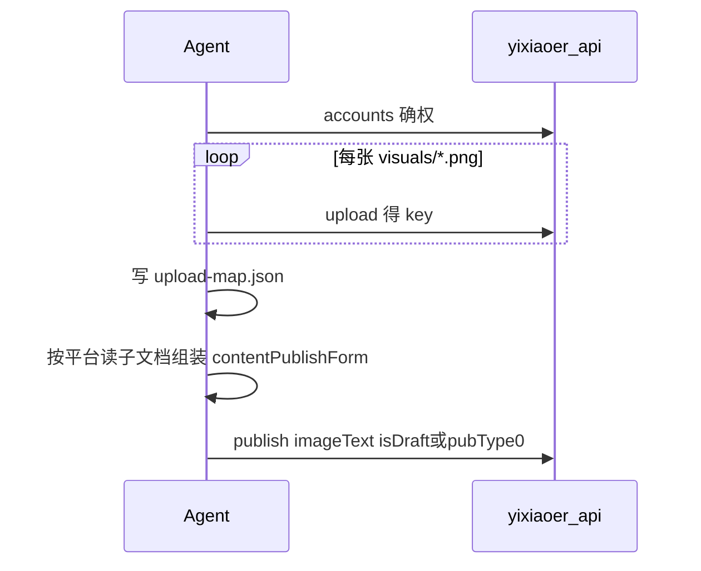

# 蚁小二发布交接（imageText）

仅当用户**明确要求**发布、存平台草稿或存蚁小二草稿时执行。默认交付文件即可。

## 前置

1. PilotDeck **设置 → 能力接入中心 → 社媒发布（蚁小二）** 已配置 `tools.yixiaoer.apiKey`，或环境变量 `YIXIAOER_API_KEY`。
2. 用户已在 [蚁小二网页](https://www.yixiaoer.cn/) 绑定目标平台账号。
3. 已读完 `references/anti-patterns.md` 与 `platform-deep-links.md`。

## 顺序（强制）



### 1. 查账号

```json
{"action":"accounts","platforms":["抖音","小红书"],"loginStatus":1,"page":1,"size":100}
```

仅使用 `status===1`（登录正常）的 `platformAccountId`。

### 2. 上传图片

对 `manifest.recommendedMapping` 涉及的每个文件调用 `upload`（见 `upload-resource.md`）。记录到 `yixiaoer/upload-map.json`：

```json
{
  "artifacts/social-matrix/<slug>/visuals/image-3x4.png": {
    "key": "...",
    "width": 1104,
    "height": 1472,
    "size": 123456,
    "format": "png"
  }
}
```

### 3. 装配 publish

- `action`: `publish`
- `publishType`: `imageText`
- `platforms`: 中文名数组
- `publishArgs.content`: 可放通用描述或留空按账号填
- 每个 `accountForms[]`：
  - `platformAccountId`
  - `images[]` / `cover`（含 width/height/size/key/format）
  - `contentPublishForm`：按平台 md 填写

**草稿默认**：

| 用户意图 | 做法 |
|----------|------|
| 「存平台草稿」 | 平台支持则 `pubType: 0`；否则 `visibleType: 1`（私密） |
| 「存蚁小二草稿」 | 根级 `isDraft: true` |
| 未说明 | 优先平台草稿，勿直接公开 |

### 4. 调用工具

优先 `yixiaoer_api` 传入完整 JSON payload。可选用：

```bash
node scripts/pack-social-matrix-yixiaoer.mjs --manifest artifacts/social-matrix/<slug>/manifest.json --upload-map artifacts/social-matrix/<slug>/yixiaoer/upload-map.json
```

生成 `publish-draft.json` 供核对后再 `yixiaoer_api`。

## 与 manifest 的映射

- 文案取自 `manifest.copy[<平台>].body` / `title`。
- 图片取自 `recommendedMapping[<平台>]` → `upload-map.json` 的 key。

## 失败处理

- 先读 `skills/yixiaoer/docs/troubleshooting-guide.md`。
- 校验失败：回到对应平台 md 补必填字段，勿重复 upload 同一文件。

## 验收（发布交接后）

- [ ] `upload-map.json` 中每个 `recommendedMapping` 文件均有 `key`
- [ ] `publish-draft.json` 无 `REPLACE_` 占位 `platformAccountId`
- [ ] 各平台 `contentPublishForm` 已按子文档补齐必填项
- [ ] 用户未要求公开时，已设 `pubType: 0` 或 `isDraft: true`

结构校验（无需 API）：`npm run smoke:social-matrix`

## 更多例句

`docs/yixiaoer-prompt-examples.md` · 矩阵用户例句 `docs/social-matrix-prompt-examples.md`
